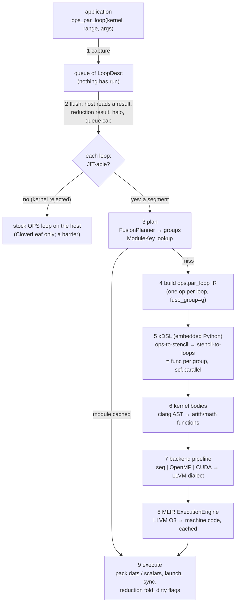

# From an OPS loop to a running kernel: the ops-mlir compilation flow

This document follows one `ops_par_loop` call through every stage that turns it into machine code,
and shows the artefact each stage produces. All listings are **real output** of this repository
(commands in [§13](#13-inspecting-every-stage)), taken from two applications:

* **Taylor-Green vortex (TGV)** — an OpenSBLI-generated 3-D Navier–Stokes solver (`apps/c/taylor_green_vortex`),
  26 loop sites over 25 kernels, written in OPS's older *pointer style* (one scalar argument per stencil point, results
  through a return value or an out-struct). Shown at `N = 16` (fields of 26×26×28 doubles), sequential backend unless noted.
* **CloverLeaf 2D** — the unmodified OPS port (`apps/c/cloverleaf_2d`), 82 kernels written with `ACC<T>`
  *accessors* (`density(0,-1)`), data-dependent control flow, reductions and registered constants. Shown on its
  tiny default deck (10×2 cells, so fields are 11×20 doubles).

The two styles use two different kernel translators (§8), which is why both appear. The fusion planner,
the xDSL pass and the backends are shared. Companion documents: [loop_fusion.md](loop_fusion.md) (the fusion
rules in depth), [cloverleaf.md](cloverleaf.md) (the CloverLeaf port and its correctness checks).

Abbreviations in listings: `!F` is the (long) `!stencil.field<[0,26]x[0,26]x[0,28]xf64>` type of the
dat being discussed, pointer values inside attributes are elided as `<ptr>`, and `…` marks removed lines. `//` comments in the IR listings are annotations added for this document (MLIR's own comments are not printed).

## 1. The whole flow on one page



| # | stage | code | in → out | when it runs |
|---|---|---|---|---|
| 1 | capture | `ops_par_loop` in `include/ops/OPSWrapper.h`, `JITEngine::enqueueParLoop` | OPS call → `LoopDesc` | every call; microseconds |
| 2 | flush & segment | `compile_and_execute`, `runsOnHost` | queue → stretches of JIT-able loops | at a host-visible OPS call |
| 3 | plan | `planFusion` (`FusionPlanner.cpp`), `ModuleKey` | segment → groups of loops | once per distinct queue shape |
| 4 | IR build | `IRBuilder::buildModule` | groups → `ops.par_loop` ops | on a cache miss |
| 5 | xDSL | `xdsl_impl/ops_to_stencil.py`, `ops_to_xdsl.py` | `ops.par_loop` → `func`/`scf.parallel` over `memref` | on a cache miss |
| 6 | kernel bodies | `KernelIRBuilder.cpp` (pointer style), `AccessorKernel.cpp` (accessor style) | C++ kernel → `func` of scalars | on a cache miss |
| 7 | backend lowering | `BackendPipeline.h` | + inlining, loops → `scf`/`omp`/`gpu` → LLVM dialect | on a cache miss |
| 8 | engine | `JITEngine::createEngine` | LLVM dialect → machine code (the GPU fatbin is already part of the module) | on a cache miss |
| 9 | execute | `JITEngine::execute` | group + dat pointers → launch | every flush |

"Cache miss" is the expensive path: stages 4–8 cost seconds (e.g. 2.6 s for the TGV queue below, 28–43 s for
the six distinct queues of a CloverLeaf run — [§10](#10-stage-8--the-engine-the-caches-and-what-compilation-costs)); a cache hit goes straight from the plan to stage 9.

## 2. The loops used as examples

| loop | app | what it shows |
|---|---|---|
| `Kernel008/010/012/019/025` | TGV | five point-wise loops (`u = ρu/ρ` ×3, pressure, temperature) that fuse into **one kernel with forwarded values** (§5, §7.3, §9) |
| `Kernel007`, `011/014/015` | TGV | 4-point derivative stencils; three loops fused although one was *moved* ahead of another (§5, §7.4) |
| `Kernel039` | TGV | `ops_arg_idx` and a five-output out-struct (§7.5, §8.1) |
| `Kernel040` | TGV | Runge–Kutta update: `OPS_RW` dats and per-stage scalars `rkA`, `rkB` (§7.6) |
| `ideal_gas_kernel` | CloverLeaf | the simplest accessor kernel, reads an output it just wrote (§8.2) |
| `revert_kernel` + `accelerate_kernel` | CloverLeaf | fused although their **ranges differ** (a *guarded* member), `dt` read as a registered constant (§5, §7.7) |
| `advec_cell_kernel3_xdir` | CloverLeaf | data-dependent offsets: `density1(donor,0)` (§8.3) |
| `calc_dt_kernel_min` | CloverLeaf | a **reduction** (§7.9, §11.3) |
| `initialise_chunk_kernel_xx` | CloverLeaf | a 2-D loop that **writes a 1-D array** (§7.8) |
| `generate_chunk_kernel` | CloverLeaf | `states[i].energy`: an array of structs registered as a constant (§8.4) |

## 3. Stage 1 — capture

### 3.1 What the application does

An application that is built for ops-mlir includes `ops/OPSWrapper.h` instead of running the OPS source-to-source
translator, and tells the runtime where the kernel bodies live and which globals the kernels read:

```cpp
set_kernel_source_file(dir + "/opensbliblock00_kernels.h");   // TGV: where to read kernel C++ from
ops_register_kernel_constant("gama", &gama);                  // a global the kernels read by name
```

CloverLeaf is not touched at all: its build puts `apps/c/cloverleaf_2d/shim/ops_seq_v2.h` first on the include
path, which (a) renames the stock OPS `ops_par_loop` to `ops_par_loop_stock`, (b) includes the wrapper,
and (c) turns `ops_decl_const` into "declare to OPS *and* register for the JIT". `main_wrapper.cpp` registers the
kernel headers and the includes the kernel files rely on (`set_kernel_preamble`).

### 3.2 What `ops_par_loop` does

Here is a TGV loop, `u0 = rhou0 / rho` over the whole 3-D block including a halo of 2 cells:

```cpp
int iteration_range_8_block0[] = {-2, block0np0 + 2, -2, block0np1 + 2, -2, block0np2 + 2};
ops_par_loop(opensbliblock00Kernel008, "opensbliblock00Kernel008", opensbliblock00, 3,
             iteration_range_8_block0,
    ops_arg_dat(rho_B0,   1, stencil_0_00_00_00_3, "double", OPS_READ),
    ops_arg_dat(rhou0_B0, 1, stencil_0_00_00_00_3, "double", OPS_READ),
    ops_arg_dat(u0_B0,    1, stencil_0_00_00_00_3, "double", OPS_WRITE));
```

`ops_par_loop` is a C++ template in the wrapper. It does **not** call the kernel. It

1. packs the `ops_arg`s, and takes the **kernel's address** as its identity (`kernel_ptr`). The label string
   cannot be used: CloverLeaf labels a dozen different kernels `"update_halo_kernel1"`. The runtime resolves the address
   with `dladdr` (the executables link with `-rdynamic`) to the function name, which is also the name to look up in the kernel source;
2. deduces the element type of every `ops_arg_gbl` / reduction argument from the kernel's parameter types
   (OPS records only `sizeof(T)`, which cannot tell `int` from `float`);
3. in a CloverLeaf build, also stores a **fallback closure** that can run the same loop through the stock OPS implementation;
4. calls `JITEngine::enqueueParLoop`, which builds a `LoopDesc` (below) and appends it to the queue.

### 3.3 The `LoopDesc`

| field | content | used by |
|---|---|---|
| `kernel_name`, `kernel_token` | resolved function name; address | kernel lookup, module key |
| `block`, `dims`, `range[2*dims]` | OPS block, dimensionality, `{x0,x1,y0,y1,…}` half-open | everything |
| `args[i].argtype/acc` | `DAT`, `GBL` (read-only value or reduction), `IDX`; `READ/WRITE/RW/INC/MIN/MAX` | dependence analysis, signature |
| `args[i].dat` | index, `size`, `base`, `d_m`, `d_p`, `stride`, name, element type, host pointer | field types, `d_m` normalisation, device buffers |
| `args[i].stencil` | points (offset list), `stride` | `stencil.access` offsets, strided/rank-reduced dats |
| `args[i].gbl_value` | **bytes of a read-only global, copied now** | scalar arguments at launch |
| synthetic `gbl` args | current value of every registered constant the kernel reads (CloverLeaf's `dt`, `field.x_max`, `states[i].xmin`, …) | scalar arguments at launch |
| `fallback` | closure running the stock loop | host loops (§4) |

Two details matter for correctness of the laziness:

* **Values are snapshotted at enqueue.** A read-only global (TGV's `rkA[stage]`, `rkB[stage]`) is copied into the `LoopDesc` when the loop is
  enqueued, and the registered constants a kernel reads are appended as extra read-only globals, also copied now. A host write between the call and the flush
  therefore cannot leak into an earlier loop (CloverLeaf changes `dt` every step).
* **Data are not touched.** Dats stay in OPS memory; the descriptor only records their pointer and shape.

## 4. Stage 2 — when the queue is flushed, and what a segment is

The queue is flushed (`compile_and_execute`) when

* the application asks for a value: `ops_reduction_result` (CloverLeaf's `calc_dt` ends by reading its reductions, so the queue is flushed once per time step there),
  `ops_dat_get_raw_pointer`, `ops_dat_fetch_data`, `ops_print_dat_to_txtfile`, `ops_timing_output`, `ops_halo_transfer`, `ops_exit`, …
  The wrapper redefines these as macros that flush first and, on the GPU, copy the dat back from the device;
* the application calls `compile_and_execute()` itself (TGV does, after each group of loops);
* the queue reaches `OPS_MLIR_QUEUE_MAX` loops (default 512), to bound module size and memory.

A flush walks the queue in order. A loop whose kernel the translator cannot handle (`runsOnHost`) is run through its
fallback closure right there, after making its dats current on the host; it is a **barrier**: the loops on either side are
compiled and fused as separate *segments*. The rules for "cannot handle" are in §8.6; CloverLeaf 2D and 3D have none left
(`coverage: 11751 loops JIT-compiled, 0 through the stock fallback`), and TGV never has a fallback.

## 5. Stage 3 — planning: which loops share a kernel

For a segment the runtime builds a `ModuleKey` — a digest of everything that changes the generated code — and looks it
up in two caches (the plan cache and the compiled-module cache).

The key contains, per loop: kernel name, `dims`, `range`, and per argument the access mode, `dim`, element size/kind, the dat's
shape (`size`, `base`, `d_m`, `d_p`, `stride`, element type), the stencil's offsets and type, **and which dat slot the argument is**
(slots numbered by first appearance in the queue, so two queues that differ only in *which* dat is which — `copy(A→B); copy(B→C)` versus
`copy(A→B); copy(C→D)` — get different keys). It does **not** contain host pointers or the values of read-only globals, so a time loop that
re-enqueues the same loops over the same dats hits the cache every time. Registered integer constants that were folded into the code
(§8.4) are added by value.

On a miss, `planFusion` decides the groups. It builds a dependence DAG over the queue (RAW/WAR/WAW between footprints computed from
ranges and stencils) and puts loops into one kernel only if no value has to travel *between different grid points* inside the kernel
(details and proofs-by-test in [loop_fusion.md](loop_fusion.md)). It may **move** a loop earlier past loops it commutes with. TGV's Runge–Kutta stage:

```text
[plan] 17 loops -> 6 kernels, 3 loops moved, est. traffic 4.11e+06 -> 2.63e+06 bytes (1.56x)
[plan]   new kernel started because: dependence=5 first=1 order=1 range=3
[plan]   K0: opensbliblock00Kernel008#0 opensbliblock00Kernel010#1 opensbliblock00Kernel012#2 opensbliblock00Kernel019#3 opensbliblock00Kernel025#4
[plan]   K1: opensbliblock00Kernel007#5
[plan]   K2: opensbliblock00Kernel009#6
[plan]   K3: opensbliblock00Kernel011#7 opensbliblock00Kernel014#9 opensbliblock00Kernel015#10
[plan]   K4: opensbliblock00Kernel013#8 opensbliblock00Kernel016#11 opensbliblock00Kernel017#12 opensbliblock00Kernel018#13 opensbliblock00Kernel031#14 opensbliblock00Kernel032#15
```

* `K0` is the five point-wise loops. They are consecutive, read/write the same points, and the later ones read what the earlier ones wrote at offset 0.
* `K3 = Kernel011#7 + Kernel014#9 + Kernel015#10`: loop #8 (`Kernel013`, a different range) is skipped over and #9, #10 are pulled forward to join #7. #8 starts the next kernel `K4`.
  The line "`3 loops moved`" counts such moves. "`new kernel started because: dependence=5 first=1 order=1 range=3`" gives the reasons for each kernel boundary.
* The estimate "4.11e+06 → 2.63e+06 bytes (1.56×)" is the planner's own traffic model for this queue.

CloverLeaf's default deck, first (initialisation) queue and the guarded group:

```text
[plan] 35 loops -> 25 kernels, 14 loops moved, est. traffic 2.84e+04 -> 2.91e+04 bytes (0.98x)
[plan]   new kernel started because: block=23 dependence=21 first=1 order=4 range=11
[plan]   K0: initialise_chunk_kernel_xx#0
[plan]   K1: initialise_chunk_kernel_yy#1
[plan]   K2: initialise_chunk_kernel_x#2
[plan]   K3: initialise_chunk_kernel_y#3
[plan]   K4: initialise_chunk_kernel_cellx#4
[plan]   K5: initialise_chunk_kernel_celly#5
[plan]   K6 guarded: initialise_chunk_kernel_volume#6 generate_chunk_kernel#7 ideal_gas_kernel#8
[plan]   K7: update_halo_kernel1_b2#9
```

`K6` fuses `initialise_chunk_kernel_volume`, `generate_chunk_kernel` and `ideal_gas_kernel` although their ranges differ — marked **guarded**:
the kernel iterates over the bounding box and each smaller member only runs where the point is inside its own range (§7.7). The hydro time-step queue
(156 loops → 104 kernels, 112 loops moved) contains groups such as

```text
[plan]   K11: update_halo_kernel3_plus_4_a#19 update_halo_kernel2_xvel_plus_4_a#46 update_halo_kernel2_yvel_minus_4_a#54
[plan]   K12: update_halo_kernel3_plus_2_a#20 update_halo_kernel2_xvel_plus_2_a#47 update_halo_kernel2_yvel_minus_2_a#55
```

where three boundary-update loops from queue positions 19, 46 and 54 touch disjoint dats and become one launch.

How much does fusing `K0` save? Unfused, its five loops issue 13 loads (`rho` is read by each of the five) and 5 stores; fused, `rho` is loaded once and
`u0, u1, u2, p` stay in registers between members, so the kernel does **5 loads and 5 stores** (§7.3 shows the code). The values are still stored,
because OPS dats are user-visible.

## 6. Stage 4 — building the `ops.par_loop` module

For a cache miss `IRBuilder::buildModule` turns the segment into an MLIR module with one `ops.par_loop` operation per loop,
in queue order, each carrying its plan group in `fuse_group`. The operation is a thin, lossless carrier of the `LoopDesc` — a
custom dialect (`ops`, defined in `include/Dialect/OPS` and mirrored for Python in `xdsl_impl/ops_dialect.py`) with no semantics of its own.
This is TGV's `Kernel008` as printed by `OPS_MLIR_DUMP_LOWERED=1`, decoded (the real text is one 1.2 kB line; `<ptr>` are raw host addresses that
travel as integers because the IR is only a transport between C++ and Python):

```mlir
ops.par_loop {
  kernel_name = "opensbliblock00Kernel008", kernel_ptr = 4980640 : i64,
  dims = 3 : i32, block_dims = 3 : i32, fuse_group = 0 : i64,
  range = array<i64: -2, 18, -2, 18, -2, 18>,                 // OPS order: x first
  args = [
    #ops.arg<                                                 // arg 0: rho_B0, OPS_READ
      dat     <index=6, block=<ptr>, dim=1, type_size=8, elem_size=8,
               size=[28, 26, 26], base=[0, 0, 0], d_m=[-5, -5, -5], d_p=[7, 5, 5], stride=[1, 1, 1],
               "rho_B0", "double", data=<ptr>, data_d=0>,
      stencil <index=5, dims=3, points=1, "stencil_0_00_00_00_3temp", offsets=<ptr>, stride=<ptr>, mgrid=0, type=0>,
      dim=1, elem_size=0, data=<ptr>, data_d=0, acc=0, argtype=1 (DAT), opt=1, elem_kind=0>,
    #ops.arg< … "rhou0_B0" … acc=0 … >,                        // arg 1: OPS_READ
    #ops.arg< … "u0_B0"    … acc=1 … > ] }                     // arg 2: OPS_WRITE
```

Note the numbers that drive everything below: the dat is `28×26×26` (x fastest) with a halo `d_m = -5` below and `d_p = 7 / 5 / 5`
above; the loop range `-2…18` is in OPS *global* indices, so relative to the allocation it is `3…23` (§7.2).

## 7. Stage 5 — xDSL: loops → `stencil` → loops over memrefs

### 7.1 Mechanics

`JITEngine::runXdslLowering` calls into an **embedded CPython** (the interpreter is started in the `JITEngine` constructor,
`xdsl_impl/` is put on `sys.path`) with the module as *text* and receives text back: `ops_to_xdsl.convert_ir_text`. Inside, xDSL
(a fork with reductions, see README) parses the module and runs two passes:

1. **`OPSToStencilPass`** (`ops_to_stencil.py`, `convert_group`): every group of `ops.par_loop` ops becomes one `func.func` containing one `stencil.apply`;
2. **`ConvertStencilToLLMLIRPass`** (xDSL's): `stencil.apply` → `scf.parallel` over `memref`s.

Kernel bodies are not part of this stage: each kernel appears as an external declaration `func.func private @kernel(...)` that is a `func.call` in the body
(§8 fills it in). `OPS_MLIR_DUMP_STENCIL=1` prints the IR between the two passes, `OPS_MLIR_DUMP_LOWERED=1` the result.
A group function is named `ops_par_loop_group_<g>` for several loops and `ops_par_loop_<kernel>_<queue index>` for a single one; the runtime derives the same name to call it.

### 7.2 Conventions worth knowing

* **Axes are reversed**: OPS lists `x` first and `x` is the unit-stride axis; the stencil and `memref` IR lists the slowest axis first, so a 3-D OPS `[x, y, z]` becomes `[z, y, x]`
  (`memref<26x26x28xf64>` is `z × y × x` with `x` = 28). Offsets are reversed likewise: OPS offset `(-2, 0, 0)` is `stencil.access %f[0, 0, -2]`.
* **Indices are normalised by `d_m`**: the field is `[0, size)` along each axis, so loop index `i` (OPS global) is element `i − d_m = i + 5` of the buffer.
  TGV's range `-2…18` becomes the stencil bounds `3…23`; this is the `to <[3, 3, 3], [23, 23, 23]>` at the end of each `stencil.apply`.
  `ops_arg_idx` undoes this (§7.5).
* **Signature**: one field per *distinct dat* of the group, in order of first appearance (dats are identified by their OPS index, not by position), then one scalar per read-only global
  element of every member (including the synthetic constants), then one scratch field per reduction element (§7.9). `JITEngine::execute` packs the arguments in exactly this order.

### 7.3 A fused group of point-wise loops: TGV `K0`

The five loops `u0 = ρu0/ρ`, `u1`, `u2`, `p = (γ-1)(ρE − ½ρ|u|²)` and `T = γMa²·p/ρ` (the group of §5), after pass 1:

```mlir
  func.func private @ops_par_loop_group_0(%0: !F, %1: !F, %2: !F, %3: !F, %4: !F, %5: !F, %6: !F, %7: !F, %8: !F, %9: !F) {
    stencil.apply(%10 = %0 : !F, %11 = %1 : !F, %12 = %3 : !F, %13 = %5 : !F, %14 = %7 : !F, %15 = %2 : !F, %16 = %4 : !F, %17 = %6 : !F, %18 = %8 : !F) outs (%2 : !F, %4 : !F, %6 : !F, %8 : !F, %9 : !F) {
      %19 = stencil.access %10[0, 0, 0] : !F
      %20 = stencil.access %11[0, 0, 0] : !F
      %21 = "memref.alloca_scope"() ({
        %22 = func.call @opensbliblock00Kernel008(%19, %20) : (f64, f64) -> f64
        "memref.alloca_scope.return"(%22) : (f64) -> ()
      }) : () -> f64
      %23 = stencil.access %12[0, 0, 0] : !F
      %24 = "memref.alloca_scope"() ({
        %25 = func.call @opensbliblock00Kernel010(%19, %23) : (f64, f64) -> f64
        "memref.alloca_scope.return"(%25) : (f64) -> ()
      }) : () -> f64
      %26 = stencil.access %13[0, 0, 0] : !F
      %27 = "memref.alloca_scope"() ({
        %28 = func.call @opensbliblock00Kernel012(%19, %26) : (f64, f64) -> f64
        "memref.alloca_scope.return"(%28) : (f64) -> ()
      }) : () -> f64
      %29 = stencil.access %14[0, 0, 0] : !F
      %30 = "memref.alloca_scope"() ({
        %31 = func.call @opensbliblock00Kernel019(%29, %19, %21, %24, %27) : (f64, f64, f64, f64, f64) -> f64
        "memref.alloca_scope.return"(%31) : (f64) -> ()
      }) : () -> f64
      %32 = "memref.alloca_scope"() ({
        %33 = func.call @opensbliblock00Kernel025(%30, %19) : (f64, f64) -> f64
        "memref.alloca_scope.return"(%33) : (f64) -> ()
      }) : () -> f64
      stencil.return %21, %24, %27, %30, %32 : f64, f64, f64, f64, f64
    } to <[3, 3, 3], [23, 23, 23]>
    func.return
  }
```

What happened:

* **One `stencil.apply`** over the bounding box (all five members have the same range). Its operands are the dats any member reads: ρ (`%0`), ρu₀ (`%1`), ρu₁ (`%3`), ρu₂ (`%5`), ρE (`%7`), and also `u0, u1, u2, p` (`%2, %4, %6, %8`), which later members read at offset 0 (those four are never accessed: the reads are forwarded, see below). Its `outs` are the five written dats. There is **one `stencil.access` per distinct (dat, offset)**:
  `%19` (ρ) is loaded once and feeds four of the five kernels.
* **Forwarding**: `Kernel019` needs `u0, u1, u2`, which earlier members of the same group just computed (`%21, %24, %27`). Instead of loading `%2, %4, %6` (the dats being written) it is passed the SSA values.
  `Kernel025` likewise receives `p` (`%30`). Only a *zero-offset* read of a value written by an earlier member can be forwarded; the planner never fuses a loop that would need a neighbour's freshly written value.
* The `memref.alloca_scope` wrappers hold per-point scratch (the out-struct of multi-output kernels, the index buffer of `ops_arg_idx`) and keep the call inlinable as one block.
* `stencil.return` yields the five values; the stencil lowering turns them into stores.

After pass 2 (stencil → loops) the same function is a loop nest over plain buffers, with the offsets as index arithmetic:

```mlir
  func.func private @ops_par_loop_group_0(%0: memref<26x26x28xf64>, %1: memref<26x26x28xf64>, %2: memref<26x26x28xf64>, %3: memref<26x26x28xf64>, %4: memref<26x26x28xf64>, %5: memref<26x26x28xf64>, %6: memref<26x26x28xf64>, %7: memref<26x26x28xf64>, %8: memref<26x26x28xf64>, %9: memref<26x26x28xf64>) {
    %10 = memref.subview %2[0, 0, 0] [26, 26, 28] [1, 1, 1] : memref<26x26x28xf64> to memref<26x26x28xf64, strided>
    %11 = memref.subview %4[0, 0, 0] [26, 26, 28] [1, 1, 1] : memref<26x26x28xf64> to memref<26x26x28xf64, strided>
    %12 = memref.subview %6[0, 0, 0] [26, 26, 28] [1, 1, 1] : memref<26x26x28xf64> to memref<26x26x28xf64, strided>
    %13 = memref.subview %8[0, 0, 0] [26, 26, 28] [1, 1, 1] : memref<26x26x28xf64> to memref<26x26x28xf64, strided>
    %14 = memref.subview %9[0, 0, 0] [26, 26, 28] [1, 1, 1] : memref<26x26x28xf64> to memref<26x26x28xf64, strided>
    %15 = memref.subview %0[0, 0, 0] [26, 26, 28] [1, 1, 1] : memref<26x26x28xf64> to memref<26x26x28xf64, strided>
    %16 = memref.subview %1[0, 0, 0] [26, 26, 28] [1, 1, 1] : memref<26x26x28xf64> to memref<26x26x28xf64, strided>
    %17 = memref.subview %3[0, 0, 0] [26, 26, 28] [1, 1, 1] : memref<26x26x28xf64> to memref<26x26x28xf64, strided>
    %18 = memref.subview %5[0, 0, 0] [26, 26, 28] [1, 1, 1] : memref<26x26x28xf64> to memref<26x26x28xf64, strided>
    %19 = memref.subview %7[0, 0, 0] [26, 26, 28] [1, 1, 1] : memref<26x26x28xf64> to memref<26x26x28xf64, strided>
    %20 = arith.constant 3 : index
    %21 = arith.constant 3 : index
    %22 = arith.constant 3 : index
    %23 = arith.constant 1 : index
    %24 = arith.constant 1 : index
    %25 = arith.constant 1 : index
    %26 = arith.constant 23 : index
    %27 = arith.constant 23 : index
    %28 = arith.constant 23 : index
    "scf.parallel"(%20, %21, %22, %26, %27, %28, %23, %24, %25) <{operandSegmentSizes = array<i32: 3, 3, 3, 0>}> ({
    ^bb0(%29: index, %30: index, %31: index):
      %32 = memref.load %15[%29, %30, %31] : memref<26x26x28xf64, strided>
      %33 = memref.load %16[%29, %30, %31] : memref<26x26x28xf64, strided>
      %34 = "memref.alloca_scope"() ({
        %35 = func.call @opensbliblock00Kernel008(%32, %33) : (f64, f64) -> f64
        "memref.alloca_scope.return"(%35) : (f64) -> ()
      }) : () -> f64
      %36 = memref.load %17[%29, %30, %31] : memref<26x26x28xf64, strided>
      %37 = "memref.alloca_scope"() ({
        %38 = func.call @opensbliblock00Kernel010(%32, %36) : (f64, f64) -> f64
        "memref.alloca_scope.return"(%38) : (f64) -> ()
      }) : () -> f64
      %39 = memref.load %18[%29, %30, %31] : memref<26x26x28xf64, strided>
      %40 = "memref.alloca_scope"() ({
        %41 = func.call @opensbliblock00Kernel012(%32, %39) : (f64, f64) -> f64
        "memref.alloca_scope.return"(%41) : (f64) -> ()
      }) : () -> f64
      %42 = memref.load %19[%29, %30, %31] : memref<26x26x28xf64, strided>
      %43 = "memref.alloca_scope"() ({
        %44 = func.call @opensbliblock00Kernel019(%42, %32, %34, %37, %40) : (f64, f64, f64, f64, f64) -> f64
        "memref.alloca_scope.return"(%44) : (f64) -> ()
      }) : () -> f64
      %45 = "memref.alloca_scope"() ({
        %46 = func.call @opensbliblock00Kernel025(%43, %32) : (f64, f64) -> f64
        "memref.alloca_scope.return"(%46) : (f64) -> ()
      }) : () -> f64
      memref.store %34, %10[%29, %30, %31] : memref<26x26x28xf64, strided>
      memref.store %37, %11[%29, %30, %31] : memref<26x26x28xf64, strided>
      memref.store %40, %12[%29, %30, %31] : memref<26x26x28xf64, strided>
      memref.store %43, %13[%29, %30, %31] : memref<26x26x28xf64, strided>
      memref.store %45, %14[%29, %30, %31] : memref<26x26x28xf64, strided>
      scf.reduce
    }) : (index, index, index, index, index, index, index, index, index) -> ()
    func.return
  }
```

Count the memory operations: **5 loads, 5 stores**. The five loops run separately would be 13 loads and 5 stores.
The `subview`s are identity views the stencil lowering always creates; they disappear in the backend pipeline.

### 7.4 Stencil reads, and two stencils on one dat

`Kernel007` is a 4-point derivative `∂u0/∂x` (offsets ±1, ±2 in x), range `0…16 × -2…18 × -2…18`:

```mlir
  func.func private @ops_par_loop_opensbliblock00Kernel007_5(%0: !F, %1: !F) {
    stencil.apply(%2 = %0 : !F) outs (%1 : !F) {
      %3 = stencil.access %2[0, 0, -2] : !F
      %4 = stencil.access %2[0, 0, -1] : !F
      %5 = stencil.access %2[0, 0, 1] : !F
      %6 = stencil.access %2[0, 0, 2] : !F
      %7 = "memref.alloca_scope"() ({
        %8 = func.call @opensbliblock00Kernel007(%3, %4, %5, %6) : (f64, f64, f64, f64) -> f64
        "memref.alloca_scope.return"(%8) : (f64) -> ()
      }) : () -> f64
      stencil.return %7 : f64
    } to <[3, 3, 5], [23, 23, 21]>
    func.return
  }
```

The lowered version turns each `stencil.access` into an `addi` on the index and a load (`%15` is the x index, the last one):

```mlir
  func.func private @ops_par_loop_opensbliblock00Kernel007_5(%0: memref<26x26x28xf64>, %1: memref<26x26x28xf64>) {
    %2 = memref.subview %1[0, 0, 0] [26, 26, 28] [1, 1, 1] : memref<26x26x28xf64> to memref<26x26x28xf64, strided>
    %3 = memref.subview %0[0, 0, 0] [26, 26, 28] [1, 1, 1] : memref<26x26x28xf64> to memref<26x26x28xf64, strided>
    %4 = arith.constant 3 : index
    %5 = arith.constant 3 : index
    %6 = arith.constant 5 : index
    %7 = arith.constant 1 : index
    %8 = arith.constant 1 : index
    %9 = arith.constant 1 : index
    %10 = arith.constant 23 : index
    %11 = arith.constant 23 : index
    %12 = arith.constant 21 : index
    "scf.parallel"(%4, %5, %6, %10, %11, %12, %7, %8, %9) <{operandSegmentSizes = array<i32: 3, 3, 3, 0>}> ({
    ^bb0(%13: index, %14: index, %15: index):
      %16 = arith.constant -2 : index
      %17 = arith.addi %15, %16 : index
      %18 = memref.load %3[%13, %14, %17] : memref<26x26x28xf64, strided>
      %19 = arith.constant -1 : index
      %20 = arith.addi %15, %19 : index
      %21 = memref.load %3[%13, %14, %20] : memref<26x26x28xf64, strided>
      %22 = arith.constant 1 : index
      %23 = arith.addi %15, %22 : index
      %24 = memref.load %3[%13, %14, %23] : memref<26x26x28xf64, strided>
      %25 = arith.constant 2 : index
      %26 = arith.addi %15, %25 : index
      %27 = memref.load %3[%13, %14, %26] : memref<26x26x28xf64, strided>
      %28 = "memref.alloca_scope"() ({
        %29 = func.call @opensbliblock00Kernel007(%18, %21, %24, %27) : (f64, f64, f64, f64) -> f64
        "memref.alloca_scope.return"(%29) : (f64) -> ()
      }) : () -> f64
      memref.store %28, %2[%13, %14, %15] : memref<26x26x28xf64, strided>
      scf.reduce
    }) : (index, index, index, index, index, index, index, index, index) -> ()
    func.return
  }
```

The group `K3 = Kernel011 + Kernel014 + Kernel015` reads `u2` with an x-stencil (`Kernel011`) *and* a y-stencil (`Kernel015`) and `u1` with a y-stencil (`Kernel014`).
Several stencils on one dat are fine as long as the dat is only read in the group (alloca scopes omitted):

```mlir
  func.func private @ops_par_loop_group_3(%0: !F, %1: !F, %2: !F, %3: !F, %4: !F) {
    stencil.apply(%5 = %0, %6 = %2) outs (%1, %3, %4) {   // %0 = u2, %2 = u1;  outputs wk2, wk4, wk5
      %7 = stencil.access %5[0, 0, -2] : !F
      %8 = stencil.access %5[0, 0, -1] : !F
      %9 = stencil.access %5[0, 0, 1] : !F
      %10 = stencil.access %5[0, 0, 2] : !F
        %12 = func.call @opensbliblock00Kernel011(%7, %8, %9, %10) : (f64, f64, f64, f64) -> f64
      %13 = stencil.access %6[0, -2, 0] : !F
      %14 = stencil.access %6[0, -1, 0] : !F
      %15 = stencil.access %6[0, 1, 0] : !F
      %16 = stencil.access %6[0, 2, 0] : !F
        %18 = func.call @opensbliblock00Kernel014(%13, %14, %15, %16) : (f64, f64, f64, f64) -> f64
      %19 = stencil.access %5[0, -2, 0] : !F
      %20 = stencil.access %5[0, -1, 0] : !F
      %21 = stencil.access %5[0, 1, 0] : !F
      %22 = stencil.access %5[0, 2, 0] : !F
        %24 = func.call @opensbliblock00Kernel015(%19, %20, %21, %22) : (f64, f64, f64, f64) -> f64
      stencil.return %11, %17, %23 : f64, f64, f64
    } to <[3, 5, 5], [23, 21, 21]>
```

### 7.5 `ops_arg_idx`

`Kernel039` (the initial condition) computes from the global grid index, takes no dat input and writes five dats:

```cpp
void opensbliblock00Kernel039(const int *idx, opensbliblock00Kernel039_result *out)
{
   double x0 = Delta0block0*idx[0];
   double x1 = Delta1block0*idx[1];
   double x2 = Delta2block0*idx[2];

   double u0 = cos(x1)*cos(x2)*sin(x0);
   double u1 = -cos(x0)*cos(x2)*sin(x1);
   double u2 = 0.0;

   double p = (2.0 + cos(2.0*x2))*(0.0625*cos(2.0*x0) + 0.0625*cos(2.0*x1)) + 1.0/((Minf*Minf)*gama);
   double r = gama*p*(Minf*Minf);

   out->rhoE_B0 = p/(-1 + gama) + 0.5*r*((u0*u0) + (u1*u1) + (u2*u2));
   out->rho_B0 = r;
   out->rhou0_B0 = r*u0;
   out->rhou1_B0 = r*u1;
   out->rhou2_B0 = r*u2;
}
```

```mlir
  func.func private @ops_par_loop_opensbliblock00Kernel039_0(%0: memref<26x26x28xf64>, …, %4: memref<26x26x28xf64>) {
    …
    "scf.parallel"(%10, %11, %12, %16, %17, %18, %13, %14, %15) <{operandSegmentSizes = array<i32: 3, 3, 3, 0>}> ({
    ^bb0(%19: index, %20: index, %21: index):
      %22, %23, %24, %25, %26 = "memref.alloca_scope"() ({
        %27 = memref.alloca() : memref<3xi32>
        %28 = arith.constant -5 : index
        %29 = arith.addi %19, %28 : index
        %30 = arith.index_cast %29 : index to i32
        %31 = arith.constant 2 : index
        memref.store %30, %27[%31] : memref<3xi32>
        %32 = arith.constant -5 : index
        %33 = arith.addi %20, %32 : index
        %34 = arith.index_cast %33 : index to i32
        %35 = arith.constant 1 : index
        memref.store %34, %27[%35] : memref<3xi32>
        %36 = arith.constant -5 : index
        %37 = arith.addi %21, %36 : index
        %38 = arith.index_cast %37 : index to i32
        %39 = arith.constant 0 : index
        memref.store %38, %27[%39] : memref<3xi32>
        %40 = memref.alloca() : memref<5xf64>
        func.call @opensbliblock00Kernel039(%27, %40) : (memref<3xi32>, memref<5xf64>) -> ()
        …   // 5 × (index constant; memref.load %40[i])
        "memref.alloca_scope.return"(%42, %44, %46, %48, %50) : (f64, f64, f64, f64, f64) -> ()
      }) : () -> (f64, f64, f64, f64, f64)
      memref.store %22, %5[%19, %20, %21] : …    // rhoE_B0
      …                                           // rho_B0, rhou0_B0, rhou1_B0, rhou2_B0
      scf.reduce
    }) : (…) -> ()
    func.return
  }
```

The kernel receives a `memref<3xi32>` holding the **OPS-order** global index `(i, j, k)`: the loop indices are in buffer coordinates, so the lowering adds `d_m` back
(`i + (-5)`) and stores them *reversed* (loop axis 0 is `z`, OPS dimension 2). All five results come back through one `memref<5xf64>` (the out-struct) and are stored to the five dats.

### 7.6 `OPS_RW` dats and per-stage scalars

TGV's Runge–Kutta update `Kernel040` reads and writes ten dats in place and takes `rkA[stage]`, `rkB[stage]`, which change between launches:

```cpp
ops_par_loop(opensbliblock00Kernel040, "opensbliblock00Kernel040", opensbliblock00, 3,
             iteration_range_40_block0,
    ops_arg_dat(Residual0_B0, 1, stencil_0_00_00_00_3, "double", OPS_READ),   // × 5 residuals
    …
    ops_arg_dat(rho_B0,       1, stencil_0_00_00_00_3, "double", OPS_RW),     // × 10: ρ, ρ_RKold, ρu0, …
    ops_arg_dat(rho_RKold_B0, 1, stencil_0_00_00_00_3, "double", OPS_RW),
    …
    ops_arg_gbl(&rkA[stage], 1, "double", OPS_READ),
    ops_arg_gbl(&rkB[stage], 1, "double", OPS_READ));
```

```mlir
  func.func private @ops_par_loop_opensbliblock00Kernel040_16(%0: !F, %1: !F, …, %14: !F, %15: f64, %16: f64) {
    stencil.apply(%17 = %0, …, %31 = %14, %32 = %15 : f64, %33 = %16 : f64)
      outs (%5, %6, %7, %8, %9, %10, %11, %12, %13, %14) {      // the OPS_RW dats are inputs *and* outputs
      %34 = stencil.access %17[0, 0, 0] : !F
      …
        func.call @opensbliblock00Kernel040(%34, …, %48, %32, %33, %59) : (f64 ×17, memref<10xf64>) -> ()
      …
      stencil.return %49, …, %58 : f64, …
    } to <[3, 3, 3], [23, 23, 23]>
```

The `OPS_RW` dats are inputs *and* outputs of the `stencil.apply` (`%5…%14` appear in both lists). `%15`, `%16` are the two `f64` scalars, copied at enqueue
(§3.3) and passed by value at launch; since the values are not in the module key, the module compiled for stage 0 serves stages 1 and 2.

### 7.7 Loops with different ranges: guarded members (CloverLeaf `revert_kernel` + `accelerate_kernel`)

```cpp
ops_par_loop(revert_kernel, "revert_kernel", clover_grid, 2, rangexy_inner,
    ops_arg_dat(density0, 1, S2D_00, "double", OPS_READ),
    ops_arg_dat(density1, 1, S2D_00, "double", OPS_WRITE),
    ops_arg_dat(energy0,  1, S2D_00, "double", OPS_READ),
    ops_arg_dat(energy1,  1, S2D_00, "double", OPS_WRITE));
```
```cpp
int rangexy_inner_plus1[] = {x_min, x_max+1, y_min, y_max+1};   // inner range plus 1
ops_par_loop(accelerate_kernel, "accelerate_kernel", clover_grid, 2, rangexy_inner_plus1,
    ops_arg_dat(density0,   1, S2D_00_M10_0M1_M1M1, "double", OPS_READ),
    ops_arg_dat(volume,     1, S2D_00_M10_0M1_M1M1, "double", OPS_READ),
    ops_arg_dat(work_array1,1, S2D_00,              "double", OPS_WRITE),
    ops_arg_dat(xvel0,      1, S2D_00,              "double", OPS_READ),
    ops_arg_dat(xvel1,      1, S2D_00,              "double", OPS_WRITE),
    ops_arg_dat(xarea,      1, S2D_00_0M1,          "double", OPS_READ),
    ops_arg_dat(pressure,   1, S2D_00_M10_0M1_M1M1, "double", OPS_READ),
    ops_arg_dat(yvel0,      1, S2D_00,              "double", OPS_READ),
    ops_arg_dat(yvel1,      1, S2D_00,              "double", OPS_WRITE),
    ops_arg_dat(yarea,      1, S2D_00_M10,          "double", OPS_READ),
    ops_arg_dat(viscosity,  1, S2D_00_M10_0M1_M1M1, "double", OPS_READ));
```

`revert_kernel` runs over the interior (2×10 cells), `accelerate_kernel` over the interior plus one (3×11 vertices) and reads neighbours at `(-1,0)`, `(0,-1)`, `(-1,-1)`;
`dt` is a global the kernel names. The planner fuses them into `K5` (guarded) because the smaller loop reads point-locally and the two do not conflict
(`revert` writes `density1, energy1`; `accelerate` reads `density0`, not `density1`). The fused function iterates over the larger box `[4,4]…[7,15]`:

```mlir
  func.func private @ops_par_loop_group_0(%0: !F, …, %13: !F, %14: f64) {
    stencil.apply(…) outs (%1, %3, %5, %7, %11) {
      %27 = stencil.access %15[0, 0] : !F
      %28 = stencil.access %17[0, 0] : !F
      %29 = stencil.index 0 <[0, 0]>
      %30 = arith.constant 4 : index
      %31 = arith.constant 6 : index
      %32 = arith.cmpi sge, %29, %30 : index
      %33 = arith.cmpi slt, %29, %31 : index
      %34 = arith.andi %32, %33 : i1
      %35 = stencil.index 1 <[0, 0]>
      %36 = arith.constant 4 : index
      %37 = arith.constant 14 : index
      %38 = arith.cmpi sge, %35, %36 : index
      %39 = arith.cmpi slt, %35, %37 : index
      %40 = arith.andi %38, %39 : i1
      %41 = arith.andi %34, %40 : i1
      %42 = stencil.access %16[0, 0] : !F
      %43 = stencil.access %18[0, 0] : !F
      %44, %45 = scf.if %41 -> (f64, f64) {
        %46, %47 = "memref.alloca_scope"() ({
          %48 = memref.alloca() : memref<2xf64>
          func.call @revert_kernel(%27, %28, %48) : (f64, f64, memref<2xf64>) -> ()
          %49 = arith.constant 0 : index
          %50 = memref.load %48[%49] : memref<2xf64>
          %51 = arith.constant 1 : index
          %52 = memref.load %48[%51] : memref<2xf64>
          "memref.alloca_scope.return"(%50, %52) : (f64, f64) -> ()
        }) : () -> (f64, f64)
        scf.yield %46, %47 : f64, f64
      } else {
        scf.yield %42, %43 : f64, f64
      }
      …   // 22 more stencil.access ops for accelerate_kernel (offsets (0,-1), (-1,0), (-1,-1), …)
      %74, %75, %76 = "memref.alloca_scope"() ({
        %77 = memref.alloca() : memref<3xf64>
        func.call @accelerate_kernel(%27, %53, …, %73, %26, %77) : (f64 ×23, memref<3xf64>) -> ()
        %78 = arith.constant 0 : index
        %79 = memref.load %77[%78] : memref<3xf64>
        %80 = arith.constant 1 : index
        %81 = memref.load %77[%80] : memref<3xf64>
        %82 = arith.constant 2 : index
        %83 = memref.load %77[%82] : memref<3xf64>
        "memref.alloca_scope.return"(%79, %81, %83) : (f64, f64, f64) -> ()
      }) : () -> (f64, f64, f64)
      stencil.return %44, %45, %74, %75, %76 : f64, f64, f64, f64, f64
    } to <[4, 4], [7, 15]>
    func.return
  }
```

* The **box** is the bounding box of the members' ranges. A member whose range is smaller is **guarded**: a predicate `(y ≥ 4 ∧ y < 6) ∧ (x ≥ 4 ∧ x < 14)` built from `stencil.index` and `arith.cmpi`.
* `stencil.apply` stores every point of its bounds, so outside the member's range the dats must be written back unchanged: the `else` branch yields the **current** values `%42, %43` of `density1` and `energy1`.
  That is why a guarded write also makes the dat an input of the apply (`%16`, `%18`).
* The `scf.if` encloses the `alloca_scope` and the call, so the guarded kernel body only executes inside its range.
* `%14: f64` is `dt`, the synthetic constant argument (§3.3). It is the last of the 23 scalar parameters of `accelerate_kernel`; the other 22 are the stencil points of the 8 dats it reads (4+4+1+2+4+1+2+4).

Lowered, the guard is plain arithmetic and a conditional:

```mlir
  func.func private @ops_par_loop_group_0(%0: memref<11x20xf64>, …, %13: memref<11x20xf64>, %14: f64) {
    %15 = memref.subview %1[0, 0] [11, 20] [1, 1] : …     // one identity view per field
    …
    %31 = arith.constant 4 : index
    %32 = arith.constant 4 : index
    %33 = arith.constant 1 : index
    %34 = arith.constant 1 : index
    %35 = arith.constant 7 : index
    %36 = arith.constant 15 : index
    "scf.parallel"(%31, %32, %35, %36, %33, %34) <{operandSegmentSizes = array<i32: 2, 2, 2, 0>}> ({
    ^bb0(%37: index, %38: index):
      %39 = memref.load %20[%37, %38] : memref<11x20xf64, strided<[20, 1]>>
      %40 = memref.load %22[%37, %38] : memref<11x20xf64, strided<[20, 1]>>
      %41 = arith.constant 4 : index
      %42 = arith.constant 6 : index
      %43 = arith.cmpi sge, %37, %41 : index
      %44 = arith.cmpi slt, %37, %42 : index
      %45 = arith.andi %43, %44 : i1
      %46 = arith.constant 4 : index
      %47 = arith.constant 14 : index
      %48 = arith.cmpi sge, %38, %46 : index
      %49 = arith.cmpi slt, %38, %47 : index
      %50 = arith.andi %48, %49 : i1
      %51 = arith.andi %45, %50 : i1
      %52 = memref.load %21[%37, %38] : memref<11x20xf64, strided<[20, 1]>>
      %53 = memref.load %23[%37, %38] : memref<11x20xf64, strided<[20, 1]>>
      %54, %55 = scf.if %51 -> (f64, f64) {
        %56, %57 = "memref.alloca_scope"() ({
          %58 = memref.alloca() : memref<2xf64>
          func.call @revert_kernel(%39, %40, %58) : (f64, f64, memref<2xf64>) -> ()
          %59 = arith.constant 0 : index
          %60 = memref.load %58[%59] : memref<2xf64>
          %61 = arith.constant 1 : index
          %62 = memref.load %58[%61] : memref<2xf64>
          "memref.alloca_scope.return"(%60, %62) : (f64, f64) -> ()
        }) : () -> (f64, f64)
        scf.yield %56, %57 : f64, f64
      } else {
        scf.yield %52, %53 : f64, f64
      }
      …   // the 22 loads of accelerate_kernel's inputs: arith.addi %37, -1 ; memref.load
      %120, %121, %122 = "memref.alloca_scope"() ({
        %123 = memref.alloca() : memref<3xf64>
        func.call @accelerate_kernel(%39, %65, …, %119, %14, %123) : (f64 ×23, memref<3xf64>) -> ()
        …
      }) : () -> (f64, f64, f64)
      memref.store %54,  %15[%37, %38] : …    // density1  (revert_kernel's result, or its old value)
      memref.store %55,  %16[%37, %38] : …    // energy1
      memref.store %120, %17[%37, %38] : …    // work_array1 (stepbymass)
      memref.store %121, %18[%37, %38] : …    // xvel1
      memref.store %122, %19[%37, %38] : …    // yvel1
      scf.reduce
    }) : (index, index, index, index, index, index) -> ()
    func.return
  }
```

### 7.8 Rank-reduced dats: 1-D arrays inside a 2-D loop

CloverLeaf stores its coordinate arrays as 1-D dats of a 2-D block (`xx`, `vertexx`, `cellx` are indexed along x; `yy`, `vertexy`, … along y) and accesses them
with *strided* stencils (`S2D_00_STRID2D_X` = stride `(1,0)`). A **read** becomes a lower-rank field and an access with an `offset_mapping` onto the loop's axes;
the `_` marks the axis the dat does not have (`!F1` is a 1-D field type; `generate_chunk_kernel` reads `vertexx` along x and `vertexy` along y):

```mlir
  func.func private @ops_par_loop_generate_chunk_kernel_0(%0: !F1, %1: !F1, %2: !F, %3: !F, %4: !F, %5: !F, %6: !F1, %7: !F1,
                                                          %8: f64, …, %25: f64) {   // %8…%25: the 18 constants
    stencil.apply(%26 = %0, %27 = %1, %28 = %6, %29 = %7, %30 = %8 : f64, …, %47 = %25 : f64) outs (%2, %3, %4, %5) {
      %48 = stencil.access %26[_, 0] : !F1        // vertexx(0,0)    : only the x axis is indexed
      %49 = stencil.access %26[_, 1] : !F1        // vertexx(1,0)
      %50 = stencil.access %26[_, -1] : !F1       // vertexx(-1,0)
      %51 = stencil.access %27[0, _] : !F1        // vertexy(0,0)    : only the y axis is indexed
      %52 = stencil.access %27[1, _] : !F1        // vertexy(0,1)
      %53 = stencil.access %27[-1, _] : !F1       // vertexy(0,-1)
      …                                           // cellx (%28) and celly (%29) likewise
      %60, %61, %62, %63 = "memref.alloca_scope"() ({
        %64 = memref.alloca() : memref<4xf64>
        func.call @generate_chunk_kernel(%48, …, %59, %30, …, %47, %64) : (f64 ×12, 18 constants (f64 and i32), memref<4xf64>) -> ()
        …
      stencil.return %60, %61, %62, %63 : f64, f64, f64, f64
    } to <…>
```

A **write** is the harder case. This 2-D loop fills a 1-D array, so the stock implementation stores each element once per row (the same value every time):

```cpp
int rangefull[] = {-2, x_cells+8, -2, y_cells+8};
ops_par_loop(initialise_chunk_kernel_xx, "initialise_chunk_kernel_xx", clover_grid, 2, rangefull,
    ops_arg_dat(xx, 1, S2D_00_STRID2D_X, "int", OPS_WRITE),
    ops_arg_idx());
```
```cpp
void initialise_chunk_kernel_xx(ACC<int> &xx, int *idx) {
  xx(0,0) = idx[0]-2;
}
```

The generated function iterates over the axes the dat has and visits each element once (the dropped axis is not looped over, and the kernel is passed `0` for that component of `idx`):

```mlir
  func.func private @ops_par_loop_initialise_chunk_kernel_xx_0(%0: !stencil.field<[0,20]xi32>) {
    stencil.apply() outs (%0 : !stencil.field<[0,20]xi32>) {
      %1 = "memref.alloca_scope"() ({
        %2 = memref.alloca() : memref<2xi32>
        %3 = arith.constant 0 : i32
        %4 = arith.constant 1 : index
        memref.store %3, %2[%4] : memref<2xi32>
        %5 = stencil.index 0 <[-2]>
        %6 = arith.index_cast %5 : index to i32
        %7 = arith.constant 0 : index
        memref.store %6, %2[%7] : memref<2xi32>
        %8 = func.call @initialise_chunk_kernel_xx(%2) : (memref<2xi32>) -> i32
        "memref.alloca_scope.return"(%8) : (i32) -> ()
      }) : () -> i32
      stencil.return %1 : i32
    } to <[0], [20]>
    func.return
  }
```

```mlir
  func.func private @ops_par_loop_initialise_chunk_kernel_xx_0(%0: memref<20xi32>) {
    %1 = memref.subview %0[0] [20] [1] : memref<20xi32> to memref<20xi32, strided<[1]>>
    %2 = arith.constant 0 : index
    %3 = arith.constant 1 : index
    %4 = arith.constant 20 : index
    "scf.parallel"(%2, %4, %3) <{operandSegmentSizes = array<i32: 1, 1, 1, 0>}> ({
    ^bb0(%5: index):
      %6 = "memref.alloca_scope"() ({
        %7 = memref.alloca() : memref<2xi32>
        %8 = arith.constant 0 : i32
        %9 = arith.constant 1 : index
        memref.store %8, %7[%9] : memref<2xi32>
        %10 = arith.constant -2 : index
        %11 = arith.addi %5, %10 : index
        %12 = arith.index_cast %11 : index to i32
        %13 = arith.constant 0 : index
        memref.store %12, %7[%13] : memref<2xi32>
        %14 = func.call @initialise_chunk_kernel_xx(%7) : (memref<2xi32>) -> i32
        "memref.alloca_scope.return"(%14) : (i32) -> ()
      }) : () -> i32
      memref.store %6, %1[%5] : memref<20xi32, strided<[1]>>
      scf.reduce
    }) : (index, index, index) -> ()
    func.return
  }
```

This is only equivalent to the stock loop under conditions that are checked before the loop is accepted (`JITEngine::runsOnHost`): all the loop's dats are indexed along the same axes, they
are only `OPS_WRITE`/`OPS_READ` (not accumulated), there is no reduction, and the translator reports that the kernel never reads `idx[k]` of a dropped axis.
The planner additionally never puts loops with different axis sets into one kernel.

### 7.9 Reductions: `calc_dt_kernel_min`

```cpp
void calc_dt_kernel_min(const ACC<double> &dt_min /*dt_min is work_array1*/,
                    double* dt_min_val) {
  *dt_min_val = MIN(*dt_min_val, dt_min(0,0));
  //printf("%lf ",*dt_min_val);
}
```

OPS accumulates into a single value, which a parallel loop cannot do. Instead the generated kernel returns this point's **contribution** (starting from the operation's identity) as an additional output,
which is stored in a **scratch field over the iteration box**; a separate step folds the scratch field (§11.3). In stencil form:

```mlir
  func.func private @ops_par_loop_calc_dt_kernel_min_0(%0: !F, %1: !F) {
    stencil.apply(%2 = %0 : !F) outs (%1 : !F) {
      %3 = stencil.access %2[0, 0] : !F
      %4 = "memref.alloca_scope"() ({
        %5 = func.call @calc_dt_kernel_min(%3) : (f64) -> f64
        "memref.alloca_scope.return"(%5) : (f64) -> ()
      }) : () -> f64
      stencil.return %4 : f64
    } to <[4, 4], [6, 14]>
    func.return
  }
```

`%1` is the scratch field (`6×14`, the upper bounds of the box, starting at 0); it is the loop's only output. After lowering it looks like any other written dat:

```mlir
  func.func private @ops_par_loop_calc_dt_kernel_min_0(%0: memref<12x20xf64>, %1: memref<6x14xf64>) {
    %2 = memref.subview %1[0, 0] [6, 14] [1, 1] : memref<6x14xf64> to memref<6x14xf64, strided<[14, 1]>>
    %3 = memref.subview %0[0, 0] [12, 20] [1, 1] : memref<12x20xf64> to memref<12x20xf64, strided<[20, 1]>>
    %4 = arith.constant 4 : index
    %5 = arith.constant 4 : index
    %6 = arith.constant 1 : index
    %7 = arith.constant 1 : index
    %8 = arith.constant 6 : index
    %9 = arith.constant 14 : index
    "scf.parallel"(%4, %5, %8, %9, %6, %7) <{operandSegmentSizes = array<i32: 2, 2, 2, 0>}> ({
    ^bb0(%10: index, %11: index):
      %12 = memref.load %3[%10, %11] : memref<12x20xf64, strided<[20, 1]>>
      %13 = "memref.alloca_scope"() ({
        %14 = func.call @calc_dt_kernel_min(%12) : (f64) -> f64
        "memref.alloca_scope.return"(%14) : (f64) -> ()
      }) : () -> f64
      memref.store %13, %2[%10, %11] : memref<6x14xf64, strided<[14, 1]>>
      scf.reduce
    }) : (index, index, index, index, index, index) -> ()
    func.return
  }
```

The kernel `calc_dt_kernel_min(f64) -> f64` is `min(+inf, dt_min(0,0))` — the identity is the starting value of `*dt_min_val` (§8.5).

### 7.10 From `stencil.apply` to loops

`ConvertStencilToLLMLIRPass` is a mechanical rewrite: each field becomes a `memref` plus an identity `subview`; `stencil.apply … to <lb, ub>` becomes an `scf.parallel` over `[lb, ub)` with
unit steps; `stencil.access %f[o…]` becomes `memref.load %f[i+o…]`; `stencil.return` becomes the stores to the `outs`; `stencil.index` becomes the loop index. All loops are `scf.parallel` (no ordering between
iterations is assumed — that is precisely what the planner's point-locality rule guarantees).

## 8. Stage 6 — kernel bodies: C++ → MLIR

After stage 5 every kernel is a bodiless declaration. `materializeKernelBody` finds each distinct kernel of the segment, translates its C++ source with a **clang AST walker** (the project links clang's libraries and parses
the registered kernel files in-process), replaces the declaration with a `func.func` of `arith`/`math`/`memref` operations, and the backend pipeline inlines it (§9). Two translators exist, chosen by whether the loop carries a stock-fallback closure:

| | pointer style (`KernelIRBuilder.cpp`) | accessor style (`AccessorKernel.cpp`) |
|---|---|---|
| used for | TGV (no fallback closure) | CloverLeaf (stock fallback available) |
| kernel signature | `T k(T a, T b, …)` or `void k(…, result *out)`; `const int *idx` | `void k(const ACC<T> &a, ACC<T> &b, T *gbl, const int *idx)` with `a(dx,dy)` |
| generated function | `(one scalar per read stencil point…, read-only globals…, idx memrefs…) -> result` or `+ out memref` | `(one scalar per read stencil point…, globals…, constants…, idx memrefs…, out memref)` |
| control flow | straight-line code and simple conditionals | `if` → selects, unrolled loops, data-dependent offsets, reductions |
| globals | **baked** as constants at translation time | runtime scalar parameters (value snapshotted at enqueue) |

### 8.1 Pointer style (TGV)

The convention is that of OpenSBLI's generated kernels: the arguments are the stencil points of every read dat in argument order, then the read-only globals, then `idx`; the result is the return value or the fields of an out-struct, in the order of the written dats.

```cpp
double opensbliblock00Kernel019(double rhoE_B0, double rho_B0, double u0_B0, double u1_B0, double u2_B0)
{
   return (-1 + gama)*(-(1.0/2.0)*(u0_B0*u0_B0)*rho_B0 -
     (1.0/2.0)*(u1_B0*u1_B0)*rho_B0 - (1.0/2.0)*(u2_B0*u2_B0)*rho_B0 +
     rhoE_B0);
}
```

translates, with nothing but the AST, to

```mlir
func.func private @opensbliblock00Kernel019(%arg0: f64, %arg1: f64, %arg2: f64, %arg3: f64, %arg4: f64) -> f64 {
  %c1_i32 = arith.constant 1 : i32
  %c0_i32 = arith.constant 0 : i32
  %0 = arith.subi %c0_i32, %c1_i32 : i32
  %1 = arith.sitofp %0 : i32 to f64
  %cst = arith.constant 1.400000e+00 : f64
  %2 = arith.addf %1, %cst : f64
  %cst_0 = arith.constant 1.000000e+00 : f64
  %cst_1 = arith.constant 2.000000e+00 : f64
  %3 = arith.divf %cst_0, %cst_1 : f64
  %4 = arith.negf %3 : f64
  %5 = arith.mulf %arg2, %arg2 : f64
  %6 = arith.mulf %4, %5 : f64
  %7 = arith.mulf %6, %arg1 : f64
  %cst_2 = arith.constant 1.000000e+00 : f64
  %cst_3 = arith.constant 2.000000e+00 : f64
  %8 = arith.divf %cst_2, %cst_3 : f64
  %9 = arith.mulf %arg3, %arg3 : f64
  %10 = arith.mulf %8, %9 : f64
  %11 = arith.mulf %10, %arg1 : f64
  %12 = arith.subf %7, %11 : f64
  %cst_4 = arith.constant 1.000000e+00 : f64
  %cst_5 = arith.constant 2.000000e+00 : f64
  %13 = arith.divf %cst_4, %cst_5 : f64
  %14 = arith.mulf %arg4, %arg4 : f64
  %15 = arith.mulf %13, %14 : f64
  %16 = arith.mulf %15, %arg1 : f64
  %17 = arith.subf %12, %16 : f64
  %18 = arith.addf %17, %arg0 : f64
  %19 = arith.mulf %2, %18 : f64
  return %19 : f64
}
```

(`(-1 + gama)` shows up as `0 - 1` converted to `f64` plus the **constant** `1.4`: the global `gama` is looked up in the registered-constant table and its current value is written into the IR. The
backend's canonicaliser folds the lot.) The point-wise kernels are a line each:

```mlir
func.func private @opensbliblock00Kernel008(%arg0: f64, %arg1: f64) -> f64 {
  %0 = arith.divf %arg1, %arg0 : f64
  return %0 : f64
}
```

and the stencil kernel `Kernel007` is `(u_{x-2}, u_{x-1}, u_{x+1}, u_{x+2}) -> f64` with the constant `invDelta0block0 = 2.546…` baked in:

```mlir
func.func private @opensbliblock00Kernel007(%arg0: f64, %arg1: f64, %arg2: f64, %arg3: f64) -> f64 {
  %cst = arith.constant 2.000000e+00 : f64
  %cst_0 = arith.constant 3.000000e+00 : f64
  %0 = arith.divf %cst, %cst_0 : f64
  %1 = arith.negf %0 : f64
  %2 = arith.mulf %1, %arg1 : f64
  %cst_1 = arith.constant 1.000000e+00 : f64
  %cst_2 = arith.constant 1.200000e+01 : f64
  %3 = arith.divf %cst_1, %cst_2 : f64
  %4 = arith.mulf %3, %arg3 : f64
  %5 = arith.subf %2, %4 : f64
  %cst_3 = arith.constant 1.000000e+00 : f64
  %cst_4 = arith.constant 1.200000e+01 : f64
  %6 = arith.divf %cst_3, %cst_4 : f64
  %7 = arith.mulf %6, %arg0 : f64
  %8 = arith.addf %5, %7 : f64
  %cst_5 = arith.constant 2.000000e+00 : f64
  %cst_6 = arith.constant 3.000000e+00 : f64
  %9 = arith.divf %cst_5, %cst_6 : f64
  %10 = arith.mulf %9, %arg2 : f64
  %11 = arith.addf %8, %10 : f64
  %cst_7 = arith.constant 2.5464790894703255 : f64
  %12 = arith.mulf %11, %cst_7 : f64
  return %12 : f64
}
```

Consequence of baking: in this translator the value of a registered global is part of the *compiled code*, but not of the module key. Applications whose registered constants change over a run must
pass those values as `ops_arg_gbl` (TGV's `rkA`, `rkB`, which do change per stage, are passed that way; `dt`, which is constant in TGV, is registered). The accessor translator does not have this restriction.

### 8.2 Accessor style (CloverLeaf)

The accessor translator takes the *loop* into account, not just the kernel: its function signature follows from the loop's arguments (`KernelArgInfo`): a parameter for each point of each stencil of each read dat, one per element of
each read-only global, then one for each **registered constant** the body reads, then one `memref<rank x i32>` per `ops_arg_idx`, and an output `memref` when there is more than one result. For the simplest CloverLeaf kernel:

```cpp
int rangexy_inner[] = {x_min, x_max, y_min, y_max};   // inner range without border
ops_par_loop(ideal_gas_kernel, "ideal_gas_kernel", clover_grid, 2, rangexy_inner,
    ops_arg_dat(density0,   1, S2D_00, "double", OPS_READ),
    ops_arg_dat(energy0,    1, S2D_00, "double", OPS_READ),
    ops_arg_dat(pressure,   1, S2D_00, "double", OPS_WRITE),
    ops_arg_dat(soundspeed, 1, S2D_00, "double", OPS_WRITE));
```
```cpp
void ideal_gas_kernel( const ACC<double> &density, const ACC<double> &energy,
                     ACC<double> &pressure, ACC<double> &soundspeed) {

  double sound_speed_squared, v, pressurebyenergy, pressurebyvolume;

  v = 1.0 / density(0,0);
  pressure(0,0) = (1.4 - 1.0) * density(0,0) * energy(0,0);
  pressurebyenergy = (1.4 - 1.0) * density(0,0);
  pressurebyvolume = -1*density(0,0) * pressure(0,0);
  sound_speed_squared = v*v*(pressure(0,0) * pressurebyenergy-pressurebyvolume);
  soundspeed(0,0) = sqrt(sound_speed_squared);
}
```

```mlir
func.func private @ideal_gas_kernel(%arg0: f64, %arg1: f64, %arg2: memref<2xf64>) {
  %cst = arith.constant 0.000000e+00 : f64
  %cst_0 = arith.constant 0.000000e+00 : f64
  %cst_1 = arith.constant 0.000000e+00 : f64
  %cst_2 = arith.constant 0.000000e+00 : f64
  %cst_3 = arith.constant 1.000000e+00 : f64
  %0 = arith.divf %cst_3, %arg0 : f64
  %cst_4 = arith.constant 1.400000e+00 : f64
  %cst_5 = arith.constant 1.000000e+00 : f64
  %1 = arith.subf %cst_4, %cst_5 : f64
  %2 = arith.mulf %1, %arg0 : f64
  %3 = arith.mulf %2, %arg1 : f64
  %cst_6 = arith.constant 1.400000e+00 : f64
  %cst_7 = arith.constant 1.000000e+00 : f64
  %4 = arith.subf %cst_6, %cst_7 : f64
  %5 = arith.mulf %4, %arg0 : f64
  %c1_i32 = arith.constant 1 : i32
  %c0_i32 = arith.constant 0 : i32
  %6 = arith.subi %c0_i32, %c1_i32 : i32
  %7 = arith.sitofp %6 : i32 to f64
  %8 = arith.mulf %7, %arg0 : f64
  %9 = arith.mulf %8, %3 : f64
  %10 = arith.mulf %0, %0 : f64
  %11 = arith.mulf %3, %5 : f64
  %12 = arith.subf %11, %9 : f64
  %13 = arith.mulf %10, %12 : f64
  %14 = math.sqrt %13 : f64
  %c0 = arith.constant 0 : index
  memref.store %3, %arg2[%c0] : memref<2xf64>
  %c1 = arith.constant 1 : index
  memref.store %14, %arg2[%c1] : memref<2xf64>
  return
}
```

Note that `pressure(0,0)` is *read after being assigned* in the C++; the translator tracks the current value of every output accessor and uses `%3`, no memory round trip.
The kernel is then called by the stencil IR exactly as in §7: `func.call @ideal_gas_kernel(%6, %7, %10)` and two loads from the out-memref.

`accelerate_kernel` of §7.7 translates to a function with 22 point parameters, the constant `dt` (`%arg22`) and a 3-element output memref (`stepbymass`, `xvel1`, `yvel1`):

```mlir
func.func private @accelerate_kernel(%arg0: f64, %arg1: f64, %arg2: f64, %arg3: f64, %arg4: f64, %arg5: f64, %arg6: f64, %arg7: f64, %arg8: f64, %arg9: f64, %arg10: f64, %arg11: f64, %arg12: f64, %arg13: f64, %arg14: f64, %arg15: f64, %arg16: f64, %arg17: f64, %arg18: f64, %arg19: f64, %arg20: f64, %arg21: f64, %arg22: f64, %arg23: memref<3xf64>) {
    %cst = arith.constant 0.000000e+00 : f64
    %0 = arith.mulf %arg3, %arg7 : f64
    %1 = arith.mulf %arg2, %arg6 : f64
    %2 = arith.addf %0, %1 : f64
    %3 = arith.mulf %arg0, %arg4 : f64
    %4 = arith.addf %2, %3 : f64
    %5 = arith.mulf %arg1, %arg5 : f64
  …
```

### 8.3 Data-dependent control flow

`advec_cell_kernel3_xdir` chooses the donor cell from the sign of a flux, then indexes `density1(donor, 0)`:

```cpp
//pre_vol accessed with: {0,0, -1,0};          (comments in the original source)
//density1, energy1 accessed with: {0,0, 1,0, -1,0, -2,0};
int upwind, donor, downwind, dif;
if (vol_flux_x(0,0) > 0.0) {
  upwind = -2;  donor = -1;  downwind = 0;   dif = donor;
} else if (xx(1,0) < x_max+2-2) {
  upwind = 1;   donor = 0;   downwind = -1;  dif = upwind;
} else {
  upwind = 0;   donor = 0;   downwind = -1;  dif = upwind;
}
sigmat = fabs(vol_flux_x(0,0)) / pre_vol(donor,0);
diffuw = density1(donor,0) - density1(upwind,0);
diffdw = density1(downwind,0) - density1(donor,0);
…
```

* **`if` becomes `select`.** Both branches are computed (they only use values that are already loaded) and merged; integer division inside a conditional is rejected because it would run speculatively.
* **Data-dependent offsets** such as `density1(donor,0)` are valid only when `donor` is one of the stencil's declared points. The translator reads *all* the points the stencil declares (they are all parameters)
  and picks the one whose offset equals `donor` with a chain of `cmpi eq` / `select`:

```mlir
  func.func private @advec_cell_kernel3_xdir(%arg0: f64, %arg1: f64, %arg2: f64, %arg3: i32, %arg4: i32, %arg5: f64, %arg6: f64, %arg7: f64, %arg8: f64, %arg9: f64, %arg10: f64, %arg11: f64, %arg12: f64, %arg13: f64, %arg14: f64, %arg15: f64, %arg16: i32, %arg17: memref<2xf64>) {
  …
  // flux > 0 ?   and   xx(1,0) < x_max ?
    %1 = arith.cmpf ogt, %arg0, %cst_12 : f64
    %6 = arith.cmpi slt, %arg4, %5 : i32
  // the four offsets of the C++, as selects over the three branches
    %13 = arith.select %1, %2, %9 : i32
    %14 = arith.select %1, %3, %10 : i32
    %15 = arith.select %1, %c0_i32_15, %11 : i32
    %16 = arith.select %1, %3, %12 : i32
  …
  // density1(donor,0) with donor = %14: the declared points are args 8..11 = offsets 0, 1, -1, -2;
  // pick the one whose offset equals %14  (density1(upwind,0) does the same with %13)
  %c0_i32_32 = arith.constant 0 : i32
  %31 = arith.cmpi eq, %14, %c0_i32_32 : i32
  %c1_i32_33 = arith.constant 1 : i32
  %32 = arith.cmpi eq, %14, %c1_i32_33 : i32
  %33 = arith.select %32, %arg9, %arg8 : f64
  %c-1_i32_34 = arith.constant -1 : i32
  %34 = arith.cmpi eq, %14, %c-1_i32_34 : i32
  %35 = arith.select %34, %arg10, %33 : f64
  %c-2_i32 = arith.constant -2 : i32
  %36 = arith.cmpi eq, %14, %c-2_i32 : i32
  %37 = arith.select %36, %arg11, %35 : f64
  …
```

  The whole kernel has 55 selects. A kernel that indexes outside its declared stencil would be mistranslated, not rejected.
* **Loops** with compile-time bounds (`for (int i1 = -1; i1 <= 0; i1++)` in `generate_chunk_kernel`) are unrolled, up to 256 iterations.
* **`x_max`** in that kernel is `field.x_max`, a member of a registered struct: a constant parameter (`%arg16 : i32` above).

### 8.4 Registered constants, structs and arrays

A global the kernel reads is looked up in the table filled by `ops_register_kernel_constant` / the shim's `ops_decl_const`. What the translator does depends on how it is used:

* **Scalar or struct member** (`dt`, `grid.xmin`, `field.x_max`): becomes a **parameter**; the runtime appends a read-only global holding its current value to every loop that uses it, copied at enqueue. Value changes do not recompile.
* **Array element with a compile-time subscript** (`states[i].energy`, `i` an unrolled loop variable, `states` declared as a pointer): the element's address is the registered base plus `i·sizeof(state_type)` plus the member's offset, and each distinct element is a parameter.
  The elements are only known while the body is emitted, so the translator runs **twice**: the first pass records the elements it needs, the second has them in its signature. `generate_chunk_kernel` ends up with 18 constant parameters:

```cpp
//State 1 is always the background state

energy0(0,0)= states[0].energy;
density0(0,0)= states[0].density;
xvel0(0,0)=states[0].xvel;
yvel0(0,0)=states[0].yvel;

for(int i = 1; i<number_of_states; i++) {

  x_cent=states[i].xmin;
  y_cent=states[i].ymin;
  is_in = 0;
```

```text
func.func private @generate_chunk_kernel(f64, f64, f64, f64, f64, f64, f64, f64, f64, f64, f64, f64, f64, f64, f64, f64, i32, i32, i32, i32, f64, f64, i32, f64, f64, f64, f64, f64, f64, f64, memref<4xf64>)
```

  (12 `f64` stencil points of `vertexx`, `vertexy`, `cellx`, `celly`; then the constants; then the 4-element output.)
* **Integer constants used as loop bounds or array subscripts** (`number_of_states`): needed at translation time to unroll, so they are **baked in**; their value is recorded, added to the module key,
  and a change invalidates both the kernel probe and the compiled module. (A change *between* enqueue and flush of the same loop is not handled.)

### 8.5 Reductions

A reduction argument is an extra *output* whose running value starts at the operation's identity (`0` for `OPS_INC`, `+max` for `OPS_MIN`, `-max` for `OPS_MAX`), so the value left in it at the end of the body is this point's contribution:

```mlir
func.func private @calc_dt_kernel_min(%arg0: f64) -> f64 {
    %cst = arith.constant 0x7FF0000000000000 : f64
    %0 = arith.cmpf olt, %cst, %arg0 : f64
    %1 = arith.select %0, %cst, %arg0 : f64
    return %1 : f64
  }
```

`*dt_min_val = MIN(*dt_min_val, x)` with `*dt_min_val = +inf` is `select(+inf < x, +inf, x)`. `*r = *r + e` (and `e + *r`) is recognised as an accumulation. Any other assignment to an `OPS_INC` argument (`*r = e`) is only equal to the parallel fold when the loop visits one point, so
such a loop with more points is sent to the host.

### 8.6 What is rejected

The accessor translator refuses (with a reason printed under `OPS_MLIR_EXPLAIN=1`, and the loop then runs on the host): unresolved names after parsing the kernel with the application's includes; unsupported statements or types;
output accessors written at a non-zero offset; multigrid strides; `INC`/`RW` through rank-reduced dats; a conditional store to a dat with no prior value; division inside a conditional; loops without compile-time bounds; unknown globals.
The pointer-style translator rejects what it cannot express (for example calls to non-math functions) and the loop fails to compile.

## 9. Stage 7 — backend pipelines

Stage 5 and 6 together give a module of `func.func`s: a group function with `scf.parallel` over `memref`s that `func.call`s the kernel functions. `runBackendLowering` runs one of three MLIR
pass pipelines on it (`include/runtime/BackendPipeline.h`), chosen by `OPS_BACKEND` (`seq`, `openmp`, `cuda`).

### 9.1 Sequential and OpenMP: inline, then loops

Both start the same way: the group functions are made public (so the engine can look them up), the **inliner** pulls each kernel body into the loop, and the canonicaliser / CSE fold what the inlining exposes.
For TGV `K0`, after inlining and canonicalisation the whole fused kernel is one flat loop body — the `alloca_scope`s are gone, the five calls are 30 arithmetic operations, and the constant expressions in the kernels
have been folded (`(-1 + gama)` is `0.4`, `0.1·0.1·1.4` is `0.014`, `1/2` is `0.5`):

```mlir
func.func @ops_par_loop_group_0(%arg0: memref<26x26x28xf64>, %arg1: memref<26x26x28xf64>, %arg2: memref<26x26x28xf64>, %arg3: memref<26x26x28xf64>, %arg4: memref<26x26x28xf64>, %arg5: memref<26x26x28xf64>, %arg6: memref<26x26x28xf64>, %arg7: memref<26x26x28xf64>, %arg8: memref<26x26x28xf64>, %arg9: memref<26x26x28xf64>) {
  %cst = arith.constant 0.014000000000000002 : f64
  %cst_0 = arith.constant -5.000000e-01 : f64
  %cst_1 = arith.constant 0.39999999999999991 : f64
  %cst_2 = arith.constant 5.000000e-01 : f64
  %c23 = arith.constant 23 : index
  %c1 = arith.constant 1 : index
  %c3 = arith.constant 3 : index
  scf.parallel (%arg10, %arg11, %arg12) = (%c3, %c3, %c3) to (%c23, %c23, %c23) step (%c1, %c1, %c1) {
    %0 = memref.load %arg0[%arg10, %arg11, %arg12] : memref<26x26x28xf64>
    %1 = memref.load %arg1[%arg10, %arg11, %arg12] : memref<26x26x28xf64>
    %2 = arith.divf %1, %0 : f64
    %3 = memref.load %arg3[%arg10, %arg11, %arg12] : memref<26x26x28xf64>
    %4 = arith.divf %3, %0 : f64
    %5 = memref.load %arg5[%arg10, %arg11, %arg12] : memref<26x26x28xf64>
    %6 = arith.divf %5, %0 : f64
    %7 = memref.load %arg7[%arg10, %arg11, %arg12] : memref<26x26x28xf64>
    %8 = arith.mulf %2, %2 : f64
    %9 = arith.mulf %8, %cst_0 : f64
    %10 = arith.mulf %9, %0 : f64
    %11 = arith.mulf %4, %4 : f64
    %12 = arith.mulf %11, %cst_2 : f64
    %13 = arith.mulf %12, %0 : f64
    %14 = arith.subf %10, %13 : f64
    %15 = arith.mulf %6, %6 : f64
    %16 = arith.mulf %15, %cst_2 : f64
    %17 = arith.mulf %16, %0 : f64
    %18 = arith.subf %14, %17 : f64
    %19 = arith.addf %18, %7 : f64
    %20 = arith.mulf %19, %cst_1 : f64
    %21 = arith.mulf %20, %cst : f64
    %22 = arith.divf %21, %0 : f64
    memref.store %2, %arg2[%arg10, %arg11, %arg12] : memref<26x26x28xf64>
    memref.store %4, %arg4[%arg10, %arg11, %arg12] : memref<26x26x28xf64>
    memref.store %6, %arg6[%arg10, %arg11, %arg12] : memref<26x26x28xf64>
    memref.store %20, %arg8[%arg10, %arg11, %arg12] : memref<26x26x28xf64>
    memref.store %22, %arg9[%arg10, %arg11, %arg12] : memref<26x26x28xf64>
    scf.reduce 
  }
  return
}
```

* **Sequential**: `scf.parallel` becomes a sequential loop nest of `cf` branches (`convert-scf-to-cf`; the outer index is `z`, the inner `x`), then everything goes to the LLVM dialect (`convert-cf-to-llvm`, `convert-arith/math/func/memref-to-llvm`):

```mlir
  …
    cf.br ^bb1(%c3 : index)
  ^bb1(%0: index):  // 2 preds: ^bb0, ^bb8
    %1 = arith.cmpi slt, %0, %c23 : index
    cf.cond_br %1, ^bb2, ^bb9
  ^bb2:  // pred: ^bb1
    cf.br ^bb3(%c3 : index)
  ^bb3(%2: index):  // 2 preds: ^bb2, ^bb7
    %3 = arith.cmpi slt, %2, %c23 : index
    cf.cond_br %3, ^bb4, ^bb8
  ^bb4:  // pred: ^bb3
    cf.br ^bb5(%c3 : index)
  ^bb5(%4: index):  // 2 preds: ^bb4, ^bb6
    %5 = arith.cmpi slt, %4, %c23 : index
    cf.cond_br %5, ^bb6, ^bb7
  ^bb6:  // pred: ^bb5
    %6 = memref.load %arg0[%0, %2, %4] : memref<26x26x28xf64>
    %7 = memref.load %arg1[%0, %2, %4] : memref<26x26x28xf64>
    %8 = arith.divf %7, %6 : f64
    %9 = memref.load %arg3[%0, %2, %4] : memref<26x26x28xf64>
    %10 = arith.divf %9, %6 : f64
    …
```

  Functions use the *bare pointer* calling convention: a `memref<26x26x28xf64>` argument is a plain `double *`, which is why `execute` can pass the dat pointers directly.
* **OpenMP**: `convert-scf-to-openmp` instead turns the loop into a parallel worksharing loop over the collapsed 3-D iteration space (the thread count is the usual `OMP_NUM_THREADS`); the
  rest of the pipeline is the same:

```mlir
func.func @ops_par_loop_group_0(%arg0: memref<26x26x28xf64>, %arg1: memref<26x26x28xf64>, %arg2: memref<26x26x28xf64>, %arg3: memref<26x26x28xf64>, %arg4: memref<26x26x28xf64>, %arg5: memref<26x26x28xf64>, %arg6: memref<26x26x28xf64>, %arg7: memref<26x26x28xf64>, %arg8: memref<26x26x28xf64>, %arg9: memref<26x26x28xf64>) {
  %cst = arith.constant 0.014000000000000002 : f64
  %cst_0 = arith.constant -5.000000e-01 : f64
  %cst_1 = arith.constant 0.39999999999999991 : f64
  %cst_2 = arith.constant 5.000000e-01 : f64
  %c23 = arith.constant 23 : index
  %c1 = arith.constant 1 : index
  %c3 = arith.constant 3 : index
  %0 = llvm.mlir.constant(1 : i64) : i64
  omp.parallel {
    omp.wsloop {
      omp.loop_nest (%arg10, %arg11, %arg12) : index = (%c3, %c3, %c3) to (%c23, %c23, %c23) step (%c1, %c1, %c1) collapse(3) {
        memref.alloca_scope  {
          %1 = memref.load %arg0[%arg10, %arg11, %arg12] : memref<26x26x28xf64>
          %2 = memref.load %arg1[%arg10, %arg11, %arg12] : memref<26x26x28xf64>
          %3 = arith.divf %2, %1 : f64
          %4 = memref.load %arg3[%arg10, %arg11, %arg12] : memref<26x26x28xf64>
          %5 = arith.divf %4, %1 : f64
          %6 = memref.load %arg5[%arg10, %arg11, %arg12] : memref<26x26x28xf64>
          %7 = arith.divf %6, %1 : f64
          %8 = memref.load %arg7[%arg10, %arg11, %arg12] : memref<26x26x28xf64>
          %9 = arith.mulf %3, %3 : f64
          %10 = arith.mulf %9, %cst_0 : f64
          %11 = arith.mulf %10, %1 : f64
          %12 = arith.mulf %5, %5 : f64
          %13 = arith.mulf %12, %cst_2 : f64
          %14 = arith.mulf %13, %1 : f64
          %15 = arith.subf %11, %14 : f64
          %16 = arith.mulf %7, %7 : f64
          %17 = arith.mulf %16, %cst_2 : f64
          %18 = arith.mulf %17, %1 : f64
          %19 = arith.subf %15, %18 : f64
          %20 = arith.addf %19, %8 : f64
          %21 = arith.mulf %20, %cst_1 : f64
          %22 = arith.mulf %21, %cst : f64
          %23 = arith.divf %22, %1 : f64
          memref.store %3, %arg2[%arg10, %arg11, %arg12] : memref<26x26x28xf64>
          memref.store %5, %arg4[%arg10, %arg11, %arg12] : memref<26x26x28xf64>
          memref.store %7, %arg6[%arg10, %arg11, %arg12] : memref<26x26x28xf64>
          memref.store %21, %arg8[%arg10, %arg11, %arg12] : memref<26x26x28xf64>
          memref.store %23, %arg9[%arg10, %arg11, %arg12] : memref<26x26x28xf64>
        }
        omp.yield
      }
    }
    omp.terminator
  }
  return
}
```

The engine then runs LLVM's `-O3` pipeline with the **host CPU's name and feature string**. On the sequential backend the fused body is auto-vectorised (here with 4-wide `double` vectors):

```llvm
vector.body:                                      ; preds = %.preheader.i
  %66 = or disjoint i64 %65, 3
  %67 = getelementptr inbounds nuw [8 x i8], ptr %3, i64 %66
  %wide.load = load <4 x double>, ptr %67, align 8
  %68 = getelementptr inbounds nuw [8 x i8], ptr %7, i64 %66
  %wide.load69 = load <4 x double>, ptr %68, align 8
  %69 = fdiv <4 x double> %wide.load69, %wide.load
  %70 = getelementptr inbounds nuw [8 x i8], ptr %15, i64 %66
  %wide.load70 = load <4 x double>, ptr %70, align 8
  %71 = fdiv <4 x double> %wide.load70, %wide.load
  %72 = getelementptr inbounds nuw [8 x i8], ptr %23, i64 %66
  %wide.load71 = load <4 x double>, ptr %72, align 8
  %73 = fdiv <4 x double> %wide.load71, %wide.load
  %74 = getelementptr inbounds nuw [8 x i8], ptr %31, i64 %66
```

### 9.2 CUDA: loops → `gpu.launch` → NVVM → fatbin

The CUDA pipeline has more steps because the kernel bodies must end up as *device* code:

1. **`MapParallelToGpuLaunchPass`** (ours): the outermost `scf.parallel` of each function becomes a `gpu.launch` with thread blocks of
   **32 × 4 × 1** — `x`, the unit-stride axis, is `threadIdx.x`. Grid size is `ceil(trip count / block)` per axis. For the TGV loop (20 points per axis at `N = 16`) the grid is `1 × 5 × 20`:

```mlir
func.func private @ops_par_loop_group_0(%arg0: memref<26x26x28xf64>, %arg1: memref<26x26x28xf64>, %arg2: memref<26x26x28xf64>, %arg3: memref<26x26x28xf64>, %arg4: memref<26x26x28xf64>, %arg5: memref<26x26x28xf64>, %arg6: memref<26x26x28xf64>, %arg7: memref<26x26x28xf64>, %arg8: memref<26x26x28xf64>, %arg9: memref<26x26x28xf64>) {
  %c23 = arith.constant 23 : index
  %c1 = arith.constant 1 : index
  %c3 = arith.constant 3 : index
  %c1_0 = arith.constant 1 : index
  %0 = arith.subi %c23, %c3 : index
  %1 = arith.ceildivsi %0, %c1 : index
  %c1_1 = arith.constant 1 : index
  %2 = arith.ceildivsi %1, %c1_1 : index
  %3 = arith.subi %c23, %c3 : index
  %4 = arith.ceildivsi %3, %c1 : index
  %c4 = arith.constant 4 : index
  %5 = arith.ceildivsi %4, %c4 : index
  %6 = arith.subi %c23, %c3 : index
  %7 = arith.ceildivsi %6, %c1 : index
  %c32 = arith.constant 32 : index
  %8 = arith.ceildivsi %7, %c32 : index
  gpu.launch blocks(%arg10, %arg11, %arg12) in (%arg16 = %8, %arg17 = %5, %arg18 = %2) threads(%arg13, %arg14, %arg15) in (%arg19 = %c32, %arg20 = %c4, %arg21 = %c1_1) {
    %9 = arith.muli %arg12, %c1_1 : index
    %10 = arith.addi %9, %arg15 : index
    %11 = arith.muli %10, %c1 : index
    %12 = arith.addi %c3, %11 : index
    %13 = arith.subi %c23, %c1 : index
    %14 = arith.minsi %12, %13 : index
    %15 = arith.muli %arg11, %c4 : index
    %16 = arith.addi %15, %arg14 : index
    %17 = arith.muli %16, %c1 : index
    %18 = arith.addi %c3, %17 : index
    %19 = arith.subi %c23, %c1 : index
    %20 = arith.minsi %18, %19 : index
    %21 = arith.muli %arg10, %c32 : index
    %22 = arith.addi %21, %arg13 : index
    %23 = arith.muli %22, %c1 : index
    %24 = arith.addi %c3, %23 : index
    %25 = arith.subi %c23, %c1 : index
    %26 = arith.minsi %24, %25 : index
    %27 = memref.load %arg0[%14, %20, %26] : memref<26x26x28xf64>
    %28 = memref.load %arg1[%14, %20, %26] : memref<26x26x28xf64>
    %29 = memref.alloca_scope  -> (f64) {
      %37 = func.call @opensbliblock00Kernel008(%27, %28) : (f64, f64) -> f64
      memref.alloca_scope.return %37 : f64
    }
    %30 = memref.load %arg3[%14, %20, %26] : memref<26x26x28xf64>
    %31 = memref.alloca_scope  -> (f64) {
      %37 = func.call @opensbliblock00Kernel010(%27, %30) : (f64, f64) -> f64
      memref.alloca_scope.return %37 : f64
    }
    %32 = memref.load %arg5[%14, %20, %26] : memref<26x26x28xf64>
    %33 = memref.alloca_scope  -> (f64) {
      %37 = func.call @opensbliblock00Kernel012(%27, %32) : (f64, f64) -> f64
      memref.alloca_scope.return %37 : f64
    }
    %34 = memref.load %arg7[%14, %20, %26] : memref<26x26x28xf64>
    %35 = memref.alloca_scope  -> (f64) {
      %37 = func.call @opensbliblock00Kernel019(%34, %27, %29, %31, %33) : (f64, f64, f64, f64, f64) -> f64
      memref.alloca_scope.return %37 : f64
    }
    %36 = memref.alloca_scope  -> (f64) {
      %37 = func.call @opensbliblock00Kernel025(%35, %27) : (f64, f64) -> f64
      memref.alloca_scope.return %37 : f64
    }
    memref.store %29, %arg2[%14, %20, %26] : memref<26x26x28xf64>
    memref.store %31, %arg4[%14, %20, %26] : memref<26x26x28xf64>
    memref.store %33, %arg6[%14, %20, %26] : memref<26x26x28xf64>
    memref.store %35, %arg8[%14, %20, %26] : memref<26x26x28xf64>
    memref.store %36, %arg9[%14, %20, %26] : memref<26x26x28xf64>
    gpu.terminator
  }
  return
}
```

   The part to read is the index computation: each thread computes `lb + (blockIdx·blockDim + threadIdx)·step` and then **clamps it to `ub − step`** (`arith.minsi`).
   Threads that fall past the end of the range (here x has 32 threads for 20 points) therefore do not skip the work: they redo the last point and store the same values.
   This avoids a branch around the body; it is correct whenever the point's outputs depend only on inputs the kernel does not write (item 2 of §14 discusses the exception).
2. **Outlining**: `gpu-kernel-outlining` moves the body into a `gpu.module` / `gpu.func` and leaves a `gpu.launch_func` in the host function. The `func.call`s to the kernel functions are then **inlined into the
   `gpu.func`** (an inliner pass nested in the `gpu.module`) so the NVVM math redirection can see them:

```mlir
func.func private @ops_par_loop_group_0(%arg0: memref<26x26x28xf64>, %arg1: memref<26x26x28xf64>, %arg2: memref<26x26x28xf64>, %arg3: memref<26x26x28xf64>, %arg4: memref<26x26x28xf64>, %arg5: memref<26x26x28xf64>, %arg6: memref<26x26x28xf64>, %arg7: memref<26x26x28xf64>, %arg8: memref<26x26x28xf64>, %arg9: memref<26x26x28xf64>) {
  %c22 = arith.constant 22 : index
  %c32 = arith.constant 32 : index
  %c4 = arith.constant 4 : index
  %c1 = arith.constant 1 : index
  %c3 = arith.constant 3 : index
  %c20 = arith.constant 20 : index
  %c5 = arith.constant 5 : index
  gpu.launch_func  @ops_par_loop_group_0_kernel::@ops_par_loop_group_0_kernel blocks in (%c1, %c5, %c20) threads in (%c32, %c4, %c1)  args(%c3 : index, %c22 : index, %c4 : index, %arg0 : memref<26x26x28xf64>, %arg1 : memref<26x26x28xf64>, %arg3 : memref<26x26x28xf64>, %arg5 : memref<26x26x28xf64>, %arg7 : memref<26x26x28xf64>, %arg2 : memref<26x26x28xf64>, %arg4 : memref<26x26x28xf64>, %arg6 : memref<26x26x28xf64>, %arg8 : memref<26x26x28xf64>, %arg9 : memref<26x26x28xf64>)
  return
}
```

   and, abridged, the device function (index setup and the five kernel calls, shown before their inlining):

```mlir
gpu.func @ops_par_loop_group_0_kernel(%arg0: index, %arg1: index, %arg2: index, %arg3: memref<26x26x28xf64>, %arg4: memref<26x26x28xf64>, %arg5: memref<26x26x28xf64>, %arg6: memref<26x26x28xf64>, %arg7: memref<26x26x28xf64>, %arg8: memref<26x26x28xf64>, %arg9: memref<26x26x28xf64>, %arg10: memref<26x26x28xf64>, %arg11: memref<26x26x28xf64>, %arg12: memref<26x26x28xf64>) kernel attributes {known_block_size = array<i32: 32, 4, 1>, known_grid_size = array<i32: 1, 5, 20>} {
  %block_id_x = gpu.block_id x
  %block_id_y = gpu.block_id y
  %block_id_z = gpu.block_id z
  %thread_id_x = gpu.thread_id x
  %thread_id_y = gpu.thread_id y
  %thread_id_z = gpu.thread_id z
  %grid_dim_x = gpu.grid_dim x
  %grid_dim_y = gpu.grid_dim y
  %grid_dim_z = gpu.grid_dim z
  %block_dim_x = gpu.block_dim x
  %block_dim_y = gpu.block_dim y
  %block_dim_z = gpu.block_dim z
  %0 = arith.addi %block_id_z, %arg0 : index
  %1 = arith.minsi %0, %arg1 : index
  %2 = arith.muli %block_id_y, %arg2 : index
  %3 = arith.addi %2, %thread_id_y : index
  %4 = arith.addi %3, %arg0 : index
  %5 = arith.minsi %4, %arg1 : index
  %6 = arith.addi %thread_id_x, %arg0 : index
  %7 = arith.minsi %6, %arg1 : index
  %8 = memref.load %arg3[%1, %5, %7] : memref<26x26x28xf64>
  %9 = memref.load %arg4[%1, %5, %7] : memref<26x26x28xf64>
  %10 = memref.alloca_scope  -> (f64) {
    %18 = func.call @opensbliblock00Kernel008(%8, %9) : (f64, f64) -> f64
    memref.alloca_scope.return %18 : f64
  }
  %11 = memref.load %arg5[%1, %5, %7] : memref<26x26x28xf64>
  %12 = memref.alloca_scope  -> (f64) {
    %18 = func.call @opensbliblock00Kernel010(%8, %11) : (f64, f64) -> f64
    memref.alloca_scope.return %18 : f64
  }
  %13 = memref.load %arg6[%1, %5, %7] : memref<26x26x28xf64>
  %14 = memref.alloca_scope  -> (f64) {
    %18 = func.call @opensbliblock00Kernel012(%8, %13) : (f64, f64) -> f64
    memref.alloca_scope.return %18 : f64
  }
  %15 = memref.load %arg7[%1, %5, %7] : memref<26x26x28xf64>
  %16 = memref.alloca_scope  -> (f64) {
    %18 = func.call @opensbliblock00Kernel019(%15, %8, %10, %12, %14) : (f64, f64, f64, f64, f64) -> f64
    memref.alloca_scope.return %18 : f64
  }
  %17 = memref.alloca_scope  -> (f64) {
    %18 = func.call @opensbliblock00Kernel025(%16, %8) : (f64, f64) -> f64
    memref.alloca_scope.return %18 : f64
  }
  memref.store %10, %arg8[%1, %5, %7] : memref<26x26x28xf64>
  memref.store %12, %arg9[%1, %5, %7] : memref<26x26x28xf64>
  memref.store %14, %arg10[%1, %5, %7] : memref<26x26x28xf64>
  memref.store %16, %arg11[%1, %5, %7] : memref<26x26x28xf64>
  memref.store %17, %arg12[%1, %5, %7] : memref<26x26x28xf64>
  gpu.return
}
```

3. **Lowering to NVVM**: `scf-to-cf` inside the `gpu.module` (an `scf.if` around an `alloca_scope` — the guarded members of §7.7 — cannot be lowered otherwise), then `convert-gpu-to-nvvm`, then `nvvm-attach-target` with the chip
   (`sm_89` here, detected through the driver or set with `OPS_GPU_SM`; `OPS_PTXAS_OPTS` adds ptxas flags such as `-maxrregcount`).
4. **`gpu-module-to-binary`** runs NVPTX code generation and **`ptxas`** at JIT time and embeds a fatbin in the module (NVPTX code generation and `ptxas` are part of the "backend lowering" column of the CUDA rows in §10).
5. **Host side**: `gpu-to-llvm` turns `gpu.launch_func` into calls of `mgpuModuleLoad`, `mgpuModuleGetFunction`, `mgpuLaunchKernel`, `mgpuStreamSynchronize` from MLIR's `libmlir_cuda_runtime.so`
   (`OPS_MLIR_CUDA_RUNTIME`). A small LLVM pass (`UseMonoCuStream`) replaces the stream the generated code creates and destroys around each launch by one persistent stream owned by the runtime.

A function whose loop covers a **single point** (CloverLeaf's `calc_dt_kernel_get` visits one cell) has no `scf.parallel` left after canonicalisation, so there is nothing to map; the pass wraps such a function in a `1×1×1`
launch. Without that, its body ran on the host against device pointers.

| | sequential | OpenMP | CUDA |
|---|---|---|---|
| parallel loop becomes | nested `scf.for` | `omp.parallel` / `omp.wsloop` / `omp.loop_nest collapse(n)` | `gpu.launch`, blocks 32×4×1, index clamped to the range |
| kernel bodies | inlined | inlined | inlined into the `gpu.func` |
| final code | LLVM O3, host features | LLVM O3, host features, OpenMP runtime | NVPTX + ptxas fatbin; host stubs call `libmlir_cuda_runtime` |
| synchronisation | none | implicit barrier | `cuCtxSynchronize` after every launch |

## 10. Stage 8 — the engine, the caches, and what compilation costs

`JITEngine::createEngine` creates the LLVM target machine for the host CPU, wraps `makeOptimizingTransformer(O3)` (plus the CUDA stream rewrite) as the engine's transformer, and builds an `mlir::ExecutionEngine`
from the lowered module (for CUDA it also loads `libmlir_cuda_runtime.so` and registers `ops_mlir_get_persistent_cuda_stream` as a symbol). The first function is looked up immediately, which makes the
JIT compile now — the cost is accounted where it belongs, and the target machine, which the optimiser keeps a pointer to, is still alive. If compilation fails and every loop of the segment has a fallback closure, the segment runs on the host instead of being
dropped.

Three caches avoid repeating work:

| cache | key | holds |
|---|---|---|
| kernel probe (`translatable_`) | kernel name (+ argument signature, and the values of any integer constants it was specialised on) | whether the accessor translator accepts the kernel, which constants it reads, whether it assigns an `INC` reduction, which `idx` components it reads |
| plan cache | `ModuleKey` | the fusion plan |
| engine cache | `ModuleKey` | the compiled `ExecutionEngine` (all the group functions of the segment) |

Costs, from `OPS_MLIR_STATS=1` (compile time is paid once per distinct queue; everything after that is cache hits):

| run | modules compiled | compile total | xDSL | kernel bodies (clang) | backend lowering | engine (LLVM) |
|---|---:|---:|---:|---:|---:|---:|
| TGV N=16, seq, host machine | 2 | 2.64 s | 0.59 s | 1.62 s | 0.04 s | 0.20 s |
| CloverLeaf 2D default, seq, A100 node CPU | 6 | 28.2 s | 12.6 s | 6.3 s | 1.2 s | 3.6 s |
| CloverLeaf 2D default, CUDA, A100 | 6 | 43.4 s | 12.2 s | 6.5 s | 16.3 s | 4.8 s |
| CloverLeaf 3D default, CUDA, A100 | 6 | 79.9 s | 23.0 s | 10.1 s | 26.9 s | 11.8 s |

CloverLeaf's 84 flushes (2D default) use only 6 distinct queue shapes. The "kernel bodies" column is the clang-based translation of every kernel of the module (the parsed AST of each kernel file is cached, so the parse itself is paid once per process); "xDSL" is the Python lowering.

## 11. Stage 9 — execution

### 11.1 One flush, one launch per group

`JITEngine::execute` walks the plan's groups in order. For each group it

1. collects the **distinct dats** (by OPS dat index, in order of first appearance — the order of the function's memref parameters) and which of them any member writes;
2. obtains a pointer for each: the OPS host pointer on the CPU backends; on CUDA `ensureDeviceBuffer(host pointer)`, which allocates a device buffer the first time a dat is seen and copies host → device (initially, and again whenever the host copy has been modified since);
3. appends the read-only scalars (from the snapshots of §3.3) and, for reductions, scratch buffers (§11.3);
4. calls `ExecutionEngine::invokePacked(name, args)` — the arguments are an array of pointers to the values, which with the bare-pointer convention is exactly the group function's signature;
5. synchronises (`cuCtxSynchronize` on CUDA), updates the profiler and the launch log, folds reductions, and marks every dat the group wrote **host-dirty** on CUDA.

The launch log (`OPS_MLIR_LAUNCH_LOG=file`) has one line per launch: kind (`G` group, `H` host loop), index, seconds, bytes moved according to the traffic model, the function, and the loops fused into it. The first
seven launches of the TGV run (the initial condition, then one Runge–Kutta stage's queue of §5):

```text
G	0	0.000339416	703040	ops_par_loop_opensbliblock00Kernel039_0	opensbliblock00Kernel039
G	1	0.000059837	1152000	ops_par_loop_group_0	opensbliblock00Kernel008+opensbliblock00Kernel010+opensbliblock00Kernel012+opensbliblock00Kernel019+opensbliblock00Kernel025
G	2	0.000018326	102400	ops_par_loop_opensbliblock00Kernel007_5	opensbliblock00Kernel007
G	3	0.000011662	81920	ops_par_loop_opensbliblock00Kernel009_6	opensbliblock00Kernel009
G	4	0.000019439	245760	ops_par_loop_group_3	opensbliblock00Kernel011+opensbliblock00Kernel014+opensbliblock00Kernel015
G	5	0.000231454	1703936	ops_par_loop_group_4	opensbliblock00Kernel013+opensbliblock00Kernel016+opensbliblock00Kernel017+opensbliblock00Kernel018+opensbliblock00Kernel031+opensbliblock00Kernel032
G	6	0.000028666	819200	ops_par_loop_opensbliblock00Kernel040_16	opensbliblock00Kernel040
```

### 11.2 Keeping host and device coherent

Every dat has a device buffer (CUDA only) with two flags: `dirty` (the host copy is newer: copy before the next launch) and `hostDirty` (the device copy is newer: copy back before the host looks).
A launch sets `hostDirty` on the dats it wrote. Every host-visible OPS call in the wrapper (§4) flushes the queue and copies back the dats it is about to expose; host writes through `ops_dat_set_data` etc. set `dirty`.
Halo exchanges (`ops_halo_transfer`) flush first. On CUDA, a 3-D exchange between dats of equal element size with the ordinary axis directions (TGV's periodic boundaries) is done as a device-to-device 3-D copy; any other exchange goes through the host.
Data therefore stays on the GPU between time steps; only what the application inspects crosses the bus.

### 11.3 Reductions at run time

A group with a reduction gets one scratch buffer per reduction element, sized for the group's box, in the order the xDSL pass declared the scratch fields. For `calc_dt_kernel_min` of §7.9 (a box of 6 × 14 points) that is 84 doubles. Per flush:

1. the scratch buffer is filled with the operation's identity (`+inf` here): a host loop on the CPU backends, a PTX `fill` kernel on the GPU. Points a guarded or collapsed kernel never writes keep the identity;
2. the group function runs and writes this point's contribution to each point it visits;
3. the buffer is **folded** to one value by a fixed schedule: on the host a fixed number of chunks are added in order and combined in order; on the GPU a PTX `red` kernel (256-thread blocks, a grid-stride slice per thread, a shared-memory fold, up to 2048 blocks)
   then once more as a single block over the per-block results. The schedule depends only on the box size, never on the number of threads, so the result is deterministic;
4. the folded value is combined into the OPS reduction handle (`+`, `min`, `max`), where `ops_reduction_result` later finds it.

A sum is not added in the sequential loop's order, so it can differ from the stock result in the last digits (min and max are exact). The helpers are native C++ and PTX (`lib/runtime/Reduction.cpp`) rather than generated MLIR.

### 11.4 Loops that run on the host

A loop that the accessor translator rejected (none in CloverLeaf any more) is run through its fallback closure: its dats are copied back if they are on the device, the stock OPS loop runs, and the dats it wrote are marked stale on the device. It is a barrier in the queue, so
fusion never crosses it.

## 12. Three complete traces

**TGV `Kernel008…025` (the group `K0`)**

| stage | artefact |
|---|---|
| 1 capture | five `LoopDesc`s, each `range = -2…18` in 3 dims, 3–6 dats; `Kernel019` reads `u0,u1,u2`, which the earlier loops write |
| 2 flush | `compile_and_execute()` after the loops of the stage (17 loops queued) |
| 3 plan | 17 loops → 6 kernels, `K0 = #0…#4`, 1.56× less traffic |
| 4 IR | five `ops.par_loop` with `fuse_group = 0` |
| 5 xDSL | `ops_par_loop_group_0(10 fields)`: one `stencil.apply`, 5 accesses, 5 forwarded/stored results, bounds `[3,3,3]…[23,23,23]` (§7.3) |
| 6 kernels | five `func.func` of 2–5 scalars each, constants `gama`, `Minf` baked (§8.1) |
| 7 backend | seq: flat 30-op loop body, vectorised; OpenMP: `omp.wsloop collapse(3)`; CUDA: `gpu.func`, grid `1×5×20`, block `32×4×1` |
| 8 engine | one `ExecutionEngine` for all 6 groups, cached under the queue's `ModuleKey` |
| 9 execute | `invokePacked("ops_par_loop_group_0", [10 dat pointers])`, 5 loads + 5 stores per point |

**CloverLeaf `calc_dt_kernel_min`**

| stage | artefact |
|---|---|
| 1 | `LoopDesc` with one dat arg (`work_array1`, `OPS_READ`) and one reduction arg (`OPS_MIN`, element kind `double`, deduced from the kernel's `double*`) |
| 2 | queued after the viscosity and `calc_dt_kernel` loops; flushed by the `ops_reduction_result` that ends `calc_dt` |
| 3 | a reduction loop is a fusion barrier: own group |
| 5 | `ops_par_loop_calc_dt_kernel_min_0(%0: memref<12x20>, %1: memref<6x14>)` — dat in, scratch field out (§7.9) |
| 6 | `calc_dt_kernel_min(f64) -> f64` = `select(+inf < x, +inf, x)` (§8.5) |
| 9 | fill scratch with `+inf`; launch; fold 84 values; `min` into the handle |

**CloverLeaf `initialise_chunk_kernel_xx`**

| stage | artefact |
|---|---|
| 1 | 2-D loop, range `-2…18 × -2…10`; args: `xx` (`OPS_WRITE`, stencil stride `(1,0)`), `ops_arg_idx` |
| 2 | accepted by `runsOnHost`: all dats along x only, `WRITE`, kernel reads `idx[0]` only |
| 5 | `ops_par_loop_…_xx_0(%0: memref<20xi32>)`: a **1-D** `scf.parallel` over the 20 elements; `idx[1]` filled with 0 (§7.8) |
| 6 | `initialise_chunk_kernel_xx(memref<2xi32>) -> i32`: `idx[0] - 2` |

## 13. Inspecting every stage

All of the following are environment variables of the running application. The shell needs the xDSL environment (`source env_setup`) or the xDSL stage fails with `No module named 'xdsl'`.

| variable | shows | section |
|---|---|---|
| `OPS_MLIR_EXPLAIN=1` | for each kernel `[jit]` or `[host]: reason` | §4, §8.6 |
| `OPS_MLIR_PLAN=1` | for each distinct queue: loops → kernels, loops moved, why kernels were split, traffic estimate | §5 |
| `OPS_MLIR_DUMP_LOWERED=1` | the `ops.par_loop` module and the module after xDSL (loops over memrefs, kernels still declarations) | §6, §7.3 |
| `OPS_MLIR_DUMP_STENCIL=1` | the stencil-dialect IR between the two xDSL passes | §7.3 |
| `OPS_DEBUG_PASS_IR=1` | the module before and after **every** backend pass (very large; includes the translated kernel bodies in the first dump) | §8, §9 |
| `OPS_MLIR_DUMP_LLVM=1` | the optimised LLVM IR that is compiled | §9.1 |
| `OPS_MLIR_DUMP_FAILED=1` | the module when backend lowering fails | |
| `OPS_MLIR_LAUNCH_LOG=file` | one line per launch (function, loops fused, time) | §11.1 |
| `OPS_MLIR_STATS=1` | loops / launches / flushes / compiles, compile-time breakdown, host-fallback count | §10 |
| `OPS_MLIR_VERIFY=1` | every JIT loop is re-run through the stock code and **all** dats (and reduction handles) are compared | |
| `OPS_MLIR_JIT_ONLY=k1,k2` | (accessor path only) only these kernels are JIT-compiled, the rest run on the host (isolates one kernel; the other loops become barriers) | |
| `OPS_MLIR_HOST=all` | every accessor loop through the stock path | |
| `OPS_MLIR_DEBUG_CANARY=1` | guard bands around reduction scratch buffers (host backends) | §11.3 |
| `OPS_MLIR_FUSION=0`, `_FUSION_REORDER=0`, `_FUSION_GUARDED=0`, `_FUSION_MAX=n`, `_FUSION_BOX_RATIO=r`, `_FUSION_PLACEMENT=latest` | the planner's knobs | §5 |
| `OPS_BACKEND=seq\|openmp\|cuda`, `OPS_GPU_SM`, `OPS_PTXAS_OPTS`, `OPS_MLIR_CUDA_RUNTIME` | backend, CUDA target, ptxas flags, runtime library | §9 |

The listings of this document were produced with `docs/data/compilation_flow/capture.sh`:

```bash
TGV_N=16 TGV_NITER=1 OPS_BACKEND=seq OPS_MLIR_PLAN=1 OPS_MLIR_DUMP_STENCIL=1 OPS_MLIR_DUMP_LOWERED=1 \
    build/apps/c/taylor_green_vortex/opensbli                       # §5, §6, §7 (TGV)
TGV_N=16 TGV_NITER=1 OPS_BACKEND=cuda OPS_DEBUG_PASS_IR=1 …          # §9.2 (needs OPS_MLIR_CUDA_RUNTIME)
OPS_BACKEND=seq OPS_MLIR_JIT_ONLY=revert_kernel,accelerate_kernel OPS_MLIR_PLAN=1 \
    OPS_MLIR_DUMP_STENCIL=1 OPS_MLIR_DUMP_LOWERED=1 build/apps/c/cloverleaf_2d/cloverleaf_2d    # §7.7
```

(`cloverleaf_2d` is run in a directory containing a `clover.in`.)

## 14. Things found while writing this, and limits that matter

1. **The module/plan cache key ignored which dat is which — fixed.** Two queues with identical kernels, ranges, shapes and access modes but a different aliasing pattern (`copy(A→B); copy(B→C)` versus
   `copy(A→B); copy(C→D)`) shared one cached fusion plan and compiled module, and the second silently skipped a write. The key now carries each dat's slot (§5). The e2e case `same_shapes_different_aliasing` fails without the fix. CloverLeaf's and TGV's results were right throughout, so the pattern does not occur in them (this was not audited exhaustively).
2. **Overshoot GPU threads redo the last point instead of being masked (§9.2).** Harmless for point-wise functions of unwritten inputs, which is almost everything. For an `OPS_RW` dat updated in place at a point visited by two *warps* — a range whose
   extent in `y` is not a multiple of the block's 4 (the overshooting threads of `x` share a warp with the real last point and run in lockstep; `z` has block size 1) — the second visit could read the first one's result and apply the update twice. The memory model does not rule this out. It was not observed:
   `in_place_update_applied_once` repeats an in-place update 200 times on a 37×23 range on the GPU, and all CloverLeaf and TGV QA values are correct. The robust fix is a bounds test around the body; it has not been made because it
   changes the register use of every kernel and all performance numbers.
3. **The pointer-style translator bakes registered globals into the IR (§8.1)** without making their value part of the module key. TGV is safe (`dt` is constant, the per-stage values go through `ops_arg_gbl`), but a pointer-style application that changes a
   registered global in a time loop would keep the first value. The accessor translator passes registered globals as parameters and only bakes the integer ones it needs to unroll, which it does key on.
4. **Reductions are folded in a different order from the sequential loop** (§11.3): deterministic, not bitwise equal for sums. CloverLeaf's QA value moves from `8.5e-14 %` to `1.2e-11 %` on the larger deck, far under the `1e-3 %` pass level.
5. **Data-dependent offsets are resolved by selecting among the declared stencil points** (§8.3). A kernel that computes an offset outside its stencil is mistranslated rather than rejected.
6. **Fusion is point-local only.** A loop that reads a neighbour of something an earlier loop writes never joins that loop's kernel; stencil producer–consumer fusion with redundant halo computation is not implemented ([loop_fusion.md §12](loop_fusion.md)).
   Reduction loops are fusion barriers.
