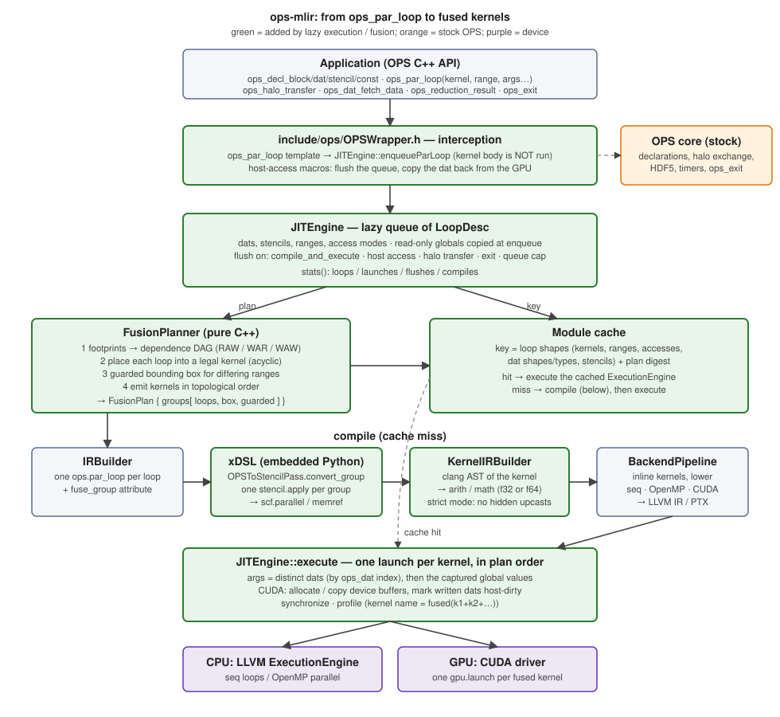
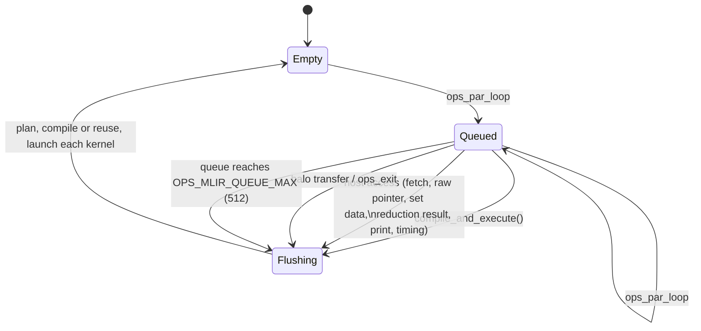
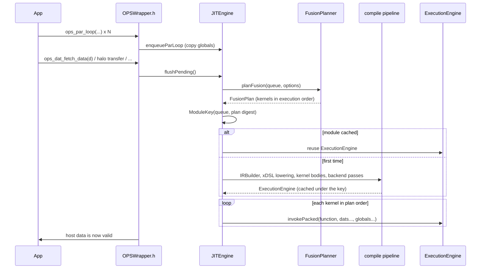
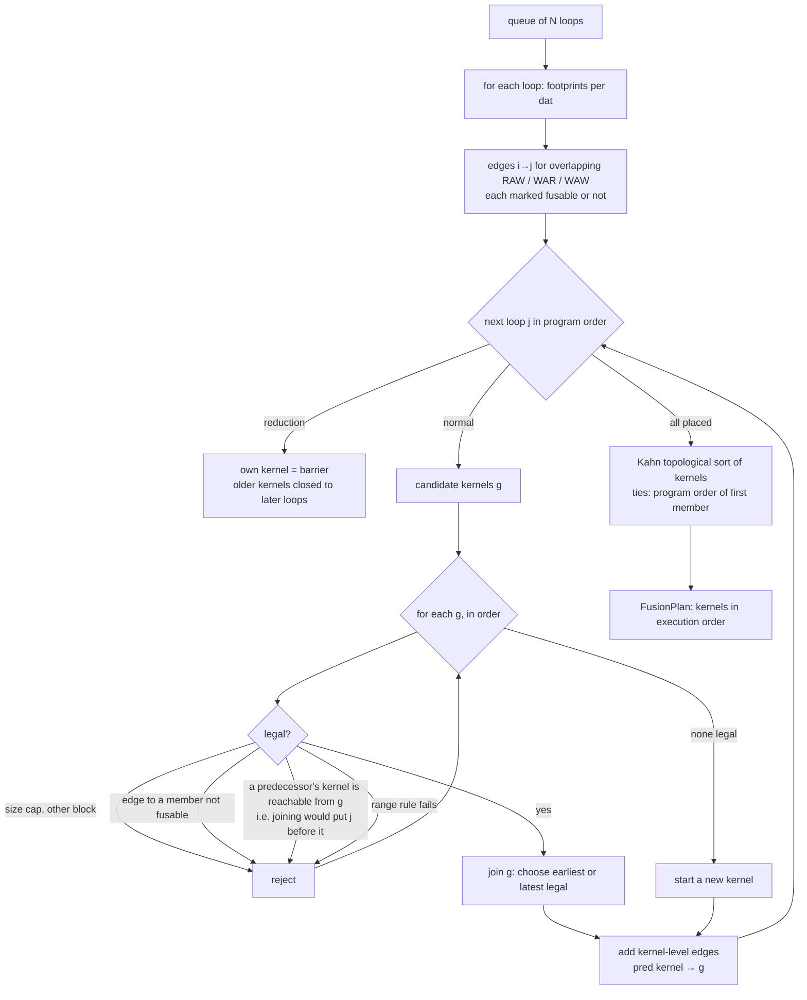
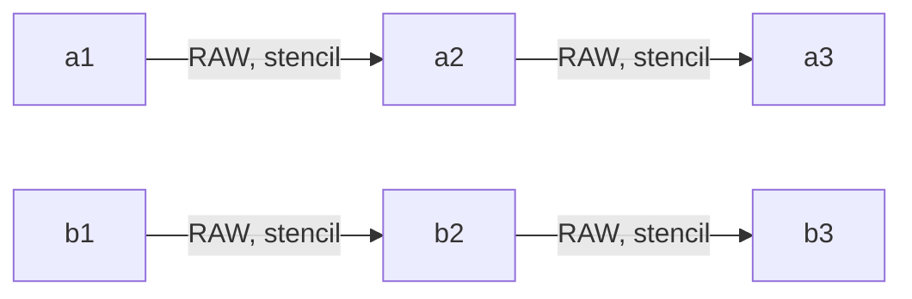

# Lazy execution and loop fusion in ops-mlir

> The whole pipeline, stage by stage with real IR, is in [compilation_flow.md](compilation_flow.md); this document is about the fusion rules.

This document explains how `ops-mlir` turns a stream of `ops_par_loop` calls
into a small number of fused, JIT-compiled kernels: how it fits into OPS, what
the runtime does at every step, how loops are analysed, grouped and reordered,
how a group is lowered to MLIR, and how the result is tested. Measurements on
the Taylor-Green vortex are in [`tgv_evaluation.md`](tgv_evaluation.md).

Contents

1. [Overview](#1-overview)
2. [Where it sits in OPS](#2-where-it-sits-in-ops)
3. [Lazy execution](#3-lazy-execution)
4. [Dependence analysis](#4-dependence-analysis)
5. [The planner](#5-the-planner)
6. [Lowering a fused group](#6-lowering-a-fused-group)
7. [Execution](#7-execution)
8. [Precision](#8-precision)
9. [Configuration reference](#9-configuration-reference)
10. [Testing](#10-testing)
11. [Results in brief](#11-results-in-brief)
12. [Limitations and future work](#12-limitations-and-future-work)

---

## 1. Overview

A structured-mesh time step is dozens of short loops: each reads a few fields,
applies a small kernel, writes a field. Run one by one, every loop streams its
inputs and outputs through memory and pays a launch (GPU) or a parallel-region
(OpenMP) cost. Two loops that touch the same points can often be run as one
pass, doing both computations while the data is in registers.

`ops-mlir` does this in three steps:

1. **Defer.** `ops_par_loop` records the loop instead of running it
   ([§3](#3-lazy-execution)). Nothing executes until the program needs a result.
2. **Plan.** When the queue is flushed, a planner decides which loops run
   together and in what order ([§4](#4-dependence-analysis),
   [§5](#5-the-planner)).
3. **Generate.** Each group of loops becomes one MLIR function with one
   iteration space, compiled for the selected backend, cached, and launched
   once ([§6](#6-lowering-a-fused-group), [§7](#7-execution)).

What can fuse is deliberately conservative: loops are fused only where a value
never has to travel *between* grid points inside the fused kernel
(*point-local* dependences). That is what lets the fused kernel run its points
in any order, in parallel, without synchronisation.



## 2. Where it sits in OPS

OPS normally generates code per application: a source-to-source translator
reads `ops_par_loop` calls and emits one backend-specific function per loop.
`ops-mlir` replaces that with a runtime (JIT) path:

* The application defines `OPS_2D` or `OPS_3D` and includes
  `ops/OPSWrapper.h` **instead of** running the OPS translator. `ops_par_loop`
  is a C++ template there; calling it packs the arguments and calls
  `JITEngine::enqueueParLoop`. The kernel function is only remembered as a
  token; its body is never executed on the host. (The kernel source file is
  registered with `set_kernel_source_file`; the body is read later by
  `KernelIRBuilder`, [§6](#6-lowering-a-fused-group).)
* Everything that is *not* a parallel loop still goes to the stock OPS library
  (`ops_seq`): block/dat/stencil declaration, memory allocation, halo
  exchange, HDF5, timers. `ops_dat` memory is ordinary OPS host memory.
* OPS API calls that let the host **observe or modify** data are wrapped by
  macros in `OPSWrapper.h` so they first flush the queue and, on the GPU, copy
  the dat back ([§3](#3-lazy-execution)).

OPS already has a lazy-execution mode of its own (`OPS_TILING`,
`OPS/ops/c/src/core/ops_lazy.cpp`). It analyses dependences across queued
loops to build *cache-blocking tiles*: loops still run as separate functions,
just tile by tile. This work fuses loops into **single generated kernels**
instead, which removes the intermediate loads/stores and the extra launches.
The dependence analysis is similar in spirit (footprints from ranges and
stencils); the uses differ. The two are independent: ops-mlir does not call
into `ops_lazy.cpp`.

## 3. Lazy execution

The runtime object is `JITEngine` (`include/runtime/JITEngine.h`), a
singleton. Its queue holds one `LoopDesc` per `ops_par_loop`
(`include/runtime/Core.h`): kernel name, range, and for each argument the dat
(index, shape, halo, element size, type string), stencil (offset table, stride),
access mode and, for read-only `ops_arg_gbl`, **a copy of the value**.



Why globals are copied at enqueue time: a program may write
`rkA[stage]` or `dt` between enqueueing a loop and the flush. The loop must see
the value it was enqueued with, exactly as if it had run immediately.

A flush (`JITEngine::compile_and_execute`):



**Module cache.** The key is a text digest of the queue (kernel names, ranges,
argument access modes, dat shapes/types/halos, stencil offsets) plus the plan
digest (e.g. `0,2|1,3|4,5`). A time loop that enqueues the same batch every
step compiles once and then only launches. Values that vary between steps —
read-only globals — are *not* part of the key; they are passed as arguments.
*Extern kernel constants* (`ops_register_kernel_constant`) are the exception:
they are baked into the generated code when the kernel is translated, so they
must not change between steps that share a compiled module
([§12](#12-limitations-and-future-work)).

**Host-access hooks** (`OPSWrapper.h`): `ops_dat_get_raw_pointer`,
`ops_dat_fetch_data*`, `ops_dat_set_data*`, `ops_dat_release_raw_data`,
`ops_get_data`, `ops_print_dat_to_txtfile`, `ops_dat_copy/deep_copy`,
`ops_reduction_result`, `ops_timing_output*`, `ops_halo_transfer`, `ops_exit`.
Reads flush and copy the dat back from the GPU; writes also invalidate the
cached device copy. Code that reads `dat->data` directly must call
`sync_all_host_buffers()` first (it flushes too).

## 4. Dependence analysis

Two loops need an ordering only if they touch the same dat at overlapping
points and at least one writes. The analysis works on **footprints** in OPS
index space:

| quantity | definition |
|---|---|
| write footprint of a loop on dat D | the loop's range (box `[lo,hi)` per dimension) |
| read footprint | the range expanded per dimension by the min/max offset of the stencil: `[lo+minOff, hi+maxOff)` |
| strided / multigrid stencil | treated as unbounded (touches everything) |

For loops *i* before *j* and a dat D touched by both there is a dependence edge
*i → j* when

* **RAW** (flow): *i* writes D, *j* reads D and the write footprint of *i*
  overlaps the read footprint of *j*;
* **WAR** (anti): *i* reads D, *j* writes D, read footprint of *i* overlaps the
  write footprint of *j*;
* **WAW** (output): both write and the write footprints overlap.

Because footprints are boxes, loops that work on different regions of the same
dat (for example a boundary strip and a far interior block) are independent.

An edge is **fusable** if crossing it inside one kernel never needs a value
from a *different* point:

| edge | fusable when |
|---|---|
| RAW *i → j* | every read of D in *j* is point-local (only the zero offset) |
| WAR *i → j* | every read of D in *i* is point-local |
| WAW | both writes are point-local (always true for OPS write stencils) |

Otherwise the edge is a **barrier between kernels**: *j* must run in a later
kernel than *i*. Examples:

```
Jacobi:   Anew = lap5(A)   ;   A = copy(Anew)      WAR on A, lap5 reads A at ±1
                                                   → two kernels (and in-place would race)
Chain:    P = 2*X          ;   Q = lap5(P)         RAW on P, lap5 reads P at ±1
                                                   → two kernels
Pointwise: Y = 2*X         ;   Z = Y + 1           RAW on Y, read at offset 0
                                                   → one kernel, Y forwarded in a register
```

**Reductions are barriers.** A loop that carries a reduction (`ops_arg_gbl`
with a non-read access) is never fused and nothing is moved across it.
(Reductions are lowered for accessor-style kernels — see [cloverleaf.md §2.1](cloverleaf.md) — but fusing them is future work, [§12](#12-limitations-and-future-work).)

## 5. The planner

`include/runtime/FusionPlanner.h`, `lib/runtime/FusionPlanner.cpp`. Pure C++
over `LoopDesc`s; no MLIR or GPU involved, which is why it can be tested with
synthetic input and a randomized oracle ([§10](#10-testing)).

There are two planners with the same legality rules:

* **Consecutive** (`OPS_MLIR_FUSION_REORDER=0`): scans the queue once and
  extends the current kernel with the next loop if it is compatible, else starts
  a new one. Only neighbours can fuse.
* **DAG** (default): builds the dependence graph of [§4](#4-dependence-analysis)
  over the **whole queue** so a loop may join an *earlier* kernel, moving ahead
  of independent loops in between.

### The DAG planner



Details:

* **Acyclicity (convexity).** Kernels form a graph with an edge *h → g* when
  some loop in *g* depends on a loop in *h*. Putting loop *j* into kernel *g*
  is rejected if any predecessor of *j* lives in a kernel *h ≠ g* that *g*
  already reaches — that would require *g* to run both before and after *h*.
  This is exactly the condition under which moving *j* earlier is safe.
* **Placement.** `earliest` (default) joins the first legal kernel, which
  behaves like level scheduling of the dependence chains and finds the most
  fusion; `latest` keeps loops near their program-order neighbours.
* **Range rules.** A kernel has one iteration space. Identical ranges join
  freely. Different ranges need *guarded* fusion: the kernel runs over the
  bounding box and each member executes only at points inside its own range.
  It is allowed only if
  1. `volume(box) ≤ OPS_MLIR_FUSION_BOX_RATIO × Σ member volumes` (a thin strip
     must not drag a full-grid launch along), and
  2. every member whose range is smaller than the box reads **point-locally**.
     A guarded member's inputs are read at every point of the box, not only
     inside its range; a point-local read is always inside the allocation, a
     stencil read could fall outside it. The rule is re-checked against all
     existing members whenever the box grows.
* **Other limits.** Same block and dimensionality; at most
  `OPS_MLIR_FUSION_MAX` (8) loops per kernel, to bound register pressure.
* **Output order.** Kernels are emitted by Kahn's algorithm with ties broken
  by the smallest original loop index, so without constraints the order is the
  program order. Loops inside a kernel are in ascending original order, which
  is a valid execution order because every edge points forward.
* **Safety net.** If the emitted plan ever has fewer kernels than were built
  (a cycle), the planner falls back to the consecutive planner instead of
  dropping work.

### Example

Two independent three-step pipelines, each step a stencil read of the previous
result, enqueued interleaved (`a1 a2 b1 b2 a3 b3`):



| planner | kernels |
|---|---|
| unfused | 6 |
| consecutive | `[a1] [a2 b1] [b2 a3] [b3]` — 4 (5 when the ranges differ as in the test) |
| DAG, earliest | `[a1 b1] [a2 b2] [a3 b3]` — 3; `b1` moved ahead of `a2` |

Every kernel in the DAG plan is a level of the dependence graph. This is the
case `caseReorder` in `tests/e2e/fusion_cases.cpp` checks for real.

### Plan inspection

`OPS_MLIR_PLAN=1` prints, once per distinct queue shape, the kernels, how many
loops moved, the estimated memory traffic (OPS convention: extent × element
size, read and write counted once each, stencil neighbours assumed cached;
fused kernels load each distinct dat at most once and not at all when a member
writes it first) and a histogram of why loops had to start a new kernel
(`dependence`, `order`, `range`, `size`, `block`, `first`).

## 6. Lowering a fused group

Each group becomes one MLIR function. `IRBuilder` first builds one
`ops.par_loop` operation per loop and attaches `fuse_group = <kernel index>`;
the xDSL pass `OPSToStencilPass` (`xdsl_impl/ops_to_stencil.py`,
`convert_group`) merges loops that share an id.

**Signature.** One buffer per *distinct dat* of the group (identified by the OPS
dat index, in order of first appearance), followed by the read-only scalar
globals of every member loop in order. `JITEngine::execute` packs arguments in
exactly this order.

**Body.** A single `stencil.apply` over the group's (normalized) bounding box.
Members are emitted in ascending order; for each:

1. Inputs. For a read at the **zero offset** of a dat that an earlier member of
   the group wrote, the value is **forwarded** (an SSA value, no memory
   access). All other reads are `stencil.access` ops on the input field;
   identical (dat, offset) pairs are created once.
2. A `memref.alloca_scope` holds the member's per-point scratch (index buffer
   for `ops_arg_idx`, the out-struct of a multi-output kernel) and the call to
   the kernel.
3. Results become the current value of each dat the member writes.

The apply returns, per written dat, its final value; the stencil lowering
stores it. Forwarding means an intermediate that is written and immediately
consumed is computed once, kept in a register, and stored once (it stays in
memory because OPS dats are user-visible).

**Guarded members.** A member whose range is smaller than the box is wrapped
as

```
%inside = (idx0 ≥ lo0) ∧ (idx0 < hi0) ∧ …       // stencil.index, arith.cmpi
%r      = scf.if %inside {
             memref.alloca_scope { …call kernel… }   // new value
          } else {
             <previous value of the dat>             // forwarded value or a zero-offset read
          }
```

`stencil.apply` stores every point of its bounds, so outside the member's range
the dat has to be written back with its old value; a guarded write therefore
also adds the dat as an input. Forwarded values use the merged result, so a
later member at a point outside an earlier member's range correctly sees the
old data.

Two pipeline facts this relies on:

* `memref.alloca_scope` must be lowered with its parent region allowed to have
  several blocks, but an `scf.if` region must have exactly one until it is
  lowered to control flow. On CPU the `scf.if` is lowered first. The CUDA
  pipeline needed one extra pass — `scf-to-cf` inside the `gpu.module` before
  `gpu-to-nvvm` (`BackendPipeline.h`).
* The kernel body is translated from C++ by `KernelIRBuilder` (a clang AST
  walker) into `arith`/`math`, then inlined into the loop body, so the fused
  kernel is one flat region the LLVM or NVVM back end can optimise across
  members.

Lowering the stencil dialect (`ConvertStencilToLLMLIRPass`) yields an
`scf.parallel` over the box; the backend pipelines then produce sequential
loops, `omp.parallel` loops, or a `gpu.launch` with 32×4×1 thread blocks.

## 7. Execution

`JITEngine::execute(engine, plan)` iterates the plan's kernels in order. For
each one:

1. Collect the distinct dats, and which of them any member writes.
2. On CUDA: `ensureDeviceBuffer` (allocate and copy host→device on first use).
3. Collect the captured global values (4 or 8 bytes, chosen by `sizeof`).
4. `invokePacked` the generated function; synchronize.
5. Record time under a name like `fused(k1+k2+k3)` and mark written dats
   host-dirty, so the next host access copies them back.

Counters (`JITEngine::stats()`) record loops, launches, flushes and compiles;
`OPS_MLIR_STATS=1` prints them at exit.

## 8. Precision

Dats and scalar globals may be `float` or `double`. The MLIR element type of a
dat comes from the type string passed to `ops_decl_dat`; scalar globals use
`sizeof` (OPS records only the size of an `ops_arg_gbl`). The kernel translator
follows the C++ types: `float`/`double` parameters, results, locals, literals
(typed by their suffix), `truncf`/`extf` where C++ converts, and `sinf`-style
names map onto the same math ops.

C++ silently promotes `0.5 * x` to double when `x` is `float`, and `cos(x)` may
bind to the double overload. A single-precision kernel must not do that — it
costs throughput and changes results. `KernelIRBuilder` warns when a kernel with
only single-precision parameters computes in `f64`, and with
`OPS_MLIR_STRICT_FP=1` it rejects the kernel. The generated single-precision
Taylor-Green vortex (`to_single_precision.py`) converts every floating literal,
type, type-name string, `M_PI` and math call, and the tests prove it with the
strict translator ([§10](#10-testing)).

## 9. Configuration reference

| variable | default | effect |
|---|---|---|
| `OPS_BACKEND` | `cuda` | `seq`, `openmp` or `cuda` |
| `OPS_MLIR_FUSION` | `1` | `0`: one kernel per loop |
| `OPS_MLIR_FUSION_REORDER` | `1` | `0`: only adjacent loops fuse (consecutive planner) |
| `OPS_MLIR_FUSION_PLACEMENT` | `earliest` | `latest`: join the last legal kernel |
| `OPS_MLIR_FUSION_GUARDED` | `1` | `0`: only identical ranges fuse |
| `OPS_MLIR_FUSION_MAX` | `8` | maximum loops per kernel |
| `OPS_MLIR_FUSION_BOX_RATIO` | `1.0` | bounding box volume / summed member volumes |
| `OPS_MLIR_QUEUE_MAX` | `512` | flush automatically at this queue length |
| `OPS_MLIR_STRICT_FP` | unset | reject single-precision kernels that compute in double |
| `OPS_MLIR_PLAN` | unset | print the plan, traffic estimate and blockers per queue shape |
| `OPS_MLIR_STATS` | unset | print loop / launch / flush / compile counts at exit |
| `OPS_MLIR_DUMP_LOWERED` | unset | print the `ops.par_loop` IR and the per-group lowered IR |
| `OPS_GPU_SM`, `OPS_PTXAS_OPTS`, `OPS_MLIR_CUDA_RUNTIME` | | CUDA target, ptxas flags, runtime library |

## 10. Testing

| suite | what it proves |
|---|---|
| `unittests/FusionPlannerTest` | every legality rule on hand-built loops; interleaved chains (DAG needs 3 kernels where adjacent grouping needs 4); footprint independence; barriers; **randomized oracle**: 4000 random 1D programs × 6 planner configurations — the plan, run with fused at-point semantics in plan order, must produce the same data as program order. Removing the convexity check, or treating RAW or WAR as fusable, makes it fail (verified by mutation). |
| `tests/e2e/accessor_cases` (double; seq, OpenMP, CUDA) | the accessor-style kernel path CloverLeaf uses: INC/MIN/MAX reductions (several elements, `r = r + e`, two loops into one handle, a single-point loop that assigns), loops that write 1-D arrays indexed along one axis of a 2-D loop and read them back, and a registered array of structs under a loop bounded by a registered constant (including a changed constant re-translating the kernel). Each case also requires that no loop fell back to the stock implementation. |
| `tests/e2e/fusion_cases` (built for `float` and `double`) | host-reference comparison of every pattern (pointwise chain, stencil RAW with identical and different ranges, Jacobi WAR, boundary setup, multi-output kernels, RW chains, globals, lazy flush, queue cap, module-cache reuse); fused output equals unfused output (bitwise on CPU); exact launch counts; interleaved chains reorder. Run on seq, OpenMP and CUDA, and with fusion off, same-range only, no reordering and latest placement. |
| `unittests/KernelIRBuilderTest`, `kernel-ir-dump` tests | f32 translation: signatures, literal typing, casts, `sinf`, out-structs |
| `apps/c/taylor_green_vortex/check_single_precision.py` | no `double`, unsuffixed literal, `M_PI` or bare math call remains in the generated single-precision sources; all 25 kernels translate under `OPS_MLIR_STRICT_FP=1` with no `f64` in the IR; a **negative control** (plain `double`→`float`) must be rejected, so the check cannot pass by being blind |
| `check_tgv_precision.py` | single-precision fields stay within single-precision distance of double on seq, OpenMP and CUDA |

```bash
ctest --test-dir build                # everything except the fp64-on-GPU check
ctest --test-dir build -L gpu         # fp32 on the GPU
ctest --test-dir build -L gpu-fp64    # fp64 on the GPU (correctness only)
```

## 11. Results in brief

Measured on the Taylor-Green vortex (RTX 4050 laptop GPU; full data and method in
[`tgv_evaluation.md`](tgv_evaluation.md)):

* One Runge-Kutta stage queues 17 loops: 17 kernels unfused, 8 with adjacent-only
  fusion, **6 with the dependence DAG** (3 loops moved).
* Single precision, 128³: **20.9 → 13.7 ms/iteration (1.53×)**; most of it from plain
  fusion (1.44×), reordering adds about 6%. The kernels are memory-bound: the modelled
  traffic drops 1.55× and so does the kernel time. Host overhead is under 4%.
* Double precision on this GPU: only 1.10× (fp64 throughput is the limit).
* On an A100 (cluster node `renyi`, 256³, [`tgv_evaluation_a100.md`](tgv_evaluation_a100.md)) the
  single-precision gain is smaller, **24.2 → 20.0 ms (1.21×)**. Nsight Compute shows why: the largest
  fused kernel moves 2× fewer bytes than its parts but needs 160 registers per thread, so it runs at
  17% occupancy and 30% of peak DRAM throughput and is only 1.48× faster. Double precision gains 1.05×.
* Every configuration reproduces the unfused result bit for bit, on both GPUs.

## 12. Limitations and future work

* **Reductions** are lowered (a contribution per point into a scratch field, then a deterministic
  fold), but the planner still treats them as barriers. In CloverLeaf `calc_dt` has three consecutive
  loops (`calc_dt_kernel`, `calc_dt_kernel_min`, `calc_dt_kernel_get`) that could share a kernel, and
  `field_summary` could join the loops before it. The scratch fields would have to be per group,
  and the fold would then run once per group rather than once per loop.
* **Point-local fusion only.** A stencil consumer cannot join the kernel that
  produces its input: the neighbours of a point are produced by other points.
  Fusing those needs redundant halo computation or tiling with shared memory.
  In the Taylor-Green vortex these stencil chains are what limits the kernel
  count ([evaluation](tgv_evaluation.md)).
* **Greedy placement.** The planner is a heuristic, not an optimal clustering;
  there is no cost model for arithmetic intensity, register pressure (only a
  loop-count cap) or occupancy.
* **Kernel constants.** For kernels in the original `KernelIRBuilder` style,
  `ops_register_kernel_constant` values are read when the kernel is translated; a cached
  module keeps the old value if the constant changes later. Accessor-style kernels
  (CloverLeaf, [cloverleaf.md](cloverleaf.md)) do not have this problem: each constant
  becomes a scalar argument whose value is snapshotted when the loop is enqueued.
  (Read-only `ops_arg_gbl` values never had it.) The registered pointer's type is
  trusted to match the kernel's `extern` declaration.
* **Guarded kernels evaluate a guard per member per point** and add a
  read of the old value; the box-ratio rule bounds the waste but not the
  divergence on GPUs.
* **GPU threads past the end of a range redo the last point** instead of being masked; see
  [compilation_flow.md §14](compilation_flow.md#14-things-found-while-writing-this-and-limits-that-matter).
* **Hazards inside `stencil.apply`.** Correctness of a fused group relies on the
  planner's point-local guarantee; the stencil dialect's buffer semantics would
  otherwise be ambiguous for in-place updates.
* **Flush points are conservative.** Every halo transfer flushes, even one on
  dats the queue does not touch.
