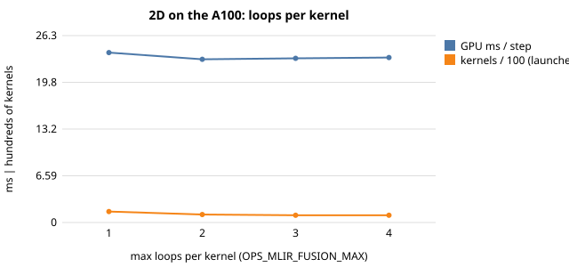
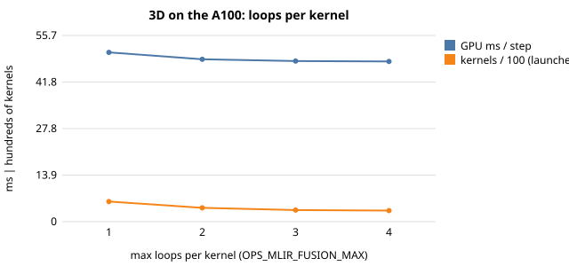
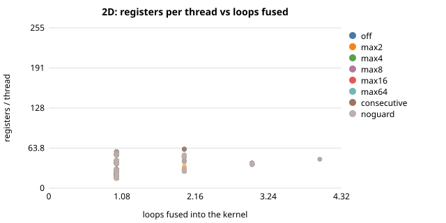
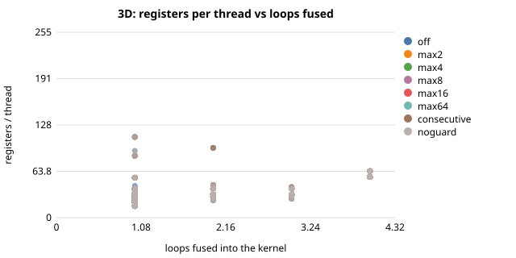
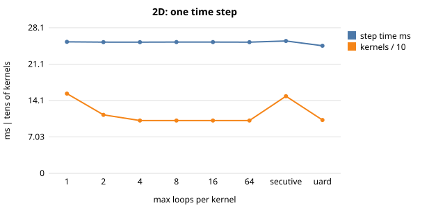
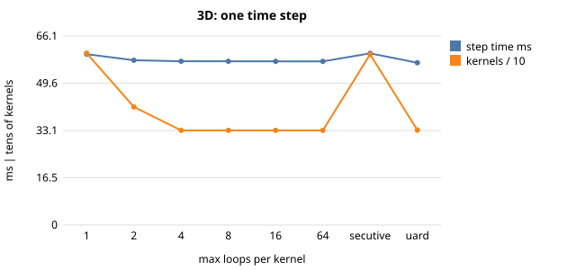

# CloverLeaf on the A100: how much fusion helps, and what limits it

> This is the Simplified Technical English (ASD-STE100) version of [cloverleaf_large.md](../cloverleaf_large.md). Code, listings and numbers are the same as in the original.

The larger decks run on one NVIDIA A100-PCIE-40GB (renyi). They use the CUDA backend and double precision:

| | deck | grid | steps | QA reference |
|---|---|---|---:|---|
| 2D | `clover_bm16_short.in` | 3840² | 87 | test problem 4 |
| 3D | `clover_bm1s_short.in` | 256³ | 87 | test problem 4 |

Every run below gives the stock result (2D `1.582e-11 %`, 3D `2.274e-13 %`, both `PASSED`).
The stock single-thread implementation takes 1063 s (2D) and 1941 s (3D). Other work ran on the node during this
measurement, so use these two numbers as upper bounds. This study follows the [Taylor-Green study](tgv_evaluation_a100.md).
[cloverleaf.md](cloverleaf.md) describes the CloverLeaf port. Raw data is in
`docs/data/clover_large/`. The drivers are `apps/c/cloverleaf_2d/{eval_fusion,ncu_clover,report_large}.py` and
`cluster/job_clover_{repeat,ncu,host,large}.sbatch`.

## Update: with every loop on the GPU

The study below ran when `calc_dt_kernel_min`, `calc_dt_kernel_get` and `field_summary_kernel` still ran as stock loops
on the host. The host also initialised the 1-D coordinate dats. Now the runtime compiles these loops
([cloverleaf.md §2.1](cloverleaf.md)).

The same repeated, interleaved CUDA sweep (3 repetitions, none of our other work
running) now gives the numbers below. Each number is the median per variant of `execute + host-fallback + host-copy`
seconds for the whole run. The data is in `docs/data/clover_allgpu/`. The earlier numbers are in
`docs/data/clover_large/clover_repeat_*.json`.

| deck | | launches | GPU kernel s | host s | host copy s | steady s |
|---|---|---:|---:|---:|---:|---:|
| 2D 3840² | before, unfused | 13 434 | 5.90 | 7.07 | 1.37 | 14.82 |
| | **all on GPU, unfused** | 13 625 | 2.01 | 0 | 0 | **2.46** |
| | all on GPU, `noguard` | 9 179 | 1.92 | 0 | 0 | **2.36** |
| 3D 256³ | before, unfused | 52 383 | 12.71 | 10.94 | 1.88 | 26.23 |
| | **all on GPU, unfused** | 52 577 | 4.55 | 0 | 0 | **5.35** |
| | all on GPU, `noguard` | 29 132 | 4.20 | 0 | 0 | **4.89** |

* The reductions and the setup loops now run on the GPU. This makes the steady-state time of the run 6× shorter (2D) and
  4.9× shorter (3D). This is far more than all the fusion variants together. The GPU kernel time also fell
  (5.9 → 2.0 s, 12.7 → 4.6 s). I did not find the reason. The likely reason is that the earlier figure included
  synchronisation that the host loops forced. I did not measure this.
* The conclusion about fusion stays the same at the new, smaller baseline. The best variant (`noguard`) saves 4 % (2D) and
  9 % (3D) of the steady time (4.5 % and 8 % of the GPU kernel time). Caps of 3–4 loops give 1–6 %. As before, the launch
  counts (−33 % / −45 %) change much more than the time in relative terms. The relative gain is a little larger than
  before because the denominator is smaller.
* All 21 + 21 runs gave a PASSED QA line. The QA value is not bitwise the same as the stock value now (2D: 4.6e-11 %
  against 1.6e-11 % for stock, 3D: 7.4e-11 % against 2.3e-13 %). The reason is that the reductions sum in a different
  order. See cloverleaf.md §4.1.
* Some numbers in the sections below include host-fallback time. These are the `host s` column, the 80 % figure and the
  per-step breakdowns. They describe the previous state. The results for the GPU kernels (registers, occupancy, DRAM
  traffic, plans) did not change, because the GPU kernels are the same.

## Summary

1. **Fusion removes a third to a half of the launches, but only a small part of the time.** The DAG planner changes
   13 434 launches into 8 902 (2D, −34 %) and 52 383 into 28 852 (3D, −45 %). Fusion of adjacent loops only removes
   3 % / 1 %. The steady-state GPU time per step falls by 2.9–3.9 % (2D) and 4.1–5.3 % (3D) for caps of 2–4 loops. The
   default cap of 8 gives the same plan as 4.
2. **Dependences limit the groups, not the size cap.** The largest generated kernel has 3 loops (2D) and 4 (3D).
   A cap of 3 (2D) or 4 (3D) gives exactly the same plan as a cap of 64.
3. **The default planner does not reduce the memory traffic here. It increases the traffic a little.** The measured DRAM
   traffic per step goes from 24.7 to 25.2 GB (2D, +2.2 %) and from 49.0 to 47.9 GB (3D, −2.2 %). The own estimate of the
   planner for 2D is 0.98×. Fused loops still store every intermediate value (nothing removes dead temporary values). So
   the plan saves only re-reads.
4. **Guarded fusion costs more than it saves. `noguard` (only loops with identical ranges fuse) is the best setting.**
   The count of GPU kernels is almost the same (103 against 102, 332 against 331). `noguard` moves 3.3 % (2D) and 5.5 % (3D)
   less data than unfused. It is the fastest variant on both decks (GPU −5.6 % and −7.6 % per step).
5. **Register pressure is not the limit.** The largest register count of any GPU kernel is 62 (2D) and 111 (3D) of 255.
   No GPU kernel reaches 128. The time-weighted mean rises only from 35 to 39 (2D) and from 41 to 45 (3D). One GPU kernel
   uses many registers: `viscosity_kernel` (111 registers, 24 % occupancy in 3D, 7 % of the step). The planner does
   not fuse it with any other loop.
6. **Something else dominates the end-to-end time: the reductions that stay on the host.** The GPU kernels take 23–24 ms
   (2D) and 48–51 ms (3D) per step. The host-fallback loops take 91 ms and 130 ms. The GPU kernels are 20 % / 27 % of the
   step. So the whole-step gain from fusion is only 0.5–2.2 %. Section 4 gives the details.

## 1. Method and two measurement mistakes

**Per-step time at steady state.** The method has these steps for each distinct launch (same generated kernel and same
fused loops) or each host loop. Take the median time over the run. Multiply it by the number of times that it runs. Divide it
by the 87 steps.

Drop the items that run fewer than 5 times (one-time grid setup). Keep the periodic work
(`field_summary` every 10 steps).

The timings are the timings of the runtime itself (launch plus stream synchronisation). `OPS_MLIR_LAUNCH_LOG` records them
for each launch. An average over the whole run is wrong for this comparison. The first launch of every compiled module costs
≈ 0.8–0.9 s (it loads the code of the module). A setting that creates more modules pays more of this cost.

**Nsight Compute** profiles one time step (step 3) for each setting with `ncu`. The option is
`--target-processes application-only`. The JIT starts `ptxas` for every module, and the trace of these child processes made
the profile very slow.

The method matches each profiled CUDA kernel to the launch log of the runtime by order. It checks the name of every kernel
against the log. There were no mismatches.

This match shows which loops the planner fuses in a kernel. So it gives the registers, the
occupancy and the traffic of the kernel for these loops. Nsight locks the clocks. So its step time is ≈ 6 % (2D) to 20 % (3D)
above the steady-state figure of the runtime.

**What went wrong the first time.** The first CUDA sweep ran at the same time as the single-thread stock baseline. Both ran
on the same node.

Other users also share renyi. The host-fallback loops took 14.6 s instead of 7.0 s. The 3D variants differed
by up to 40 % at identical launch counts. This is contention and not an effect of fusion.

The sweep ran again with none of our other work running. It had three repetitions interleaved round-robin. The spread between
repetitions is below ≈ 1 %.

The OpenMP numbers below are single runs (the stock baseline did not run any more). Use a margin
of ±5 % when you read them.

## 2. How many generated kernels, and how big

(The two series are the steady-state GPU time per step and the GPU kernels per step, divided by 100.)

The appendix gives the launch counts and the group sizes. A change from "no fusion" (1) to a cap of 2 gives most of the
reduction of launches and most of the time gain. The launch count goes 13 434 → 9 773 in 2D and
52 383 → 36 002 in 3D. In 2D a cap of 3 reaches the limit of the plan. In 3D a cap of 4 reaches it.

## 3. Register pressure and occupancy (Nsight Compute)

* The registers per thread grow with the number of fused loops, but slowly. In 2D the mean is 30 → 42 → 38 for 1, 2, 3
  loops. In 3D it is 22 → 34 → 32 → 58 for 1–4 loops. The 4-loop 3D kernels are small halo updates, so they are not
  representative.
* No GPU kernel comes near the limit of 255 registers. For the GPU kernels that matter, the registers limit the occupancy to
  4–16 blocks per SM. The time-weighted achieved occupancy goes 68 → 66 % (2D) and 61 → 59 % (3D). Bandwidth limits the GPU
  kernels, not occupancy (the big ones reach 70–82 % of peak DRAM throughput).
* **The local-memory traffic does not come from register spills.** It is the same, ≈ 4.1·10⁸ sectors per 2D step, for every
  fusion setting, in GPU kernels that use 22–58 registers. The most probable source is the per-thread buffer through which
  multi-output GPU kernels return their results (it is largest in the two-output `advec_cell_kernel4_{x,y}dir`). I did not
  confirm this. It costs L1 traffic, not DRAM traffic.
* **`viscosity_kernel` shows the register pressure.** 58 registers (2D) and 111 (3D) limit it to 8 and 4 blocks per SM.
  Its achieved occupancy is 46 % / 24 % and it reaches only 22 % / 19 % of peak DRAM throughput. In 3D it takes 4.2 ms of a
  57 ms step. It is the largest single kernel. Fusion cannot help it. A split or a tuning of the GPU kernel can possibly help.

## 4. What limits the whole step

Per-step time on the A100 at steady state (minimum of 3 repetitions, default planner):

| | GPU kernels | host-fallback loops (including copies) | total |
|---|---:|---:|---:|
| 2D, 3840² | 23.3 ms | 91.3 ms | 114.5 ms |
| 3D, 256³ | 47.9 ms | 130.3 ms | 178.2 ms |

Two loops stay on the stock implementation: the time-step reduction (`calc_dt_kernel_min`) and the field summary
(`field_summary_kernel`, every 10 steps).

In one breakdown run they are 94 % of the host-loop time in 2D. The numbers are 3.9 s + 2.8 s of 7.1 s, plus 1.7 s of
device-to-host copies, against 5.4 s of GPU kernel time. In 3D they are 86 %. The numbers are 4.6 s + 4.9 s of 11.0 s, plus
1.9 s of copies, against 12.1 s.

The GPU kernels are only 20 % (2D) and 27 % (3D) of the step. So a change of these two reductions to the GPU is worth far more
than any fusion setting measured here. Nobody did this work.

## 5. Other backends and compilation

OpenMP, 16 threads (single runs): GPU+host takes 14.7 s / 26.2 s on the A100 against 75 s / 132 s on 16 CPU threads.

The effect of fusion on the `openmp` backend, per kernel time of the whole run: `noguard` −6.2 % (2D) and −7.0 % (3D). The
default plan gives +1.3 % (2D) and −8.0 % (3D). `consecutive` gives +7.1 % and +3.2 %.

The 2D default result is within the
±5 % margin of zero. The CUDA compile time falls with the count of GPU kernels: 43 → 38 s (2D) and 86 → 71 s (3D).

## 6. What this suggests

* The traffic model of the planner already predicts "no gain" (2D: 0.98×). The planner can use the model: it accepts a
  guarded fusion only when the estimated traffic falls. This gives the `noguard` result without a manual switch. We did not
  implement this.
* A fusion that removes dead temporary values, or a multi-output return that stays in registers, are the next steps for the
  traffic. Neither exists.
* If the runtime runs the reductions on the device (section 4), the gain for the end-to-end time is probably larger than the
  gain from all of the above.

## Appendix: full tables

## Timing

### 2D: 2D, 3840², `clover_bm16_short.in`

Stock implementation, one thread: **1063 s** wall time, QA 1.582e-11 % (PASSED).

**CUDA (A100)** -- 3 interleaved repetitions: minimum (median)

| variant | launches | kernel s | host loops s | host copies s | GPU+host s | vs off | compile s | QA |
|---|---:|---:|---:|---:|---:|---:|---:|---|
| off | 13434 | 5.88 (5.90) | 7.06 (7.07) | 1.35 (1.37) | 14.70 (14.82) | +0.0% (kernel) | 43 | 1.582e-11 |
| max2 | 9773 | 5.52 (5.52) | 7.02 (7.05) | 1.36 (1.37) | 14.30 (14.35) | -6.2% (kernel) | 39 | 1.582e-11 |
| max3 | 8902 | 5.45 (5.46) | 7.04 (7.04) | 1.36 (1.36) | 14.24 (14.24) | -7.4% (kernel) | 38 | 1.582e-11 |
| max4 | 8902 | 5.45 (5.47) | 7.01 (7.06) | 1.35 (1.36) | 14.24 (14.26) | -7.3% (kernel) | 38 | 1.582e-11 |
| consecutive | 12999 | 5.80 (5.86) | 7.02 (7.04) | 1.35 (1.36) | 14.59 (14.68) | -1.4% (kernel) | 43 | 1.582e-11 |
| noguard | 8989 | 5.41 (5.46) | 7.00 (7.01) | 1.36 (1.36) | 14.16 (14.22) | -8.0% (kernel) | 38 | 1.582e-11 |
| ratio16 | 8902 | 5.49 (5.51) | 7.00 (7.01) | 1.35 (1.36) | 14.25 (14.37) | -6.7% (kernel) | 38 | 1.582e-11 |

**OpenMP (16 threads)**

| variant | launches | kernel s | host loops s | host copies s | GPU+host s | vs off | compile s | QA |
|---|---:|---:|---:|---:|---:|---:|---:|---|
| off | 13434 | 65.92 | 9.39 | 0.00 | 75.43 | +0.0% (kernel) | 28 | 1.582e-11 |
| max2 | 9773 | 65.71 | 9.39 | 0.00 | 75.22 | -0.3% (kernel) | 27 | 1.582e-11 |
| max8 | 8902 | 66.75 | 9.40 | 0.00 | 76.27 | +1.3% (kernel) | 26 | 1.582e-11 |
| consecutive | 12999 | 70.62 | 9.41 | 0.00 | 80.15 | +7.1% (kernel) | 28 | 1.582e-11 |
| noguard | 8989 | 61.82 | 9.42 | 0.00 | 71.35 | -6.2% (kernel) | 26 | 1.582e-11 |
| ratio16 | 8902 | 67.85 | 9.47 | 0.00 | 77.44 | +2.9% (kernel) | 26 | 1.582e-11 |

**CUDA (A100): time per time step at steady state** (median per distinct launch x its count, minimum (median) of 3 repetitions)

| variant | GPU launches ms/step | host loops ms/step | total ms/step | vs off |
|---|---:|---:|---:|---:|
| off | 23.9 (24.3) | 91.4 (92.1) | 115.3 (116.6) | +0.0% (GPU) / +0.0% (total) |
| max2 | 23.0 (23.2) | 91.4 (91.6) | 114.6 (114.7) | -3.9% (GPU) / -0.6% (total) |
| max3 | 23.1 (23.2) | 91.6 (91.8) | 114.7 (115.0) | -3.4% (GPU) / -0.5% (total) |
| max4 | 23.3 (23.3) | 91.3 (91.6) | 114.5 (114.9) | -2.9% (GPU) / -0.7% (total) |
| consecutive | 24.0 (24.2) | 91.5 (91.6) | 115.5 (115.8) | +0.1% (GPU) / +0.2% (total) |
| noguard | 22.6 (22.6) | 91.3 (91.5) | 114.0 (114.7) | -5.6% (GPU) / -1.2% (total) |
| ratio16 | 23.6 (23.7) | 91.4 (91.4) | 115.0 (115.1) | -1.5% (GPU) / -0.3% (total) |

**2D: launches by number of loops fused** (whole run, seconds are launch + sync)

| variant | 1 loop | 2 loops | 3 loops | 4 loops | 5 loops | 6 loops | 7 loops | 8 loops | >8 | largest |
|---|---:|---:|---:|---:|---:|---:|---:|---:|---:|---:|
| off | 13434 | 0 | 0 | 0 | 0 | 0 | 0 | 0 | 0 | 1 |
| consecutive | 12738 | 174 | 0 | 87 | 0 | 0 | 0 | 0 | 0 | 4 |
| noguard | 5588 | 2357 | 1044 | 0 | 0 | 0 | 0 | 0 | 0 | 3 |
| max2 | 6112 | 3661 | 0 | 0 | 0 | 0 | 0 | 0 | 0 | 2 |
| max3 | 5501 | 2270 | 1131 | 0 | 0 | 0 | 0 | 0 | 0 | 3 |
| max4 | 5501 | 2270 | 1131 | 0 | 0 | 0 | 0 | 0 | 0 | 3 |
| ratio16 | 5501 | 2270 | 1131 | 0 | 0 | 0 | 0 | 0 | 0 | 3 |

### 3D: 3D, 256³, `clover_bm1s_short.in`

Stock implementation, one thread: **1941 s** wall time, QA 2.274e-13 % (PASSED).

**CUDA (A100)** -- 3 interleaved repetitions: minimum (median)

| variant | launches | kernel s | host loops s | host copies s | GPU+host s | vs off | compile s | QA |
|---|---:|---:|---:|---:|---:|---:|---:|---|
| off | 52383 | 12.71 (12.71) | 10.94 (10.94) | 1.88 (1.88) | 26.22 (26.23) | +0.0% (kernel) | 86 | 2.274e-13 |
| max2 | 36002 | 12.03 (12.05) | 10.94 (10.94) | 1.86 (1.87) | 25.49 (25.50) | -5.3% (kernel) | 76 | 2.274e-13 |
| max3 | 30205 | 12.04 (12.05) | 10.94 (10.94) | 1.85 (1.87) | 25.47 (25.48) | -5.2% (kernel) | 72 | 2.274e-13 |
| max4 | 28852 | 12.06 (12.07) | 10.94 (10.94) | 1.86 (1.87) | 25.54 (25.54) | -5.1% (kernel) | 71 | 2.274e-13 |
| consecutive | 52035 | 12.73 (12.74) | 10.94 (10.96) | 1.88 (1.88) | 26.26 (26.27) | +0.2% (kernel) | 86 | 2.274e-13 |
| noguard | 28939 | 11.96 (11.97) | 10.93 (10.94) | 1.86 (1.87) | 25.39 (25.40) | -5.9% (kernel) | 71 | 2.274e-13 |
| ratio16 | 28852 | 12.05 (12.05) | 10.94 (10.95) | 1.86 (1.87) | 25.49 (25.49) | -5.2% (kernel) | 71 | 2.274e-13 |

**OpenMP (16 threads)**

| variant | launches | kernel s | host loops s | host copies s | GPU+host s | vs off | compile s | QA |
|---|---:|---:|---:|---:|---:|---:|---:|---|
| off | 52383 | 117.24 | 14.29 | 0.00 | 131.85 | +0.0% (kernel) | 48 | 2.274e-13 |
| max2 | 36002 | 110.78 | 14.30 | 0.00 | 125.38 | -5.5% (kernel) | 44 | 2.274e-13 |
| max8 | 28852 | 107.81 | 14.28 | 0.00 | 122.40 | -8.0% (kernel) | 41 | 2.274e-13 |
| consecutive | 52035 | 120.96 | 14.29 | 0.00 | 135.55 | +3.2% (kernel) | 47 | 2.274e-13 |
| noguard | 28939 | 108.99 | 14.33 | 0.00 | 123.61 | -7.0% (kernel) | 41 | 2.274e-13 |
| ratio16 | 28852 | 107.94 | 14.26 | 0.00 | 122.48 | -7.9% (kernel) | 41 | 2.274e-13 |

**CUDA (A100): time per time step at steady state** (median per distinct launch x its count, minimum (median) of 3 repetitions)

| variant | GPU launches ms/step | host loops ms/step | total ms/step | vs off |
|---|---:|---:|---:|---:|
| off | 50.6 (50.7) | 130.3 (130.4) | 181.0 (181.0) | +0.0% (GPU) / +0.0% (total) |
| max2 | 48.6 (48.6) | 130.2 (130.3) | 178.8 (178.9) | -4.1% (GPU) / -1.2% (total) |
| max3 | 48.0 (48.1) | 130.1 (130.4) | 178.1 (178.4) | -5.1% (GPU) / -1.6% (total) |
| max4 | 47.9 (47.9) | 130.3 (130.4) | 178.2 (178.4) | -5.3% (GPU) / -1.5% (total) |
| consecutive | 51.3 (51.3) | 130.5 (130.7) | 181.8 (182.0) | +1.4% (GPU) / +0.4% (total) |
| noguard | 46.8 (46.8) | 130.2 (130.3) | 177.0 (177.0) | -7.6% (GPU) / -2.2% (total) |
| ratio16 | 47.9 (47.9) | 130.3 (130.4) | 178.2 (178.3) | -5.4% (GPU) / -1.5% (total) |

**3D: launches by number of loops fused** (whole run, seconds are launch + sync)

| variant | 1 loop | 2 loops | 3 loops | 4 loops | 5 loops | 6 loops | 7 loops | 8 loops | >8 | largest |
|---|---:|---:|---:|---:|---:|---:|---:|---:|---:|---:|
| off | 52383 | 0 | 0 | 0 | 0 | 0 | 0 | 0 | 0 | 1 |
| consecutive | 51774 | 174 | 87 | 0 | 0 | 0 | 0 | 0 | 0 | 3 |
| noguard | 16215 | 3573 | 7582 | 1569 | 0 | 0 | 0 | 0 | 0 | 4 |
| max2 | 19621 | 16381 | 0 | 0 | 0 | 0 | 0 | 0 | 0 | 2 |
| max3 | 17265 | 3702 | 9238 | 0 | 0 | 0 | 0 | 0 | 0 | 3 |
| max4 | 16128 | 3486 | 7669 | 1569 | 0 | 0 | 0 | 0 | 0 | 4 |
| ratio16 | 16128 | 3486 | 7669 | 1569 | 0 | 0 | 0 | 0 | 0 | 4 |

## Nsight Compute

### 2D: one steady-state time step under Nsight Compute

| variant | kernels | step time ms | DRAM MB | time-weighted regs | max regs | time-weighted occupancy | kernels ≥ 128 regs | local-memory sectors |
|---|---:|---:|---:|---:|---:|---:|---:|---:|
| off | 154 | 25.40 | 24693 | 35 | 58 | 68% | 0 | 4.08e+08 |
| max2 | 113 | 25.34 | 25312 | 38 | 62 | 67% | 0 | 4.08e+08 |
| max4 | 102 | 25.34 | 25228 | 39 | 62 | 66% | 0 | 4.08e+08 |
| max8 | 102 | 25.36 | 25230 | 39 | 62 | 66% | 0 | 4.08e+08 |
| max16 | 102 | 25.35 | 25230 | 39 | 62 | 66% | 0 | 4.08e+08 |
| max64 | 102 | 25.34 | 25230 | 39 | 62 | 66% | 0 | 4.08e+08 |
| consecutive | 149 | 25.57 | 25179 | 39 | 62 | 64% | 0 | 4.08e+08 |
| noguard | 103 | 24.64 | 23870 | 37 | 58 | 68% | 0 | 3.93e+08 |

The table pools all variants. It groups the GPU kernels by the number of loops in the kernel:

| loops fused | kernels | mean regs | max regs | mean occupancy | mean µs | DRAM MB / kernel |
|---:|---:|---:|---:|---:|---:|---:|
| 1 | 688 | 30 | 58 | 28% | 238 | 225.2 |
| 2 | 174 | 42 | 62 | 10% | 166 | 200.1 |
| 3 | 64 | 38 | 40 | 6% | 119 | 122.9 |
| 4 | 1 | 46 | 46 | 52% | 1986 | 2389.3 |

The ten slowest GPU kernels of the default setting (`max8`):

| loops fused | µs | regs | limit by regs | occupancy | DRAM util | DRAM MB | members |
|---:|---:|---:|---:|---:|---:|---:|---|
| 3 | 1770 | 40 | 12 | 67% | 71% | 1951 | advec_mom_kernel_y2, ideal_gas_kernel, reset_field_kernel1 |
| 1 | 1725 | 58 | 8 | 46% | 22% | 586 | viscosity_kernel |
| 2 | 1541 | 62 | 8 | 46% | 82% | 1962 | accelerate_kernel, revert_kernel |
| 1 | 1453 | 40 | 12 | 64% | 74% | 1661 | advec_cell_kernel4_ydir |
| 1 | 1439 | 40 | 12 | 64% | 74% | 1656 | advec_cell_kernel4_xdir |
| 2 | 1421 | 43 | 10 | 56% | 80% | 1773 | PdV_kernel_predict, ideal_gas_kernel |
| 1 | 1348 | 41 | 10 | 60% | 81% | 1699 | PdV_kernel_nopredict |
| 1 | 904 | 55 | 9 | 51% | 75% | 1060 | calc_dt_kernel |
| 1 | 869 | 40 | 12 | 70% | 35% | 467 | advec_mom_kernel1_x_nonvector |
| 1 | 869 | 40 | 12 | 70% | 35% | 467 | advec_mom_kernel1_x_nonvector |

### 3D: one steady-state time step under Nsight Compute

| variant | kernels | step time ms | DRAM MB | time-weighted regs | max regs | time-weighted occupancy | kernels ≥ 128 regs | local-memory sectors |
|---|---:|---:|---:|---:|---:|---:|---:|---:|
| off | 601 | 59.74 | 49009 | 41 | 111 | 61% | 0 | 7.44e+08 |
| max2 | 413 | 57.64 | 47940 | 43 | 111 | 60% | 0 | 6.86e+08 |
| max4 | 331 | 57.27 | 47866 | 45 | 111 | 59% | 0 | 6.86e+08 |
| max8 | 331 | 57.26 | 47933 | 45 | 111 | 59% | 0 | 6.86e+08 |
| max16 | 331 | 57.24 | 47840 | 45 | 111 | 59% | 0 | 6.86e+08 |
| max64 | 331 | 57.23 | 47895 | 45 | 111 | 59% | 0 | 6.86e+08 |
| consecutive | 597 | 60.04 | 49768 | 42 | 111 | 60% | 0 | 7.44e+08 |
| noguard | 332 | 56.76 | 46292 | 43 | 111 | 61% | 0 | 6.69e+08 |

The table pools all variants. It groups the GPU kernels by the number of loops in the kernel:

| loops fused | kernels | mean regs | max regs | mean occupancy | mean µs | DRAM MB / kernel |
|---:|---:|---:|---:|---:|---:|---:|
| 1 | 2346 | 22 | 111 | 35% | 156 | 127.6 |
| 2 | 391 | 34 | 96 | 31% | 161 | 150.4 |
| 3 | 440 | 32 | 42 | 29% | 72 | 57.9 |
| 4 | 90 | 58 | 64 | 28% | 26 | 9.6 |

The ten slowest GPU kernels of the default setting (`max8`):

| loops fused | µs | regs | limit by regs | occupancy | DRAM util | DRAM MB | members |
|---:|---:|---:|---:|---:|---:|---:|---|
| 1 | 4234 | 111 | 4 | 24% | 19% | 1238 | viscosity_kernel |
| 1 | 2656 | 40 | 12 | 68% | 70% | 2890 | PdV_kernel_nopredict |
| 2 | 2496 | 96 | 5 | 29% | 72% | 2807 | accelerate_kernel, revert_kernel |
| 3 | 2157 | 42 | 10 | 54% | 76% | 2550 | ideal_gas_kernel, reset_field_kernel1, reset_field_kernel2 |
| 2 | 2050 | 45 | 10 | 57% | 78% | 2492 | PdV_kernel_predict, ideal_gas_kernel |
| 1 | 1715 | 40 | 12 | 65% | 74% | 1969 | advec_cell_kernel4_zdir |
| 1 | 1667 | 40 | 12 | 63% | 74% | 1916 | advec_cell_kernel4_ydir |
| 1 | 1666 | 40 | 12 | 64% | 74% | 1919 | advec_cell_kernel4_xdir |
| 1 | 1354 | 85 | 5 | 29% | 71% | 1505 | calc_dt_kernel |
| 3 | 1147 | 26 | 16 | 85% | 63% | 1120 | advec_cell_kernel2_zdir, advec_mom_kernel_x2 |

