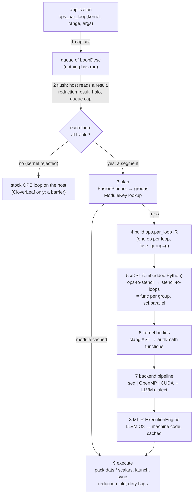

# From an OPS loop to a running kernel: the ops-mlir compilation flow

> This is the Simplified Technical English (ASD-STE100) version of [compilation_flow.md](../compilation_flow.md). Code, listings and numbers are the same as in the original.

This document follows one `ops_par_loop` call through every stage that changes it to machine code. It shows the artefact that each stage makes.
All listings are **real output** of this repository. The commands are in [§13](#13-inspect-each-stage). The listings come from two applications:

* **Taylor-Green vortex (TGV)**: a 3-D Navier–Stokes solver that OpenSBLI generates (`apps/c/taylor_green_vortex`).
  It has 26 loop sites and 25 user kernels. It uses the older *pointer style* of OPS. In this style, each stencil point is one scalar argument.
  The user kernel gives its results through a return value or an out-struct. The listings show `N = 16` (the dats are 26×26×28 doubles) and the `seq` backend, unless the text says different.
* **CloverLeaf 2D**: the unmodified OPS port (`apps/c/cloverleaf_2d`). It has 82 user kernels. They use `ACC<T>` *accessors* (`density(0,-1)`),
  control flow that depends on the data, reductions and registered constants. The listings show its small default deck (10×2 cells, so the dats are 11×20 doubles).

The two styles need two different translators for user kernels (§8). This is why both appear. The planner, the xDSL pass and the backends are the same for both styles.
These documents give more information: [loop_fusion.md](loop_fusion.md) (the fusion rules in detail) and [cloverleaf.md](cloverleaf.md) (the CloverLeaf port and the checks of its correctness).

The listings use these short forms. `!F` is the type `!stencil.field<[0,26]x[0,26]x[0,28]xf64>` of the dat that the text discusses. This type is long.

A pointer value in an attribute shows as `<ptr>`. The mark `…` shows removed lines. The `//` comments in the IR listings are notes that the authors added for this document. MLIR does not print comments.

## 1. The whole flow on one page



| # | stage | code | in → out | when it runs |
|---|---|---|---|---|
| 1 | capture | `ops_par_loop` in `include/ops/OPSWrapper.h`, `JITEngine::enqueueParLoop` | OPS call → `LoopDesc` | every call. It takes microseconds. |
| 2 | flush and segment | `compile_and_execute`, `runsOnHost` | queue → segments of loops that the JIT can compile | at an OPS call that reads a result on the host |
| 3 | plan | `planFusion` (`FusionPlanner.cpp`), `ModuleKey` | segment → groups of loops | one time for each different queue shape |
| 4 | IR build | `IRBuilder::buildModule` | groups → `ops.par_loop` operations | on a cache miss |
| 5 | xDSL | `xdsl_impl/ops_to_stencil.py`, `ops_to_xdsl.py` | `ops.par_loop` → `func`/`scf.parallel` over `memref` | on a cache miss |
| 6 | user kernels | `KernelIRBuilder.cpp` (pointer style), `AccessorKernel.cpp` (accessor style) | user kernel in C++ → `func` of scalars | on a cache miss |
| 7 | lower for the backend | `BackendPipeline.h` | + inline the calls, loops → `scf`/`omp`/`gpu` → LLVM dialect | on a cache miss |
| 8 | engine | `JITEngine::createEngine` | LLVM dialect → machine code (the GPU fatbin is already part of the module) | on a cache miss |
| 9 | run | `JITEngine::execute` | group + dat pointers → launch | every flush |

A cache miss is the slow path. Stages 4–8 take seconds. For example, they take 2.6 s for the TGV queue below and 28–43 s for the six different queues of a CloverLeaf run
([§10](#10-stage-8--the-engine-the-caches-and-the-compile-cost)). A cache hit goes directly from the plan to stage 9.

## 2. The loops that the examples use

| loop | app | what it shows |
|---|---|---|
| `Kernel008/010/012/019/025` | TGV | five point-wise loops (`u = ρu/ρ` ×3, pressure, temperature). They fuse into **one generated kernel with forwarded values** (§5, §7.3, §9) |
| `Kernel007`, `011/014/015` | TGV | 4-point derivative stencils. Three loops fuse, but the planner *moved* one loop before another loop (§5, §7.4) |
| `Kernel039` | TGV | `ops_arg_idx` and an out-struct with five outputs (§7.5, §8.1) |
| `Kernel040` | TGV | Runge–Kutta update with `OPS_RW` dats and the scalars `rkA` and `rkB` for each stage (§7.6) |
| `ideal_gas_kernel` | CloverLeaf | the simplest user kernel in accessor style. It reads an output that it just wrote (§8.2) |
| `revert_kernel` + `accelerate_kernel` | CloverLeaf | they fuse, but their **ranges are different** (a *guarded* member). The user kernel reads `dt` as a registered constant (§5, §7.7) |
| `advec_cell_kernel3_xdir` | CloverLeaf | offsets that depend on data: `density1(donor,0)` (§8.3) |
| `calc_dt_kernel_min` | CloverLeaf | a **reduction** (§7.9, §11.3) |
| `initialise_chunk_kernel_xx` | CloverLeaf | a 2-D loop that **writes a 1-D array** (§7.8) |
| `generate_chunk_kernel` | CloverLeaf | `states[i].energy`, an array of structs that the application registers as a constant (§8.4) |

## 3. Stage 1 — capture

### 3.1 What the application does

An application for ops-mlir includes `ops/OPSWrapper.h` and does not use the OPS source-to-source translator.
It tells the runtime where the source of the user kernels is and which globals the user kernels read:

```cpp
set_kernel_source_file(dir + "/opensbliblock00_kernels.h");   // TGV: where to read kernel C++ from
ops_register_kernel_constant("gama", &gama);                  // a global the kernels read by name
```

CloverLeaf needs no change to its source code. Its build puts `apps/c/cloverleaf_2d/shim/ops_seq_v2.h` first on the include path. This header does three things:

1. It renames the stock OPS `ops_par_loop` to `ops_par_loop_stock`.
2. It includes the wrapper.
3. It changes `ops_decl_const` to "declare to OPS *and* register for the JIT".

`main_wrapper.cpp` registers the headers of the user kernels and the headers that these user kernels need (`set_kernel_preamble`).

### 3.2 What `ops_par_loop` does

Here is a TGV loop, `u0 = rhou0 / rho`, over the whole 3-D block with a halo of 2 cells:

```cpp
int iteration_range_8_block0[] = {-2, block0np0 + 2, -2, block0np1 + 2, -2, block0np2 + 2};
ops_par_loop(opensbliblock00Kernel008, "opensbliblock00Kernel008", opensbliblock00, 3,
             iteration_range_8_block0,
    ops_arg_dat(rho_B0,   1, stencil_0_00_00_00_3, "double", OPS_READ),
    ops_arg_dat(rhou0_B0, 1, stencil_0_00_00_00_3, "double", OPS_READ),
    ops_arg_dat(u0_B0,    1, stencil_0_00_00_00_3, "double", OPS_WRITE));
```

`ops_par_loop` is a C++ template in the wrapper. It does **not** call the user kernel. It does these steps:

1. It packs the `ops_arg`s. It takes the **address of the user kernel** as the identity of the loop (`kernel_ptr`).
   The label string cannot be the identity, because CloverLeaf gives the label `"update_halo_kernel1"` to about 12 different user kernels.
   The runtime uses `dladdr` to find the function name from the address (the executables link with `-rdynamic`). The runtime also uses this name to find the user kernel in the kernel source.
2. It finds the element type of every `ops_arg_gbl` argument and every reduction argument from the types of the parameters of the user kernel.
   OPS records only `sizeof(T)`, and `sizeof(T)` cannot show the difference between `int` and `float`.
3. In a CloverLeaf build, it also stores a **fallback**. The fallback can run the same loop as a stock loop with the stock OPS code.
4. It calls `JITEngine::enqueueParLoop`. This function builds a `LoopDesc` (below) and adds it to the queue.

### 3.3 The `LoopDesc`

| field | content | used by |
|---|---|---|
| `kernel_name`, `kernel_token` | function name and address | lookup of the user kernel, key |
| `block`, `dims`, `range[2*dims]` | OPS block, number of dimensions, `{x0,x1,y0,y1,…}` as a half-open range | all stages |
| `args[i].argtype/acc` | `DAT`, `GBL` (read-only value or reduction) or `IDX` for the type. `READ/WRITE/RW/INC/MIN/MAX` for the access | analysis of dependences, signature |
| `args[i].dat` | index, `size`, `base`, `d_m`, `d_p`, `stride`, name, element type, host pointer | field types, normalisation of `d_m`, device buffers |
| `args[i].stencil` | stencil points (the list of offsets), `stride` | `stencil.access` offsets, strided and rank-reduced dats |
| `args[i].gbl_value` | **the bytes of a read-only global. The runtime copies them now.** | scalar arguments at launch |
| synthetic `gbl` args | the current value of every registered constant that the user kernel reads (`dt`, `field.x_max`, `states[i].xmin`, … in CloverLeaf) | scalar arguments at launch |
| `fallback` | the closure that runs the stock loop | stock loops (§4) |

Two details keep the delayed run correct:

* **The runtime copies the values when the loop enters the queue.** The runtime copies a read-only global (`rkA[stage]` and `rkB[stage]` in TGV) into the `LoopDesc` at this time.
  The runtime also adds the registered constants that the user kernel reads as more read-only globals, and copies them now.
  So a write on the host between the call and the flush cannot change an earlier loop (CloverLeaf changes `dt` at every time step).
* **The runtime does not access the data.** The dats stay in OPS memory. The descriptor records only their pointer and shape.

## 4. Stage 2 — when the runtime flushes the queue, and what a segment is

The runtime flushes the queue (`compile_and_execute`) in these cases:

* The application asks for a value. Examples are `ops_reduction_result`, `ops_dat_get_raw_pointer`, `ops_dat_fetch_data`, `ops_print_dat_to_txtfile`, `ops_timing_output`, `ops_halo_transfer`, `ops_exit`, and more calls.
  In CloverLeaf, `calc_dt` ends when it reads its reductions, so the queue flushes one time in each time step.
  The wrapper redefines these calls as macros that flush first. On the GPU, they also copy the dat back from the device.
* The application calls `compile_and_execute()` itself (TGV does this after each series of loops).
* The queue reaches `OPS_MLIR_QUEUE_MAX` loops (default 512). This limit keeps the module size and the memory small.

A flush goes through the queue in order. The translator cannot handle the user kernel of some loops (`runsOnHost`).
The runtime runs such a loop as a stock loop with its fallback at that point. Before this, it makes the dats of the loop current on the host.
This loop is a **barrier**. The runtime compiles and fuses the loops before it and the loops after it as different *segments*.

The rules for "cannot handle" are in §8.6. CloverLeaf 2D and 3D now have no such loops (`coverage: 11751 loops JIT-compiled, 0 through the stock fallback`). TGV never has a fallback.

## 5. Stage 3 — plan: which loops share a generated kernel

For a segment, the runtime makes a `ModuleKey`. The key is a digest of everything that changes the generated code.
The runtime looks up the key in two caches (the plan cache and the compiled-module cache).

The key has these items for each loop: the name of the user kernel, `dims` and `range`.
It has these items for each argument:

* the access mode, `dim`, and the size and kind of the element
* the shape of the dat (`size`, `base`, `d_m`, `d_p`, `stride`, element type)
* the offsets and the type of the stencil
* **which dat slot the argument is**


The runtime numbers the slots in the order of first appearance in the queue. So two queues that differ only in *which* dat is which get different keys.
For example, `copy(A→B); copy(B→C)` and `copy(A→B); copy(C→D)` get different keys.

The key does **not** have the host pointers or the values of the read-only globals. Because of this, a time loop that adds the same loops over the same dats to the queue again gets a cache hit every time.
The key also has the value of each registered integer constant that the runtime wrote into the code as a number (§8.4).

After a cache miss, `planFusion` decides the groups. It makes a dependence DAG over the queue (RAW, WAR and WAW dependences between footprints that the planner computes from ranges and stencils).
The planner puts loops in one group only if no value must travel *between different grid points* inside the generated kernel.
Details and proofs by test are in [loop_fusion.md](loop_fusion.md).
The planner can **move** a loop to an earlier position, past loops that commute with it. This is the plan for the Runge–Kutta stage of TGV:

```text
[plan] 17 loops -> 6 kernels, 3 loops moved, est. traffic 4.11e+06 -> 2.63e+06 bytes (1.56x)
[plan]   new kernel started because: dependence=5 first=1 order=1 range=3
[plan]   K0: opensbliblock00Kernel008#0 opensbliblock00Kernel010#1 opensbliblock00Kernel012#2 opensbliblock00Kernel019#3 opensbliblock00Kernel025#4
[plan]   K1: opensbliblock00Kernel007#5
[plan]   K2: opensbliblock00Kernel009#6
[plan]   K3: opensbliblock00Kernel011#7 opensbliblock00Kernel014#9 opensbliblock00Kernel015#10
[plan]   K4: opensbliblock00Kernel013#8 opensbliblock00Kernel016#11 opensbliblock00Kernel017#12 opensbliblock00Kernel018#13 opensbliblock00Kernel031#14 opensbliblock00Kernel032#15
```

* `K0` has the five point-wise loops. They are consecutive, and they read and write the same points. The later loops read, at offset 0, what the earlier loops wrote.
* `K3 = Kernel011#7 + Kernel014#9 + Kernel015#10`. The planner skips loop #8 (`Kernel013`, a different range) and moves #9 and #10 forward to join #7.
  Loop #8 starts the next generated kernel, `K4`. The line "`3 loops moved`" counts such moves.
  The line "`new kernel started because: dependence=5 first=1 order=1 range=3`" gives the reasons for each boundary between generated kernels.
* The estimate "4.11e+06 → 2.63e+06 bytes (1.56×)" comes from the traffic model of the planner for this queue.

This is the first queue (the initialisation) of the default deck of CloverLeaf, with a guarded group:

```text
[plan] 35 loops -> 25 kernels, 14 loops moved, est. traffic 2.84e+04 -> 2.91e+04 bytes (0.98x)
[plan]   new kernel started because: block=23 dependence=21 first=1 order=4 range=11
[plan]   K0: initialise_chunk_kernel_xx#0
[plan]   K1: initialise_chunk_kernel_yy#1
[plan]   K2: initialise_chunk_kernel_x#2
[plan]   K3: initialise_chunk_kernel_y#3
[plan]   K4: initialise_chunk_kernel_cellx#4
[plan]   K5: initialise_chunk_kernel_celly#5
[plan]   K6 guarded: initialise_chunk_kernel_volume#6 generate_chunk_kernel#7 ideal_gas_kernel#8
[plan]   K7: update_halo_kernel1_b2#9
```

`K6` fuses `initialise_chunk_kernel_volume`, `generate_chunk_kernel` and `ideal_gas_kernel`, but their ranges are different. The plan marks it **guarded**.
The generated kernel iterates over the box. Each smaller member runs only at the points that are in its own range (§7.7).
The queue of the hydro time step (156 loops → 104 generated kernels, 112 loops moved) has groups like these:

```text
[plan]   K11: update_halo_kernel3_plus_4_a#19 update_halo_kernel2_xvel_plus_4_a#46 update_halo_kernel2_yvel_minus_4_a#54
[plan]   K12: update_halo_kernel3_plus_2_a#20 update_halo_kernel2_xvel_plus_2_a#47 update_halo_kernel2_yvel_minus_2_a#55
```

Here, three boundary-update loops from the queue positions 19, 46 and 54 use different dats. They become one launch.

How much does fusion save for `K0`? Without fusion, its five loops make 13 loads and 5 stores (each of the five loops reads `rho`).
With fusion, the generated kernel loads `rho` one time. The values of `u0, u1, u2, p` stay in registers between the members.
So the generated kernel does **5 loads and 5 stores** (§7.3 shows the code). The generated kernel still stores the values, because the application can read the dats.

## 6. Stage 4 — build the `ops.par_loop` module

After a cache miss, `IRBuilder::buildModule` changes the segment to an MLIR module. The module has one `ops.par_loop` operation for each loop, in queue order.
Each operation has the plan group of its loop in `fuse_group`. The operation is a thin carrier of the `LoopDesc` and it loses no data.
It is part of a custom dialect (`ops`) that has no semantics of its own. The dialect is in `include/Dialect/OPS`, and `xdsl_impl/ops_dialect.py` is the same dialect for Python.

This is the `ops.par_loop` of `Kernel008` of TGV, as `OPS_MLIR_DUMP_LOWERED=1` prints it, in a decoded form. The real text is one line of 1.2 kB.
`<ptr>` marks raw host addresses. They go as integers because the IR is only a transport between C++ and Python:

```mlir
ops.par_loop {
  kernel_name = "opensbliblock00Kernel008", kernel_ptr = 4980640 : i64,
  dims = 3 : i32, block_dims = 3 : i32, fuse_group = 0 : i64,
  range = array<i64: -2, 18, -2, 18, -2, 18>,                 // OPS order: x first
  args = [
    #ops.arg<                                                 // arg 0: rho_B0, OPS_READ
      dat     <index=6, block=<ptr>, dim=1, type_size=8, elem_size=8,
               size=[28, 26, 26], base=[0, 0, 0], d_m=[-5, -5, -5], d_p=[7, 5, 5], stride=[1, 1, 1],
               "rho_B0", "double", data=<ptr>, data_d=0>,
      stencil <index=5, dims=3, points=1, "stencil_0_00_00_00_3temp", offsets=<ptr>, stride=<ptr>, mgrid=0, type=0>,
      dim=1, elem_size=0, data=<ptr>, data_d=0, acc=0, argtype=1 (DAT), opt=1, elem_kind=0>,
    #ops.arg< … "rhou0_B0" … acc=0 … >,                        // arg 1: OPS_READ
    #ops.arg< … "u0_B0"    … acc=1 … > ] }                     // arg 2: OPS_WRITE
```

These numbers control all the text below. The dat is `28×26×26` (x is the fastest axis). It has a halo of `d_m = -5` below and `d_p = 7 / 5 / 5` above.
The range of the loop, `-2…18`, uses OPS *global* indices. Relative to the allocation, the range is `3…23` (§7.2).

## 7. Stage 5 — xDSL: loops → `stencil` → loops over memrefs

### 7.1 Mechanics

`JITEngine::runXdslLowering` calls an **embedded CPython**. The `JITEngine` constructor starts the interpreter and puts `xdsl_impl/` on `sys.path`.
The call is `ops_to_xdsl.convert_ir_text`. It sends the module as *text* and receives text back.
Inside, xDSL (a fork that has reductions, see the README) parses the module and runs two passes:

1. **`OPSToStencilPass`** (`ops_to_stencil.py`, `convert_group`) makes one `func.func` for every group of `ops.par_loop` operations. The `func.func` is the generated kernel and it has one `stencil.apply`.
2. **`ConvertStencilToLLMLIRPass`** (from xDSL) lowers `stencil.apply` to `scf.parallel` over `memref`s.

The user kernels are not part of this stage. Each user kernel appears as an external declaration `func.func private @kernel(...)`. In the body, a `func.call` calls it (§8 gives the user kernel code).

`OPS_MLIR_DUMP_STENCIL=1` prints the IR between the two passes. `OPS_MLIR_DUMP_LOWERED=1` prints the result.
The name of a generated kernel is `ops_par_loop_group_<g>` for a group of more than one loop. The name is `ops_par_loop_<kernel>_<queue index>` for a group of one loop. The runtime makes the same name to call it.

### 7.2 Conventions to know

* **The axes are in reverse order.** OPS lists `x` first, and `x` is the axis with unit stride. The stencil IR and the `memref` IR list the slowest axis first.
  So a 3-D OPS `[x, y, z]` becomes `[z, y, x]` (`memref<26x26x28xf64>` is `z × y × x` with `x` = 28).
  The offsets are also in reverse order: the OPS offset `(-2, 0, 0)` is `stencil.access %f[0, 0, -2]`.
* **The runtime normalises the indices with `d_m`.** The field is `[0, size)` along each axis. So the loop index `i` (OPS global) is the element `i − d_m = i + 5` of the buffer.
  The range `-2…18` of TGV becomes the stencil bounds `3…23`. These are the `to <[3, 3, 3], [23, 23, 23]>` at the end of each `stencil.apply`.
  `ops_arg_idx` reverses this (§7.5).
* **Signature.** The generated kernel has one field for each *different dat* of the group, in the order of first appearance. The runtime identifies the dats by their OPS index and not by position.
  Then it has one scalar for each element of each read-only global of every member (with the synthetic constants).
  Then it has one scratch buffer for each reduction element (§7.9). `JITEngine::execute` packs the arguments in exactly this order.

### 7.3 A group of point-wise loops: TGV `K0`

The group of §5 has five loops: `u0 = ρu0/ρ`, `u1`, `u2`, `p = (γ-1)(ρE − ½ρ|u|²)` and `T = γMa²·p/ρ`. Here is the generated kernel after pass 1:

```mlir
  func.func private @ops_par_loop_group_0(%0: !F, %1: !F, %2: !F, %3: !F, %4: !F, %5: !F, %6: !F, %7: !F, %8: !F, %9: !F) {
    stencil.apply(%10 = %0 : !F, %11 = %1 : !F, %12 = %3 : !F, %13 = %5 : !F, %14 = %7 : !F, %15 = %2 : !F, %16 = %4 : !F, %17 = %6 : !F, %18 = %8 : !F) outs (%2 : !F, %4 : !F, %6 : !F, %8 : !F, %9 : !F) {
      %19 = stencil.access %10[0, 0, 0] : !F
      %20 = stencil.access %11[0, 0, 0] : !F
      %21 = "memref.alloca_scope"() ({
        %22 = func.call @opensbliblock00Kernel008(%19, %20) : (f64, f64) -> f64
        "memref.alloca_scope.return"(%22) : (f64) -> ()
      }) : () -> f64
      %23 = stencil.access %12[0, 0, 0] : !F
      %24 = "memref.alloca_scope"() ({
        %25 = func.call @opensbliblock00Kernel010(%19, %23) : (f64, f64) -> f64
        "memref.alloca_scope.return"(%25) : (f64) -> ()
      }) : () -> f64
      %26 = stencil.access %13[0, 0, 0] : !F
      %27 = "memref.alloca_scope"() ({
        %28 = func.call @opensbliblock00Kernel012(%19, %26) : (f64, f64) -> f64
        "memref.alloca_scope.return"(%28) : (f64) -> ()
      }) : () -> f64
      %29 = stencil.access %14[0, 0, 0] : !F
      %30 = "memref.alloca_scope"() ({
        %31 = func.call @opensbliblock00Kernel019(%29, %19, %21, %24, %27) : (f64, f64, f64, f64, f64) -> f64
        "memref.alloca_scope.return"(%31) : (f64) -> ()
      }) : () -> f64
      %32 = "memref.alloca_scope"() ({
        %33 = func.call @opensbliblock00Kernel025(%30, %19) : (f64, f64) -> f64
        "memref.alloca_scope.return"(%33) : (f64) -> ()
      }) : () -> f64
      stencil.return %21, %24, %27, %30, %32 : f64, f64, f64, f64, f64
    } to <[3, 3, 3], [23, 23, 23]>
    func.return
  }
```

What the pass did:

* **One `stencil.apply`** covers the box (all five members have the same range). Its operands are the dats that a member reads: ρ (`%0`), ρu₀ (`%1`), ρu₁ (`%3`), ρu₂ (`%5`) and ρE (`%7`).
  Its operands also include `u0, u1, u2, p` (`%2, %4, %6, %8`), which later members read at offset 0. The `stencil.apply` never accesses these four dats, because the pass forwards the reads (see below).
  Its `outs` are the five dats that the group writes. There is **one `stencil.access` for each different (dat, offset)**. For example, `%19` (ρ) loads one time and feeds four of the five user kernels.
* **Forwarding.** `Kernel019` needs `u0, u1, u2`, and earlier members of the same group just computed them (`%21, %24, %27`). The call gets these SSA values.
  It does not load `%2, %4, %6` (the dats that the group writes). `Kernel025` also receives `p` (`%30`).
  The pass can forward only a *zero-offset* read of a value that an earlier member wrote. The planner never fuses a loop that needs a value that a neighbour just wrote.
* The `memref.alloca_scope` wrappers hold temporary memory for each point (the out-struct of user kernels with more than one output, the index buffer of `ops_arg_idx`). They also keep the call inlinable as one block.
* `stencil.return` gives the five values. The pass that lowers the stencil changes them to stores.

After pass 2 (stencil → loops), the same generated kernel is a loop nest over plain buffers. The offsets are index arithmetic:

```mlir
  func.func private @ops_par_loop_group_0(%0: memref<26x26x28xf64>, %1: memref<26x26x28xf64>, %2: memref<26x26x28xf64>, %3: memref<26x26x28xf64>, %4: memref<26x26x28xf64>, %5: memref<26x26x28xf64>, %6: memref<26x26x28xf64>, %7: memref<26x26x28xf64>, %8: memref<26x26x28xf64>, %9: memref<26x26x28xf64>) {
    %10 = memref.subview %2[0, 0, 0] [26, 26, 28] [1, 1, 1] : memref<26x26x28xf64> to memref<26x26x28xf64, strided>
    %11 = memref.subview %4[0, 0, 0] [26, 26, 28] [1, 1, 1] : memref<26x26x28xf64> to memref<26x26x28xf64, strided>
    %12 = memref.subview %6[0, 0, 0] [26, 26, 28] [1, 1, 1] : memref<26x26x28xf64> to memref<26x26x28xf64, strided>
    %13 = memref.subview %8[0, 0, 0] [26, 26, 28] [1, 1, 1] : memref<26x26x28xf64> to memref<26x26x28xf64, strided>
    %14 = memref.subview %9[0, 0, 0] [26, 26, 28] [1, 1, 1] : memref<26x26x28xf64> to memref<26x26x28xf64, strided>
    %15 = memref.subview %0[0, 0, 0] [26, 26, 28] [1, 1, 1] : memref<26x26x28xf64> to memref<26x26x28xf64, strided>
    %16 = memref.subview %1[0, 0, 0] [26, 26, 28] [1, 1, 1] : memref<26x26x28xf64> to memref<26x26x28xf64, strided>
    %17 = memref.subview %3[0, 0, 0] [26, 26, 28] [1, 1, 1] : memref<26x26x28xf64> to memref<26x26x28xf64, strided>
    %18 = memref.subview %5[0, 0, 0] [26, 26, 28] [1, 1, 1] : memref<26x26x28xf64> to memref<26x26x28xf64, strided>
    %19 = memref.subview %7[0, 0, 0] [26, 26, 28] [1, 1, 1] : memref<26x26x28xf64> to memref<26x26x28xf64, strided>
    %20 = arith.constant 3 : index
    %21 = arith.constant 3 : index
    %22 = arith.constant 3 : index
    %23 = arith.constant 1 : index
    %24 = arith.constant 1 : index
    %25 = arith.constant 1 : index
    %26 = arith.constant 23 : index
    %27 = arith.constant 23 : index
    %28 = arith.constant 23 : index
    "scf.parallel"(%20, %21, %22, %26, %27, %28, %23, %24, %25) <{operandSegmentSizes = array<i32: 3, 3, 3, 0>}> ({
    ^bb0(%29: index, %30: index, %31: index):
      %32 = memref.load %15[%29, %30, %31] : memref<26x26x28xf64, strided>
      %33 = memref.load %16[%29, %30, %31] : memref<26x26x28xf64, strided>
      %34 = "memref.alloca_scope"() ({
        %35 = func.call @opensbliblock00Kernel008(%32, %33) : (f64, f64) -> f64
        "memref.alloca_scope.return"(%35) : (f64) -> ()
      }) : () -> f64
      %36 = memref.load %17[%29, %30, %31] : memref<26x26x28xf64, strided>
      %37 = "memref.alloca_scope"() ({
        %38 = func.call @opensbliblock00Kernel010(%32, %36) : (f64, f64) -> f64
        "memref.alloca_scope.return"(%38) : (f64) -> ()
      }) : () -> f64
      %39 = memref.load %18[%29, %30, %31] : memref<26x26x28xf64, strided>
      %40 = "memref.alloca_scope"() ({
        %41 = func.call @opensbliblock00Kernel012(%32, %39) : (f64, f64) -> f64
        "memref.alloca_scope.return"(%41) : (f64) -> ()
      }) : () -> f64
      %42 = memref.load %19[%29, %30, %31] : memref<26x26x28xf64, strided>
      %43 = "memref.alloca_scope"() ({
        %44 = func.call @opensbliblock00Kernel019(%42, %32, %34, %37, %40) : (f64, f64, f64, f64, f64) -> f64
        "memref.alloca_scope.return"(%44) : (f64) -> ()
      }) : () -> f64
      %45 = "memref.alloca_scope"() ({
        %46 = func.call @opensbliblock00Kernel025(%43, %32) : (f64, f64) -> f64
        "memref.alloca_scope.return"(%46) : (f64) -> ()
      }) : () -> f64
      memref.store %34, %10[%29, %30, %31] : memref<26x26x28xf64, strided>
      memref.store %37, %11[%29, %30, %31] : memref<26x26x28xf64, strided>
      memref.store %40, %12[%29, %30, %31] : memref<26x26x28xf64, strided>
      memref.store %43, %13[%29, %30, %31] : memref<26x26x28xf64, strided>
      memref.store %45, %14[%29, %30, %31] : memref<26x26x28xf64, strided>
      scf.reduce
    }) : (index, index, index, index, index, index, index, index, index) -> ()
    func.return
  }
```

Count the memory operations: **5 loads, 5 stores**. Five separate loops make 13 loads and 5 stores.
The `subview`s are identity views that the pass always makes when it lowers the stencil. They disappear in the backend pipeline.

### 7.4 Stencil reads, and more than one stencil on one dat

`Kernel007` is a 4-point derivative `∂u0/∂x` (offsets ±1, ±2 in x). Its range is `0…16 × -2…18 × -2…18`:

```mlir
  func.func private @ops_par_loop_opensbliblock00Kernel007_5(%0: !F, %1: !F) {
    stencil.apply(%2 = %0 : !F) outs (%1 : !F) {
      %3 = stencil.access %2[0, 0, -2] : !F
      %4 = stencil.access %2[0, 0, -1] : !F
      %5 = stencil.access %2[0, 0, 1] : !F
      %6 = stencil.access %2[0, 0, 2] : !F
      %7 = "memref.alloca_scope"() ({
        %8 = func.call @opensbliblock00Kernel007(%3, %4, %5, %6) : (f64, f64, f64, f64) -> f64
        "memref.alloca_scope.return"(%8) : (f64) -> ()
      }) : () -> f64
      stencil.return %7 : f64
    } to <[3, 3, 5], [23, 23, 21]>
    func.return
  }
```

The lowered version changes each `stencil.access` to an `addi` on the index and a load (`%15` is the x index. It is the last index):

```mlir
  func.func private @ops_par_loop_opensbliblock00Kernel007_5(%0: memref<26x26x28xf64>, %1: memref<26x26x28xf64>) {
    %2 = memref.subview %1[0, 0, 0] [26, 26, 28] [1, 1, 1] : memref<26x26x28xf64> to memref<26x26x28xf64, strided>
    %3 = memref.subview %0[0, 0, 0] [26, 26, 28] [1, 1, 1] : memref<26x26x28xf64> to memref<26x26x28xf64, strided>
    %4 = arith.constant 3 : index
    %5 = arith.constant 3 : index
    %6 = arith.constant 5 : index
    %7 = arith.constant 1 : index
    %8 = arith.constant 1 : index
    %9 = arith.constant 1 : index
    %10 = arith.constant 23 : index
    %11 = arith.constant 23 : index
    %12 = arith.constant 21 : index
    "scf.parallel"(%4, %5, %6, %10, %11, %12, %7, %8, %9) <{operandSegmentSizes = array<i32: 3, 3, 3, 0>}> ({
    ^bb0(%13: index, %14: index, %15: index):
      %16 = arith.constant -2 : index
      %17 = arith.addi %15, %16 : index
      %18 = memref.load %3[%13, %14, %17] : memref<26x26x28xf64, strided>
      %19 = arith.constant -1 : index
      %20 = arith.addi %15, %19 : index
      %21 = memref.load %3[%13, %14, %20] : memref<26x26x28xf64, strided>
      %22 = arith.constant 1 : index
      %23 = arith.addi %15, %22 : index
      %24 = memref.load %3[%13, %14, %23] : memref<26x26x28xf64, strided>
      %25 = arith.constant 2 : index
      %26 = arith.addi %15, %25 : index
      %27 = memref.load %3[%13, %14, %26] : memref<26x26x28xf64, strided>
      %28 = "memref.alloca_scope"() ({
        %29 = func.call @opensbliblock00Kernel007(%18, %21, %24, %27) : (f64, f64, f64, f64) -> f64
        "memref.alloca_scope.return"(%29) : (f64) -> ()
      }) : () -> f64
      memref.store %28, %2[%13, %14, %15] : memref<26x26x28xf64, strided>
      scf.reduce
    }) : (index, index, index, index, index, index, index, index, index) -> ()
    func.return
  }
```

The group `K3 = Kernel011 + Kernel014 + Kernel015` reads `u2` with an x-stencil (`Kernel011`) *and* a y-stencil (`Kernel015`). It reads `u1` with a y-stencil (`Kernel014`).
A group can read a dat with more than one stencil when no member writes the dat (the listing omits the alloca scopes):

```mlir
  func.func private @ops_par_loop_group_3(%0: !F, %1: !F, %2: !F, %3: !F, %4: !F) {
    stencil.apply(%5 = %0, %6 = %2) outs (%1, %3, %4) {   // %0 = u2, %2 = u1;  outputs wk2, wk4, wk5
      %7 = stencil.access %5[0, 0, -2] : !F
      %8 = stencil.access %5[0, 0, -1] : !F
      %9 = stencil.access %5[0, 0, 1] : !F
      %10 = stencil.access %5[0, 0, 2] : !F
        %12 = func.call @opensbliblock00Kernel011(%7, %8, %9, %10) : (f64, f64, f64, f64) -> f64
      %13 = stencil.access %6[0, -2, 0] : !F
      %14 = stencil.access %6[0, -1, 0] : !F
      %15 = stencil.access %6[0, 1, 0] : !F
      %16 = stencil.access %6[0, 2, 0] : !F
        %18 = func.call @opensbliblock00Kernel014(%13, %14, %15, %16) : (f64, f64, f64, f64) -> f64
      %19 = stencil.access %5[0, -2, 0] : !F
      %20 = stencil.access %5[0, -1, 0] : !F
      %21 = stencil.access %5[0, 1, 0] : !F
      %22 = stencil.access %5[0, 2, 0] : !F
        %24 = func.call @opensbliblock00Kernel015(%19, %20, %21, %22) : (f64, f64, f64, f64) -> f64
      stencil.return %11, %17, %23 : f64, f64, f64
    } to <[3, 5, 5], [23, 21, 21]>
```

### 7.5 `ops_arg_idx`

`Kernel039` (the initial condition) computes from the global grid index, has no dat input and writes five dats:

```cpp
void opensbliblock00Kernel039(const int *idx, opensbliblock00Kernel039_result *out)
{
   double x0 = Delta0block0*idx[0];
   double x1 = Delta1block0*idx[1];
   double x2 = Delta2block0*idx[2];

   double u0 = cos(x1)*cos(x2)*sin(x0);
   double u1 = -cos(x0)*cos(x2)*sin(x1);
   double u2 = 0.0;

   double p = (2.0 + cos(2.0*x2))*(0.0625*cos(2.0*x0) + 0.0625*cos(2.0*x1)) + 1.0/((Minf*Minf)*gama);
   double r = gama*p*(Minf*Minf);

   out->rhoE_B0 = p/(-1 + gama) + 0.5*r*((u0*u0) + (u1*u1) + (u2*u2));
   out->rho_B0 = r;
   out->rhou0_B0 = r*u0;
   out->rhou1_B0 = r*u1;
   out->rhou2_B0 = r*u2;
}
```

```mlir
  func.func private @ops_par_loop_opensbliblock00Kernel039_0(%0: memref<26x26x28xf64>, …, %4: memref<26x26x28xf64>) {
    …
    "scf.parallel"(%10, %11, %12, %16, %17, %18, %13, %14, %15) <{operandSegmentSizes = array<i32: 3, 3, 3, 0>}> ({
    ^bb0(%19: index, %20: index, %21: index):
      %22, %23, %24, %25, %26 = "memref.alloca_scope"() ({
        %27 = memref.alloca() : memref<3xi32>
        %28 = arith.constant -5 : index
        %29 = arith.addi %19, %28 : index
        %30 = arith.index_cast %29 : index to i32
        %31 = arith.constant 2 : index
        memref.store %30, %27[%31] : memref<3xi32>
        %32 = arith.constant -5 : index
        %33 = arith.addi %20, %32 : index
        %34 = arith.index_cast %33 : index to i32
        %35 = arith.constant 1 : index
        memref.store %34, %27[%35] : memref<3xi32>
        %36 = arith.constant -5 : index
        %37 = arith.addi %21, %36 : index
        %38 = arith.index_cast %37 : index to i32
        %39 = arith.constant 0 : index
        memref.store %38, %27[%39] : memref<3xi32>
        %40 = memref.alloca() : memref<5xf64>
        func.call @opensbliblock00Kernel039(%27, %40) : (memref<3xi32>, memref<5xf64>) -> ()
        …   // 5 × (index constant; memref.load %40[i])
        "memref.alloca_scope.return"(%42, %44, %46, %48, %50) : (f64, f64, f64, f64, f64) -> ()
      }) : () -> (f64, f64, f64, f64, f64)
      memref.store %22, %5[%19, %20, %21] : …    // rhoE_B0
      …                                           // rho_B0, rhou0_B0, rhou1_B0, rhou2_B0
      scf.reduce
    }) : (…) -> ()
    func.return
  }
```

The user kernel receives a `memref<3xi32>` that holds the **OPS-order** global index `(i, j, k)`. The loop indices are in buffer coordinates.
So the pass adds `d_m` back (`i + (-5)`) and stores them in the reverse order (loop axis 0 is `z`, OPS dimension 2). All five results come back through one `memref<5xf64>` (the out-struct). The pass stores them to the five dats.

### 7.6 `OPS_RW` dats and scalars for each stage

`Kernel040`, the Runge–Kutta update of TGV, reads and writes ten dats in place. It also takes `rkA[stage]` and `rkB[stage]`, which change between launches:

```cpp
ops_par_loop(opensbliblock00Kernel040, "opensbliblock00Kernel040", opensbliblock00, 3,
             iteration_range_40_block0,
    ops_arg_dat(Residual0_B0, 1, stencil_0_00_00_00_3, "double", OPS_READ),   // × 5 residuals
    …
    ops_arg_dat(rho_B0,       1, stencil_0_00_00_00_3, "double", OPS_RW),     // × 10: ρ, ρ_RKold, ρu0, …
    ops_arg_dat(rho_RKold_B0, 1, stencil_0_00_00_00_3, "double", OPS_RW),
    …
    ops_arg_gbl(&rkA[stage], 1, "double", OPS_READ),
    ops_arg_gbl(&rkB[stage], 1, "double", OPS_READ));
```

```mlir
  func.func private @ops_par_loop_opensbliblock00Kernel040_16(%0: !F, %1: !F, …, %14: !F, %15: f64, %16: f64) {
    stencil.apply(%17 = %0, …, %31 = %14, %32 = %15 : f64, %33 = %16 : f64)
      outs (%5, %6, %7, %8, %9, %10, %11, %12, %13, %14) {      // the OPS_RW dats are inputs *and* outputs
      %34 = stencil.access %17[0, 0, 0] : !F
      …
        func.call @opensbliblock00Kernel040(%34, …, %48, %32, %33, %59) : (f64 ×17, memref<10xf64>) -> ()
      …
      stencil.return %49, …, %58 : f64, …
    } to <[3, 3, 3], [23, 23, 23]>
```

The `OPS_RW` dats are inputs *and* outputs of the `stencil.apply` (`%5…%14` appear in both lists). `%15` and `%16` are the two `f64` scalars. The runtime copies them at enqueue
(§3.3) and passes them by value at launch. The values are not in the key, so the module that the runtime compiles for stage 0 serves stages 1 and 2.

### 7.7 Loops with different ranges: guarded members (CloverLeaf `revert_kernel` + `accelerate_kernel`)

```cpp
ops_par_loop(revert_kernel, "revert_kernel", clover_grid, 2, rangexy_inner,
    ops_arg_dat(density0, 1, S2D_00, "double", OPS_READ),
    ops_arg_dat(density1, 1, S2D_00, "double", OPS_WRITE),
    ops_arg_dat(energy0,  1, S2D_00, "double", OPS_READ),
    ops_arg_dat(energy1,  1, S2D_00, "double", OPS_WRITE));
```

```cpp
int rangexy_inner_plus1[] = {x_min, x_max+1, y_min, y_max+1};   // inner range plus 1
ops_par_loop(accelerate_kernel, "accelerate_kernel", clover_grid, 2, rangexy_inner_plus1,
    ops_arg_dat(density0,   1, S2D_00_M10_0M1_M1M1, "double", OPS_READ),
    ops_arg_dat(volume,     1, S2D_00_M10_0M1_M1M1, "double", OPS_READ),
    ops_arg_dat(work_array1,1, S2D_00,              "double", OPS_WRITE),
    ops_arg_dat(xvel0,      1, S2D_00,              "double", OPS_READ),
    ops_arg_dat(xvel1,      1, S2D_00,              "double", OPS_WRITE),
    ops_arg_dat(xarea,      1, S2D_00_0M1,          "double", OPS_READ),
    ops_arg_dat(pressure,   1, S2D_00_M10_0M1_M1M1, "double", OPS_READ),
    ops_arg_dat(yvel0,      1, S2D_00,              "double", OPS_READ),
    ops_arg_dat(yvel1,      1, S2D_00,              "double", OPS_WRITE),
    ops_arg_dat(yarea,      1, S2D_00_M10,          "double", OPS_READ),
    ops_arg_dat(viscosity,  1, S2D_00_M10_0M1_M1M1, "double", OPS_READ));
```

`revert_kernel` runs over the interior (2×10 cells). `accelerate_kernel` runs over the interior plus one (3×11 vertices) and reads the neighbours at `(-1,0)`, `(0,-1)`, `(-1,-1)`.
`dt` is a global that the user kernel names.

The planner fuses them into `K5` (guarded) because the smaller loop reads only at the point itself and the two loops do not conflict.
`revert_kernel` writes `density1` and `energy1`. `accelerate_kernel` reads `density0`, not `density1`. The generated kernel iterates over the larger box `[4,4]…[7,15]`:

```mlir
  func.func private @ops_par_loop_group_0(%0: !F, …, %13: !F, %14: f64) {
    stencil.apply(…) outs (%1, %3, %5, %7, %11) {
      %27 = stencil.access %15[0, 0] : !F
      %28 = stencil.access %17[0, 0] : !F
      %29 = stencil.index 0 <[0, 0]>
      %30 = arith.constant 4 : index
      %31 = arith.constant 6 : index
      %32 = arith.cmpi sge, %29, %30 : index
      %33 = arith.cmpi slt, %29, %31 : index
      %34 = arith.andi %32, %33 : i1
      %35 = stencil.index 1 <[0, 0]>
      %36 = arith.constant 4 : index
      %37 = arith.constant 14 : index
      %38 = arith.cmpi sge, %35, %36 : index
      %39 = arith.cmpi slt, %35, %37 : index
      %40 = arith.andi %38, %39 : i1
      %41 = arith.andi %34, %40 : i1
      %42 = stencil.access %16[0, 0] : !F
      %43 = stencil.access %18[0, 0] : !F
      %44, %45 = scf.if %41 -> (f64, f64) {
        %46, %47 = "memref.alloca_scope"() ({
          %48 = memref.alloca() : memref<2xf64>
          func.call @revert_kernel(%27, %28, %48) : (f64, f64, memref<2xf64>) -> ()
          %49 = arith.constant 0 : index
          %50 = memref.load %48[%49] : memref<2xf64>
          %51 = arith.constant 1 : index
          %52 = memref.load %48[%51] : memref<2xf64>
          "memref.alloca_scope.return"(%50, %52) : (f64, f64) -> ()
        }) : () -> (f64, f64)
        scf.yield %46, %47 : f64, f64
      } else {
        scf.yield %42, %43 : f64, f64
      }
      …   // 22 more stencil.access ops for accelerate_kernel (offsets (0,-1), (-1,0), (-1,-1), …)
      %74, %75, %76 = "memref.alloca_scope"() ({
        %77 = memref.alloca() : memref<3xf64>
        func.call @accelerate_kernel(%27, %53, …, %73, %26, %77) : (f64 ×23, memref<3xf64>) -> ()
        %78 = arith.constant 0 : index
        %79 = memref.load %77[%78] : memref<3xf64>
        %80 = arith.constant 1 : index
        %81 = memref.load %77[%80] : memref<3xf64>
        %82 = arith.constant 2 : index
        %83 = memref.load %77[%82] : memref<3xf64>
        "memref.alloca_scope.return"(%79, %81, %83) : (f64, f64, f64) -> ()
      }) : () -> (f64, f64, f64)
      stencil.return %44, %45, %74, %75, %76 : f64, f64, f64, f64, f64
    } to <[4, 4], [7, 15]>
    func.return
  }
```

* The **box** is the bounding box of the ranges of the members. The generated kernel **guards** a member with a smaller range. The guard is the test `(y ≥ 4 ∧ y < 6) ∧ (x ≥ 4 ∧ x < 14)`.
  The pass builds the guard from `stencil.index` and `arith.cmpi`.
* `stencil.apply` stores every point of its bounds. So outside the range of the member, the code must write the dats back with no change.
  The `else` branch gives the **current** values `%42, %43` of `density1` and `energy1`. For this reason, a guarded write also makes the dat an input of the apply (`%16`, `%18`).
* The `scf.if` encloses the `alloca_scope` and the call. So the user kernel of the guarded member runs only inside its range.
* `%14: f64` is `dt`, the synthetic constant argument (§3.3). It is the last of the 23 scalar parameters of `accelerate_kernel`.
  The other 22 are the stencil points of the 8 dats that it reads (4+4+1+2+4+1+2+4).

After pass 2, the guard is plain arithmetic and a conditional:

```mlir
  func.func private @ops_par_loop_group_0(%0: memref<11x20xf64>, …, %13: memref<11x20xf64>, %14: f64) {
    %15 = memref.subview %1[0, 0] [11, 20] [1, 1] : …     // one identity view per field
    …
    %31 = arith.constant 4 : index
    %32 = arith.constant 4 : index
    %33 = arith.constant 1 : index
    %34 = arith.constant 1 : index
    %35 = arith.constant 7 : index
    %36 = arith.constant 15 : index
    "scf.parallel"(%31, %32, %35, %36, %33, %34) <{operandSegmentSizes = array<i32: 2, 2, 2, 0>}> ({
    ^bb0(%37: index, %38: index):
      %39 = memref.load %20[%37, %38] : memref<11x20xf64, strided<[20, 1]>>
      %40 = memref.load %22[%37, %38] : memref<11x20xf64, strided<[20, 1]>>
      %41 = arith.constant 4 : index
      %42 = arith.constant 6 : index
      %43 = arith.cmpi sge, %37, %41 : index
      %44 = arith.cmpi slt, %37, %42 : index
      %45 = arith.andi %43, %44 : i1
      %46 = arith.constant 4 : index
      %47 = arith.constant 14 : index
      %48 = arith.cmpi sge, %38, %46 : index
      %49 = arith.cmpi slt, %38, %47 : index
      %50 = arith.andi %48, %49 : i1
      %51 = arith.andi %45, %50 : i1
      %52 = memref.load %21[%37, %38] : memref<11x20xf64, strided<[20, 1]>>
      %53 = memref.load %23[%37, %38] : memref<11x20xf64, strided<[20, 1]>>
      %54, %55 = scf.if %51 -> (f64, f64) {
        %56, %57 = "memref.alloca_scope"() ({
          %58 = memref.alloca() : memref<2xf64>
          func.call @revert_kernel(%39, %40, %58) : (f64, f64, memref<2xf64>) -> ()
          %59 = arith.constant 0 : index
          %60 = memref.load %58[%59] : memref<2xf64>
          %61 = arith.constant 1 : index
          %62 = memref.load %58[%61] : memref<2xf64>
          "memref.alloca_scope.return"(%60, %62) : (f64, f64) -> ()
        }) : () -> (f64, f64)
        scf.yield %56, %57 : f64, f64
      } else {
        scf.yield %52, %53 : f64, f64
      }
      …   // the 22 loads of accelerate_kernel's inputs: arith.addi %37, -1 ; memref.load
      %120, %121, %122 = "memref.alloca_scope"() ({
        %123 = memref.alloca() : memref<3xf64>
        func.call @accelerate_kernel(%39, %65, …, %119, %14, %123) : (f64 ×23, memref<3xf64>) -> ()
        …
      }) : () -> (f64, f64, f64)
      memref.store %54,  %15[%37, %38] : …    // density1  (revert_kernel's result, or its old value)
      memref.store %55,  %16[%37, %38] : …    // energy1
      memref.store %120, %17[%37, %38] : …    // work_array1 (stepbymass)
      memref.store %121, %18[%37, %38] : …    // xvel1
      memref.store %122, %19[%37, %38] : …    // yvel1
      scf.reduce
    }) : (index, index, index, index, index, index) -> ()
    func.return
  }
```

### 7.8 Rank-reduced dats: 1-D arrays in a 2-D loop

CloverLeaf stores its coordinate arrays as 1-D dats of a 2-D block. `xx`, `vertexx` and `cellx` have an index along x. `yy`, `vertexy`, … have an index along y.
The user kernels access them with *strided* stencils (`S2D_00_STRID2D_X` = stride `(1,0)`).

A **read** becomes a field of lower rank and an access with an `offset_mapping` onto the axes of the loop. The mark `_` shows the axis that the dat does not have.
`!F1` is a 1-D field type. `generate_chunk_kernel` reads `vertexx` along x and `vertexy` along y:

```mlir
  func.func private @ops_par_loop_generate_chunk_kernel_0(%0: !F1, %1: !F1, %2: !F, %3: !F, %4: !F, %5: !F, %6: !F1, %7: !F1,
                                                          %8: f64, …, %25: f64) {   // %8…%25: the 18 constants
    stencil.apply(%26 = %0, %27 = %1, %28 = %6, %29 = %7, %30 = %8 : f64, …, %47 = %25 : f64) outs (%2, %3, %4, %5) {
      %48 = stencil.access %26[_, 0] : !F1        // vertexx(0,0)    : only the x axis is indexed
      %49 = stencil.access %26[_, 1] : !F1        // vertexx(1,0)
      %50 = stencil.access %26[_, -1] : !F1       // vertexx(-1,0)
      %51 = stencil.access %27[0, _] : !F1        // vertexy(0,0)    : only the y axis is indexed
      %52 = stencil.access %27[1, _] : !F1        // vertexy(0,1)
      %53 = stencil.access %27[-1, _] : !F1       // vertexy(0,-1)
      …                                           // cellx (%28) and celly (%29) likewise
      %60, %61, %62, %63 = "memref.alloca_scope"() ({
        %64 = memref.alloca() : memref<4xf64>
        func.call @generate_chunk_kernel(%48, …, %59, %30, …, %47, %64) : (f64 ×12, 18 constants (f64 and i32), memref<4xf64>) -> ()
        …
      stencil.return %60, %61, %62, %63 : f64, f64, f64, f64
    } to <…>
```

A **write** is the harder case. This 2-D loop fills a 1-D array, so the stock implementation stores each element one time in each row (the same value every time):

```cpp
int rangefull[] = {-2, x_cells+8, -2, y_cells+8};
ops_par_loop(initialise_chunk_kernel_xx, "initialise_chunk_kernel_xx", clover_grid, 2, rangefull,
    ops_arg_dat(xx, 1, S2D_00_STRID2D_X, "int", OPS_WRITE),
    ops_arg_idx());
```

```cpp
void initialise_chunk_kernel_xx(ACC<int> &xx, int *idx) {
  xx(0,0) = idx[0]-2;
}
```

The generated kernel iterates over the axes that the dat has and visits each element one time. It does not iterate over the dropped axis, and the user kernel gets `0` for that component of `idx`:

```mlir
  func.func private @ops_par_loop_initialise_chunk_kernel_xx_0(%0: !stencil.field<[0,20]xi32>) {
    stencil.apply() outs (%0 : !stencil.field<[0,20]xi32>) {
      %1 = "memref.alloca_scope"() ({
        %2 = memref.alloca() : memref<2xi32>
        %3 = arith.constant 0 : i32
        %4 = arith.constant 1 : index
        memref.store %3, %2[%4] : memref<2xi32>
        %5 = stencil.index 0 <[-2]>
        %6 = arith.index_cast %5 : index to i32
        %7 = arith.constant 0 : index
        memref.store %6, %2[%7] : memref<2xi32>
        %8 = func.call @initialise_chunk_kernel_xx(%2) : (memref<2xi32>) -> i32
        "memref.alloca_scope.return"(%8) : (i32) -> ()
      }) : () -> i32
      stencil.return %1 : i32
    } to <[0], [20]>
    func.return
  }
```

```mlir
  func.func private @ops_par_loop_initialise_chunk_kernel_xx_0(%0: memref<20xi32>) {
    %1 = memref.subview %0[0] [20] [1] : memref<20xi32> to memref<20xi32, strided<[1]>>
    %2 = arith.constant 0 : index
    %3 = arith.constant 1 : index
    %4 = arith.constant 20 : index
    "scf.parallel"(%2, %4, %3) <{operandSegmentSizes = array<i32: 1, 1, 1, 0>}> ({
    ^bb0(%5: index):
      %6 = "memref.alloca_scope"() ({
        %7 = memref.alloca() : memref<2xi32>
        %8 = arith.constant 0 : i32
        %9 = arith.constant 1 : index
        memref.store %8, %7[%9] : memref<2xi32>
        %10 = arith.constant -2 : index
        %11 = arith.addi %5, %10 : index
        %12 = arith.index_cast %11 : index to i32
        %13 = arith.constant 0 : index
        memref.store %12, %7[%13] : memref<2xi32>
        %14 = func.call @initialise_chunk_kernel_xx(%7) : (memref<2xi32>) -> i32
        "memref.alloca_scope.return"(%14) : (i32) -> ()
      }) : () -> i32
      memref.store %6, %1[%5] : memref<20xi32, strided<[1]>>
      scf.reduce
    }) : (index, index, index) -> ()
    func.return
  }
```

The generated kernel is the same as the stock loop only if four conditions are true. The runtime checks them before it accepts the loop (`JITEngine::runsOnHost`):

* All dats of the loop have an index along the same axes.
* The dats have only `OPS_WRITE` or `OPS_READ` access (no accumulation).
* The loop has no reduction.
* The translator reports that the user kernel never reads `idx[k]` of a dropped axis.

The planner also never puts loops with different axis sets in one group.

### 7.9 Reductions: `calc_dt_kernel_min`

```cpp
void calc_dt_kernel_min(const ACC<double> &dt_min /*dt_min is work_array1*/,
                    double* dt_min_val) {
  *dt_min_val = MIN(*dt_min_val, dt_min(0,0));
  //printf("%lf ",*dt_min_val);
}
```

OPS accumulates into one value, and a parallel loop cannot do this. Instead, the translated user kernel returns the **contribution** of the point (it starts from the identity of the operation) as one more output.
The generated kernel stores it in a **scratch buffer over the box**. A separate step folds the scratch buffer (§11.3). In the stencil form:

```mlir
  func.func private @ops_par_loop_calc_dt_kernel_min_0(%0: !F, %1: !F) {
    stencil.apply(%2 = %0 : !F) outs (%1 : !F) {
      %3 = stencil.access %2[0, 0] : !F
      %4 = "memref.alloca_scope"() ({
        %5 = func.call @calc_dt_kernel_min(%3) : (f64) -> f64
        "memref.alloca_scope.return"(%5) : (f64) -> ()
      }) : () -> f64
      stencil.return %4 : f64
    } to <[4, 4], [6, 14]>
    func.return
  }
```

`%1` is the scratch buffer (`6×14`, the upper bounds of the box, from 0). It is the only output of the loop. After pass 2, it looks like any other dat that the loop writes:

```mlir
  func.func private @ops_par_loop_calc_dt_kernel_min_0(%0: memref<12x20xf64>, %1: memref<6x14xf64>) {
    %2 = memref.subview %1[0, 0] [6, 14] [1, 1] : memref<6x14xf64> to memref<6x14xf64, strided<[14, 1]>>
    %3 = memref.subview %0[0, 0] [12, 20] [1, 1] : memref<12x20xf64> to memref<12x20xf64, strided<[20, 1]>>
    %4 = arith.constant 4 : index
    %5 = arith.constant 4 : index
    %6 = arith.constant 1 : index
    %7 = arith.constant 1 : index
    %8 = arith.constant 6 : index
    %9 = arith.constant 14 : index
    "scf.parallel"(%4, %5, %8, %9, %6, %7) <{operandSegmentSizes = array<i32: 2, 2, 2, 0>}> ({
    ^bb0(%10: index, %11: index):
      %12 = memref.load %3[%10, %11] : memref<12x20xf64, strided<[20, 1]>>
      %13 = "memref.alloca_scope"() ({
        %14 = func.call @calc_dt_kernel_min(%12) : (f64) -> f64
        "memref.alloca_scope.return"(%14) : (f64) -> ()
      }) : () -> f64
      memref.store %13, %2[%10, %11] : memref<6x14xf64, strided<[14, 1]>>
      scf.reduce
    }) : (index, index, index, index, index, index) -> ()
    func.return
  }
```

The user kernel `calc_dt_kernel_min(f64) -> f64` is `min(+inf, dt_min(0,0))`. The identity is the start value of `*dt_min_val` (§8.5).

### 7.10 From `stencil.apply` to loops

`ConvertStencilToLLMLIRPass` is a mechanical rewrite. Each field becomes a `memref` and an identity `subview`. `stencil.apply … to <lb, ub>` becomes an `scf.parallel` over `[lb, ub)` with
unit steps. `stencil.access %f[o…]` becomes `memref.load %f[i+o…]`. `stencil.return` becomes the stores to the `outs`. `stencil.index` becomes the loop index.

All loops are `scf.parallel`. The pass assumes no order between the iterations. The point-locality rule of the planner makes sure that this is correct.

## 8. Stage 6 — user kernel bodies: C++ → MLIR

After stage 5, each user kernel is a declaration with no body. `materializeKernelBody` finds each different user kernel of the segment. It translates the C++ source of the user kernel with a **clang AST walker**. The project links the libraries of clang and parses the registered user kernel files in the same process. `materializeKernelBody` replaces the declaration with a `func.func` of `arith`, `math` and `memref` operations. The backend pipeline inlines this function (§9).

There are two translators. The loop decides which translator the runtime uses. If the loop has a stock fallback closure, the runtime uses the accessor style. If not, it uses the pointer style.

| | pointer style (`KernelIRBuilder.cpp`) | accessor style (`AccessorKernel.cpp`) |
|---|---|---|
| used for | TGV (no fallback closure) | CloverLeaf (a stock fallback exists) |
| user kernel signature | `T k(T a, T b, …)` or `void k(…, result *out)`, and `const int *idx` | `void k(const ACC<T> &a, ACC<T> &b, T *gbl, const int *idx)` with `a(dx,dy)` |
| MLIR function | `(one scalar per read stencil point…, read-only globals…, idx memrefs…) -> result` or `+ out memref` | `(one scalar per read stencil point…, globals…, constants…, idx memrefs…, out memref)` |
| control flow | straight-line code and simple conditionals | `if` becomes `select`, unrolled `for` statements, offsets that depend on data, reductions |
| globals | **baked** as constants at translation time | scalar parameters at run time (the value is a snapshot from the enqueue) |

To **bake** a value means to write the value as a constant in the IR.

### 8.1 Pointer style (TGV)

The convention is the same as for the user kernels that OpenSBLI makes. The arguments are, in this order, the stencil points of each read dat (in the order of the arguments), the read-only globals, and `idx`. The result is the return value, or the values in an out-struct (in the order of the dats that the user kernel writes).

```cpp
double opensbliblock00Kernel019(double rhoE_B0, double rho_B0, double u0_B0, double u1_B0, double u2_B0)
{
   return (-1 + gama)*(-(1.0/2.0)*(u0_B0*u0_B0)*rho_B0 -
     (1.0/2.0)*(u1_B0*u1_B0)*rho_B0 - (1.0/2.0)*(u2_B0*u2_B0)*rho_B0 +
     rhoE_B0);
}
```

The translator needs only the AST. It translates this user kernel to:

```mlir
func.func private @opensbliblock00Kernel019(%arg0: f64, %arg1: f64, %arg2: f64, %arg3: f64, %arg4: f64) -> f64 {
  %c1_i32 = arith.constant 1 : i32
  %c0_i32 = arith.constant 0 : i32
  %0 = arith.subi %c0_i32, %c1_i32 : i32
  %1 = arith.sitofp %0 : i32 to f64
  %cst = arith.constant 1.400000e+00 : f64
  %2 = arith.addf %1, %cst : f64
  %cst_0 = arith.constant 1.000000e+00 : f64
  %cst_1 = arith.constant 2.000000e+00 : f64
  %3 = arith.divf %cst_0, %cst_1 : f64
  %4 = arith.negf %3 : f64
  %5 = arith.mulf %arg2, %arg2 : f64
  %6 = arith.mulf %4, %5 : f64
  %7 = arith.mulf %6, %arg1 : f64
  %cst_2 = arith.constant 1.000000e+00 : f64
  %cst_3 = arith.constant 2.000000e+00 : f64
  %8 = arith.divf %cst_2, %cst_3 : f64
  %9 = arith.mulf %arg3, %arg3 : f64
  %10 = arith.mulf %8, %9 : f64
  %11 = arith.mulf %10, %arg1 : f64
  %12 = arith.subf %7, %11 : f64
  %cst_4 = arith.constant 1.000000e+00 : f64
  %cst_5 = arith.constant 2.000000e+00 : f64
  %13 = arith.divf %cst_4, %cst_5 : f64
  %14 = arith.mulf %arg4, %arg4 : f64
  %15 = arith.mulf %13, %14 : f64
  %16 = arith.mulf %15, %arg1 : f64
  %17 = arith.subf %12, %16 : f64
  %18 = arith.addf %17, %arg0 : f64
  %19 = arith.mulf %2, %18 : f64
  return %19 : f64
}
```

In the IR, `(-1 + gama)` is `0 - 1` with a conversion to `f64`, plus the **constant** `1.4`. The translator looks up the global `gama` in the table of registered constants. It writes the current value of `gama` in the IR. The canonicaliser of the backend simplifies all these operations. The body of a point-wise user kernel is one line:

```mlir
func.func private @opensbliblock00Kernel008(%arg0: f64, %arg1: f64) -> f64 {
  %0 = arith.divf %arg1, %arg0 : f64
  return %0 : f64
}
```

The stencil user kernel `Kernel007` has the form `(u_{x-2}, u_{x-1}, u_{x+1}, u_{x+2}) -> f64`. It has the constant `invDelta0block0 = 2.546…` baked in:

```mlir
func.func private @opensbliblock00Kernel007(%arg0: f64, %arg1: f64, %arg2: f64, %arg3: f64) -> f64 {
  %cst = arith.constant 2.000000e+00 : f64
  %cst_0 = arith.constant 3.000000e+00 : f64
  %0 = arith.divf %cst, %cst_0 : f64
  %1 = arith.negf %0 : f64
  %2 = arith.mulf %1, %arg1 : f64
  %cst_1 = arith.constant 1.000000e+00 : f64
  %cst_2 = arith.constant 1.200000e+01 : f64
  %3 = arith.divf %cst_1, %cst_2 : f64
  %4 = arith.mulf %3, %arg3 : f64
  %5 = arith.subf %2, %4 : f64
  %cst_3 = arith.constant 1.000000e+00 : f64
  %cst_4 = arith.constant 1.200000e+01 : f64
  %6 = arith.divf %cst_3, %cst_4 : f64
  %7 = arith.mulf %6, %arg0 : f64
  %8 = arith.addf %5, %7 : f64
  %cst_5 = arith.constant 2.000000e+00 : f64
  %cst_6 = arith.constant 3.000000e+00 : f64
  %9 = arith.divf %cst_5, %cst_6 : f64
  %10 = arith.mulf %9, %arg2 : f64
  %11 = arith.addf %8, %10 : f64
  %cst_7 = arith.constant 2.5464790894703255 : f64
  %12 = arith.mulf %11, %cst_7 : f64
  return %12 : f64
}
```

A baked value has a consequence.

In this translator, the value of a registered global is part of the *compiled code*. It is not part of the key. An application whose registered constants change during a run must pass these values as `ops_arg_gbl`. TGV passes `rkA` and `rkB` in this way, because they change at each stage. TGV registers `dt`, because `dt` is constant in TGV. The accessor translator does not have this restriction.

### 8.2 Accessor style (CloverLeaf)

The accessor translator uses the *loop*, not only the user kernel. The signature of its function follows from the arguments of the loop (`KernelArgInfo`). The function has these parameters, in this order:

1. One parameter for each point of each stencil of each read dat.
2. One parameter for each element of each read-only global.
3. One parameter for each **registered constant** that the body reads.
4. One `memref<rank x i32>` for each `ops_arg_idx`.
5. An output `memref`, when there is more than one result.

This is the simplest CloverLeaf user kernel:

```cpp
int rangexy_inner[] = {x_min, x_max, y_min, y_max};   // inner range without border
ops_par_loop(ideal_gas_kernel, "ideal_gas_kernel", clover_grid, 2, rangexy_inner,
    ops_arg_dat(density0,   1, S2D_00, "double", OPS_READ),
    ops_arg_dat(energy0,    1, S2D_00, "double", OPS_READ),
    ops_arg_dat(pressure,   1, S2D_00, "double", OPS_WRITE),
    ops_arg_dat(soundspeed, 1, S2D_00, "double", OPS_WRITE));
```
```cpp
void ideal_gas_kernel( const ACC<double> &density, const ACC<double> &energy,
                     ACC<double> &pressure, ACC<double> &soundspeed) {

  double sound_speed_squared, v, pressurebyenergy, pressurebyvolume;

  v = 1.0 / density(0,0);
  pressure(0,0) = (1.4 - 1.0) * density(0,0) * energy(0,0);
  pressurebyenergy = (1.4 - 1.0) * density(0,0);
  pressurebyvolume = -1*density(0,0) * pressure(0,0);
  sound_speed_squared = v*v*(pressure(0,0) * pressurebyenergy-pressurebyvolume);
  soundspeed(0,0) = sqrt(sound_speed_squared);
}
```

```mlir
func.func private @ideal_gas_kernel(%arg0: f64, %arg1: f64, %arg2: memref<2xf64>) {
  %cst = arith.constant 0.000000e+00 : f64
  %cst_0 = arith.constant 0.000000e+00 : f64
  %cst_1 = arith.constant 0.000000e+00 : f64
  %cst_2 = arith.constant 0.000000e+00 : f64
  %cst_3 = arith.constant 1.000000e+00 : f64
  %0 = arith.divf %cst_3, %arg0 : f64
  %cst_4 = arith.constant 1.400000e+00 : f64
  %cst_5 = arith.constant 1.000000e+00 : f64
  %1 = arith.subf %cst_4, %cst_5 : f64
  %2 = arith.mulf %1, %arg0 : f64
  %3 = arith.mulf %2, %arg1 : f64
  %cst_6 = arith.constant 1.400000e+00 : f64
  %cst_7 = arith.constant 1.000000e+00 : f64
  %4 = arith.subf %cst_6, %cst_7 : f64
  %5 = arith.mulf %4, %arg0 : f64
  %c1_i32 = arith.constant 1 : i32
  %c0_i32 = arith.constant 0 : i32
  %6 = arith.subi %c0_i32, %c1_i32 : i32
  %7 = arith.sitofp %6 : i32 to f64
  %8 = arith.mulf %7, %arg0 : f64
  %9 = arith.mulf %8, %3 : f64
  %10 = arith.mulf %0, %0 : f64
  %11 = arith.mulf %3, %5 : f64
  %12 = arith.subf %11, %9 : f64
  %13 = arith.mulf %10, %12 : f64
  %14 = math.sqrt %13 : f64
  %c0 = arith.constant 0 : index
  memref.store %3, %arg2[%c0] : memref<2xf64>
  %c1 = arith.constant 1 : index
  memref.store %14, %arg2[%c1] : memref<2xf64>
  return
}
```

The C++ reads `pressure(0,0)` *after the user kernel assigns it*. The translator tracks the current value of each output accessor. It uses `%3`, so there is no round trip through memory.
The stencil IR calls the user kernel as in §7, with `func.call @ideal_gas_kernel(%6, %7, %10)`. It then does two loads from the out-memref.

The translator translates `accelerate_kernel` of §7.7 to a function. The function has 22 point parameters, the constant `dt` (`%arg22`) and an output memref of 3 elements (`stepbymass`, `xvel1`, `yvel1`):

```mlir
func.func private @accelerate_kernel(%arg0: f64, %arg1: f64, %arg2: f64, %arg3: f64, %arg4: f64, %arg5: f64, %arg6: f64, %arg7: f64, %arg8: f64, %arg9: f64, %arg10: f64, %arg11: f64, %arg12: f64, %arg13: f64, %arg14: f64, %arg15: f64, %arg16: f64, %arg17: f64, %arg18: f64, %arg19: f64, %arg20: f64, %arg21: f64, %arg22: f64, %arg23: memref<3xf64>) {
    %cst = arith.constant 0.000000e+00 : f64
    %0 = arith.mulf %arg3, %arg7 : f64
    %1 = arith.mulf %arg2, %arg6 : f64
    %2 = arith.addf %0, %1 : f64
    %3 = arith.mulf %arg0, %arg4 : f64
    %4 = arith.addf %2, %3 : f64
    %5 = arith.mulf %arg1, %arg5 : f64
  …
```

### 8.3 Control flow that depends on data

`advec_cell_kernel3_xdir` chooses the donor cell from the sign of a flux. Then it indexes `density1(donor, 0)`:

```cpp
//pre_vol accessed with: {0,0, -1,0};          (comments in the original source)
//density1, energy1 accessed with: {0,0, 1,0, -1,0, -2,0};
int upwind, donor, downwind, dif;
if (vol_flux_x(0,0) > 0.0) {
  upwind = -2;  donor = -1;  downwind = 0;   dif = donor;
} else if (xx(1,0) < x_max+2-2) {
  upwind = 1;   donor = 0;   downwind = -1;  dif = upwind;
} else {
  upwind = 0;   donor = 0;   downwind = -1;  dif = upwind;
}
sigmat = fabs(vol_flux_x(0,0)) / pre_vol(donor,0);
diffuw = density1(donor,0) - density1(upwind,0);
diffdw = density1(downwind,0) - density1(donor,0);
…
```

* **`if` becomes `select`.** The translator computes both branches and merges them. The branches use only values that the translator already loaded. The translator rejects an integer division in a conditional, because the division then runs speculatively.
* **Offsets that depend on data**, such as `density1(donor,0)`, are valid only when `donor` is one of the declared points of the stencil. The translator reads *all* the points that the stencil declares. They are all parameters.
  The translator picks the point with an offset equal to `donor` with a chain of `cmpi eq` and `select`:

```mlir
  func.func private @advec_cell_kernel3_xdir(%arg0: f64, %arg1: f64, %arg2: f64, %arg3: i32, %arg4: i32, %arg5: f64, %arg6: f64, %arg7: f64, %arg8: f64, %arg9: f64, %arg10: f64, %arg11: f64, %arg12: f64, %arg13: f64, %arg14: f64, %arg15: f64, %arg16: i32, %arg17: memref<2xf64>) {
  …
  // flux > 0 ?   and   xx(1,0) < x_max ?
    %1 = arith.cmpf ogt, %arg0, %cst_12 : f64
    %6 = arith.cmpi slt, %arg4, %5 : i32
  // the four offsets of the C++, as selects over the three branches
    %13 = arith.select %1, %2, %9 : i32
    %14 = arith.select %1, %3, %10 : i32
    %15 = arith.select %1, %c0_i32_15, %11 : i32
    %16 = arith.select %1, %3, %12 : i32
  …
  // density1(donor,0) with donor = %14: the declared points are args 8..11 = offsets 0, 1, -1, -2;
  // pick the one whose offset equals %14  (density1(upwind,0) does the same with %13)
  %c0_i32_32 = arith.constant 0 : i32
  %31 = arith.cmpi eq, %14, %c0_i32_32 : i32
  %c1_i32_33 = arith.constant 1 : i32
  %32 = arith.cmpi eq, %14, %c1_i32_33 : i32
  %33 = arith.select %32, %arg9, %arg8 : f64
  %c-1_i32_34 = arith.constant -1 : i32
  %34 = arith.cmpi eq, %14, %c-1_i32_34 : i32
  %35 = arith.select %34, %arg10, %33 : f64
  %c-2_i32 = arith.constant -2 : i32
  %36 = arith.cmpi eq, %14, %c-2_i32 : i32
  %37 = arith.select %36, %arg11, %35 : f64
  …
```

  The whole user kernel has 55 selects. If a user kernel indexes outside its declared stencil, the translator makes a wrong translation. It does not reject the user kernel.
* **`for` statements**: the translator unrolls a `for` statement when it knows the bounds at translation time. The limit is 256 iterations. An example is `for (int i1 = -1; i1 <= 0; i1++)` in `generate_chunk_kernel`.
* **`x_max`** in that user kernel is `field.x_max`, a struct member of a registered struct. It is a constant parameter (`%arg16 : i32` above).

### 8.4 Registered constants, structs and arrays

The translator looks up a global that the user kernel reads in a table. `ops_register_kernel_constant` and `ops_decl_const` of the shim fill the table. What the translator does depends on how the user kernel uses the global:

* **Scalar or struct member** (`dt`, `grid.xmin`, `field.x_max`): the global becomes a **parameter**. The runtime appends to each loop that uses the global a read-only global that holds its current value. The runtime copies the value at the enqueue. If the value changes, the runtime does not compile again.
* **Array element with a subscript that the translator knows at translation time** (`states[i].energy`). Here `i` is the variable of an unrolled `for` statement, and `states` has a pointer type. The address of the element is the registered base, plus `i·sizeof(state_type)`, plus the offset of the member. Each different element is a parameter.
  The translator knows the elements only when it emits the body. So the translator runs **twice**. The first pass records the elements that it needs. The second pass has them in its signature. In the end, `generate_chunk_kernel` has 18 constant parameters:

```cpp
//State 1 is always the background state

energy0(0,0)= states[0].energy;
density0(0,0)= states[0].density;
xvel0(0,0)=states[0].xvel;
yvel0(0,0)=states[0].yvel;

for(int i = 1; i<number_of_states; i++) {

  x_cent=states[i].xmin;
  y_cent=states[i].ymin;
  is_in = 0;
```

```text
func.func private @generate_chunk_kernel(f64, f64, f64, f64, f64, f64, f64, f64, f64, f64, f64, f64, f64, f64, f64, f64, i32, i32, i32, i32, f64, f64, i32, f64, f64, f64, f64, f64, f64, f64, memref<4xf64>)
```

  The parameters are, in this order: 12 `f64` stencil points of `vertexx`, `vertexy`, `cellx` and `celly`, then the constants, then the output of 4 elements.
* **Integer constants used as loop bounds or array subscripts** (`number_of_states`): the translator needs them at translation time to unroll. So the translator **bakes** them in. It records their value and adds the value to the key.
  If the value changes, the kernel probe and the compiled module are not valid. (The translator does not handle a change *between* the enqueue and the flush of the same loop.)

### 8.5 Reductions

A reduction argument is an extra *output*. Its running value starts at the identity of the operation: `0` for `OPS_INC`, `+max` for `OPS_MIN` and `-max` for `OPS_MAX`. So the value that stays in it at the end of the body is the contribution of this point:

```mlir
func.func private @calc_dt_kernel_min(%arg0: f64) -> f64 {
    %cst = arith.constant 0x7FF0000000000000 : f64
    %0 = arith.cmpf olt, %cst, %arg0 : f64
    %1 = arith.select %0, %cst, %arg0 : f64
    return %1 : f64
  }
```

With `*dt_min_val = +inf`, the statement `*dt_min_val = MIN(*dt_min_val, x)` becomes `select(+inf < x, +inf, x)`. The translator recognises `*r = *r + e` (and `e + *r`) as an accumulation. Any other assignment to an `OPS_INC` argument (`*r = e`) is equal to the parallel fold only when the loop visits one point.
So a loop of this type with more points runs on the host.

### 8.6 What the translator rejects

The accessor translator rejects a loop in the cases below. The loop then runs on the host. With `OPS_MLIR_EXPLAIN=1`, the translator prints the reason.

* Names that stay unresolved after the translator parses the user kernel with the includes of the application.
* Statements or types that the translator does not support.
* Output accessors that the user kernel writes at an offset that is not zero.
* Multigrid strides.
* `INC` or `RW` access through dats of reduced rank.
* A conditional store to a dat that has no earlier value.
* A division in a conditional.
* A `for` statement when the translator does not know the bounds at translation time.
* Unknown globals.

The pointer-style translator rejects what it cannot express. An example is a call to a function that is not a math function. In this case the loop fails to compile.

## 9. Stage 7 — backend pipelines

Stages 5 and 6 together give a module of `func.func`s. The module has a group function. The group function has an `scf.parallel` over `memref`s, and it calls the functions of the user kernels with `func.call`. `runBackendLowering` runs one of three MLIR pass pipelines on the module (`include/runtime/BackendPipeline.h`). `OPS_BACKEND` chooses the pipeline (`seq`, `openmp`, `cuda`).

### 9.1 Sequential and OpenMP: inline, then loops

Both start in the same way. The runtime makes the group functions public, so that the engine can look them up. The **inliner** puts the body of each user kernel in the loop. The canonicaliser and CSE simplify the code after the inliner runs.

For TGV `K0`, after the inliner and the canonicaliser ran, the whole generated kernel is one flat body of the `scf.parallel`. The `alloca_scope`s are gone. The five calls are 30 arithmetic operations. The canonicaliser replaced the constant expressions in the user kernels with their values. In the result, `(-1 + gama)` is `0.4`, `0.1·0.1·1.4` is `0.014` and `1/2` is `0.5`:

```mlir
func.func @ops_par_loop_group_0(%arg0: memref<26x26x28xf64>, %arg1: memref<26x26x28xf64>, %arg2: memref<26x26x28xf64>, %arg3: memref<26x26x28xf64>, %arg4: memref<26x26x28xf64>, %arg5: memref<26x26x28xf64>, %arg6: memref<26x26x28xf64>, %arg7: memref<26x26x28xf64>, %arg8: memref<26x26x28xf64>, %arg9: memref<26x26x28xf64>) {
  %cst = arith.constant 0.014000000000000002 : f64
  %cst_0 = arith.constant -5.000000e-01 : f64
  %cst_1 = arith.constant 0.39999999999999991 : f64
  %cst_2 = arith.constant 5.000000e-01 : f64
  %c23 = arith.constant 23 : index
  %c1 = arith.constant 1 : index
  %c3 = arith.constant 3 : index
  scf.parallel (%arg10, %arg11, %arg12) = (%c3, %c3, %c3) to (%c23, %c23, %c23) step (%c1, %c1, %c1) {
    %0 = memref.load %arg0[%arg10, %arg11, %arg12] : memref<26x26x28xf64>
    %1 = memref.load %arg1[%arg10, %arg11, %arg12] : memref<26x26x28xf64>
    %2 = arith.divf %1, %0 : f64
    %3 = memref.load %arg3[%arg10, %arg11, %arg12] : memref<26x26x28xf64>
    %4 = arith.divf %3, %0 : f64
    %5 = memref.load %arg5[%arg10, %arg11, %arg12] : memref<26x26x28xf64>
    %6 = arith.divf %5, %0 : f64
    %7 = memref.load %arg7[%arg10, %arg11, %arg12] : memref<26x26x28xf64>
    %8 = arith.mulf %2, %2 : f64
    %9 = arith.mulf %8, %cst_0 : f64
    %10 = arith.mulf %9, %0 : f64
    %11 = arith.mulf %4, %4 : f64
    %12 = arith.mulf %11, %cst_2 : f64
    %13 = arith.mulf %12, %0 : f64
    %14 = arith.subf %10, %13 : f64
    %15 = arith.mulf %6, %6 : f64
    %16 = arith.mulf %15, %cst_2 : f64
    %17 = arith.mulf %16, %0 : f64
    %18 = arith.subf %14, %17 : f64
    %19 = arith.addf %18, %7 : f64
    %20 = arith.mulf %19, %cst_1 : f64
    %21 = arith.mulf %20, %cst : f64
    %22 = arith.divf %21, %0 : f64
    memref.store %2, %arg2[%arg10, %arg11, %arg12] : memref<26x26x28xf64>
    memref.store %4, %arg4[%arg10, %arg11, %arg12] : memref<26x26x28xf64>
    memref.store %6, %arg6[%arg10, %arg11, %arg12] : memref<26x26x28xf64>
    memref.store %20, %arg8[%arg10, %arg11, %arg12] : memref<26x26x28xf64>
    memref.store %22, %arg9[%arg10, %arg11, %arg12] : memref<26x26x28xf64>
    scf.reduce 
  }
  return
}
```

* **Sequential**: `convert-scf-to-cf` changes `scf.parallel` to a sequential nest of `cf` branches. The outer index is `z` and the inner index is `x`. Then the pipeline lowers everything to the LLVM dialect with `convert-cf-to-llvm` and `convert-arith/math/func/memref-to-llvm`:

```mlir
  …
    cf.br ^bb1(%c3 : index)
  ^bb1(%0: index):  // 2 preds: ^bb0, ^bb8
    %1 = arith.cmpi slt, %0, %c23 : index
    cf.cond_br %1, ^bb2, ^bb9
  ^bb2:  // pred: ^bb1
    cf.br ^bb3(%c3 : index)
  ^bb3(%2: index):  // 2 preds: ^bb2, ^bb7
    %3 = arith.cmpi slt, %2, %c23 : index
    cf.cond_br %3, ^bb4, ^bb8
  ^bb4:  // pred: ^bb3
    cf.br ^bb5(%c3 : index)
  ^bb5(%4: index):  // 2 preds: ^bb4, ^bb6
    %5 = arith.cmpi slt, %4, %c23 : index
    cf.cond_br %5, ^bb6, ^bb7
  ^bb6:  // pred: ^bb5
    %6 = memref.load %arg0[%0, %2, %4] : memref<26x26x28xf64>
    %7 = memref.load %arg1[%0, %2, %4] : memref<26x26x28xf64>
    %8 = arith.divf %7, %6 : f64
    %9 = memref.load %arg3[%0, %2, %4] : memref<26x26x28xf64>
    %10 = arith.divf %9, %6 : f64
    …
```

  Functions use the *bare pointer* calling convention. A `memref<26x26x28xf64>` argument is a plain `double *`. Because of this, `execute` can pass the pointers of the dats directly.
* **OpenMP**: `convert-scf-to-openmp` turns `scf.parallel` into a parallel worksharing loop over the collapsed 3-D iteration space. `OMP_NUM_THREADS` sets the thread count, as usual. The
  rest of the pipeline is the same:

```mlir
func.func @ops_par_loop_group_0(%arg0: memref<26x26x28xf64>, %arg1: memref<26x26x28xf64>, %arg2: memref<26x26x28xf64>, %arg3: memref<26x26x28xf64>, %arg4: memref<26x26x28xf64>, %arg5: memref<26x26x28xf64>, %arg6: memref<26x26x28xf64>, %arg7: memref<26x26x28xf64>, %arg8: memref<26x26x28xf64>, %arg9: memref<26x26x28xf64>) {
  %cst = arith.constant 0.014000000000000002 : f64
  %cst_0 = arith.constant -5.000000e-01 : f64
  %cst_1 = arith.constant 0.39999999999999991 : f64
  %cst_2 = arith.constant 5.000000e-01 : f64
  %c23 = arith.constant 23 : index
  %c1 = arith.constant 1 : index
  %c3 = arith.constant 3 : index
  %0 = llvm.mlir.constant(1 : i64) : i64
  omp.parallel {
    omp.wsloop {
      omp.loop_nest (%arg10, %arg11, %arg12) : index = (%c3, %c3, %c3) to (%c23, %c23, %c23) step (%c1, %c1, %c1) collapse(3) {
        memref.alloca_scope  {
          %1 = memref.load %arg0[%arg10, %arg11, %arg12] : memref<26x26x28xf64>
          %2 = memref.load %arg1[%arg10, %arg11, %arg12] : memref<26x26x28xf64>
          %3 = arith.divf %2, %1 : f64
          %4 = memref.load %arg3[%arg10, %arg11, %arg12] : memref<26x26x28xf64>
          %5 = arith.divf %4, %1 : f64
          %6 = memref.load %arg5[%arg10, %arg11, %arg12] : memref<26x26x28xf64>
          %7 = arith.divf %6, %1 : f64
          %8 = memref.load %arg7[%arg10, %arg11, %arg12] : memref<26x26x28xf64>
          %9 = arith.mulf %3, %3 : f64
          %10 = arith.mulf %9, %cst_0 : f64
          %11 = arith.mulf %10, %1 : f64
          %12 = arith.mulf %5, %5 : f64
          %13 = arith.mulf %12, %cst_2 : f64
          %14 = arith.mulf %13, %1 : f64
          %15 = arith.subf %11, %14 : f64
          %16 = arith.mulf %7, %7 : f64
          %17 = arith.mulf %16, %cst_2 : f64
          %18 = arith.mulf %17, %1 : f64
          %19 = arith.subf %15, %18 : f64
          %20 = arith.addf %19, %8 : f64
          %21 = arith.mulf %20, %cst_1 : f64
          %22 = arith.mulf %21, %cst : f64
          %23 = arith.divf %22, %1 : f64
          memref.store %3, %arg2[%arg10, %arg11, %arg12] : memref<26x26x28xf64>
          memref.store %5, %arg4[%arg10, %arg11, %arg12] : memref<26x26x28xf64>
          memref.store %7, %arg6[%arg10, %arg11, %arg12] : memref<26x26x28xf64>
          memref.store %21, %arg8[%arg10, %arg11, %arg12] : memref<26x26x28xf64>
          memref.store %23, %arg9[%arg10, %arg11, %arg12] : memref<26x26x28xf64>
        }
        omp.yield
      }
    }
    omp.terminator
  }
  return
}
```

The engine then runs the `-O3` pipeline of LLVM with the **name and feature string of the host CPU**. On the sequential backend, the pipeline auto-vectorises the body of the generated kernel (here with vectors of 4 `double` values):

```llvm
vector.body:                                      ; preds = %.preheader.i
  %66 = or disjoint i64 %65, 3
  %67 = getelementptr inbounds nuw [8 x i8], ptr %3, i64 %66
  %wide.load = load <4 x double>, ptr %67, align 8
  %68 = getelementptr inbounds nuw [8 x i8], ptr %7, i64 %66
  %wide.load69 = load <4 x double>, ptr %68, align 8
  %69 = fdiv <4 x double> %wide.load69, %wide.load
  %70 = getelementptr inbounds nuw [8 x i8], ptr %15, i64 %66
  %wide.load70 = load <4 x double>, ptr %70, align 8
  %71 = fdiv <4 x double> %wide.load70, %wide.load
  %72 = getelementptr inbounds nuw [8 x i8], ptr %23, i64 %66
  %wide.load71 = load <4 x double>, ptr %72, align 8
  %73 = fdiv <4 x double> %wide.load71, %wide.load
  %74 = getelementptr inbounds nuw [8 x i8], ptr %31, i64 %66
```

### 9.2 CUDA: loops → `gpu.launch` → NVVM → fatbin

The CUDA pipeline has more steps, because the bodies of the user kernels must end as *device* code:

1. **`MapParallelToGpuLaunchPass`** (a pass of this project): the outermost `scf.parallel` of each function becomes a `gpu.launch`. The thread blocks are
   **32 × 4 × 1**. The axis `x` has unit stride and is `threadIdx.x`. The size of the grid is `ceil(trip count / block)` for each axis. For the TGV loop (20 points for each axis at `N = 16`), the grid is `1 × 5 × 20`:

```mlir
func.func private @ops_par_loop_group_0(%arg0: memref<26x26x28xf64>, %arg1: memref<26x26x28xf64>, %arg2: memref<26x26x28xf64>, %arg3: memref<26x26x28xf64>, %arg4: memref<26x26x28xf64>, %arg5: memref<26x26x28xf64>, %arg6: memref<26x26x28xf64>, %arg7: memref<26x26x28xf64>, %arg8: memref<26x26x28xf64>, %arg9: memref<26x26x28xf64>) {
  %c23 = arith.constant 23 : index
  %c1 = arith.constant 1 : index
  %c3 = arith.constant 3 : index
  %c1_0 = arith.constant 1 : index
  %0 = arith.subi %c23, %c3 : index
  %1 = arith.ceildivsi %0, %c1 : index
  %c1_1 = arith.constant 1 : index
  %2 = arith.ceildivsi %1, %c1_1 : index
  %3 = arith.subi %c23, %c3 : index
  %4 = arith.ceildivsi %3, %c1 : index
  %c4 = arith.constant 4 : index
  %5 = arith.ceildivsi %4, %c4 : index
  %6 = arith.subi %c23, %c3 : index
  %7 = arith.ceildivsi %6, %c1 : index
  %c32 = arith.constant 32 : index
  %8 = arith.ceildivsi %7, %c32 : index
  gpu.launch blocks(%arg10, %arg11, %arg12) in (%arg16 = %8, %arg17 = %5, %arg18 = %2) threads(%arg13, %arg14, %arg15) in (%arg19 = %c32, %arg20 = %c4, %arg21 = %c1_1) {
    %9 = arith.muli %arg12, %c1_1 : index
    %10 = arith.addi %9, %arg15 : index
    %11 = arith.muli %10, %c1 : index
    %12 = arith.addi %c3, %11 : index
    %13 = arith.subi %c23, %c1 : index
    %14 = arith.minsi %12, %13 : index
    %15 = arith.muli %arg11, %c4 : index
    %16 = arith.addi %15, %arg14 : index
    %17 = arith.muli %16, %c1 : index
    %18 = arith.addi %c3, %17 : index
    %19 = arith.subi %c23, %c1 : index
    %20 = arith.minsi %18, %19 : index
    %21 = arith.muli %arg10, %c32 : index
    %22 = arith.addi %21, %arg13 : index
    %23 = arith.muli %22, %c1 : index
    %24 = arith.addi %c3, %23 : index
    %25 = arith.subi %c23, %c1 : index
    %26 = arith.minsi %24, %25 : index
    %27 = memref.load %arg0[%14, %20, %26] : memref<26x26x28xf64>
    %28 = memref.load %arg1[%14, %20, %26] : memref<26x26x28xf64>
    %29 = memref.alloca_scope  -> (f64) {
      %37 = func.call @opensbliblock00Kernel008(%27, %28) : (f64, f64) -> f64
      memref.alloca_scope.return %37 : f64
    }
    %30 = memref.load %arg3[%14, %20, %26] : memref<26x26x28xf64>
    %31 = memref.alloca_scope  -> (f64) {
      %37 = func.call @opensbliblock00Kernel010(%27, %30) : (f64, f64) -> f64
      memref.alloca_scope.return %37 : f64
    }
    %32 = memref.load %arg5[%14, %20, %26] : memref<26x26x28xf64>
    %33 = memref.alloca_scope  -> (f64) {
      %37 = func.call @opensbliblock00Kernel012(%27, %32) : (f64, f64) -> f64
      memref.alloca_scope.return %37 : f64
    }
    %34 = memref.load %arg7[%14, %20, %26] : memref<26x26x28xf64>
    %35 = memref.alloca_scope  -> (f64) {
      %37 = func.call @opensbliblock00Kernel019(%34, %27, %29, %31, %33) : (f64, f64, f64, f64, f64) -> f64
      memref.alloca_scope.return %37 : f64
    }
    %36 = memref.alloca_scope  -> (f64) {
      %37 = func.call @opensbliblock00Kernel025(%35, %27) : (f64, f64) -> f64
      memref.alloca_scope.return %37 : f64
    }
    memref.store %29, %arg2[%14, %20, %26] : memref<26x26x28xf64>
    memref.store %31, %arg4[%14, %20, %26] : memref<26x26x28xf64>
    memref.store %33, %arg6[%14, %20, %26] : memref<26x26x28xf64>
    memref.store %35, %arg8[%14, %20, %26] : memref<26x26x28xf64>
    memref.store %36, %arg9[%14, %20, %26] : memref<26x26x28xf64>
    gpu.terminator
  }
  return
}
```

   Read the index computation with care. Each thread computes `lb + (blockIdx·blockDim + threadIdx)·step`. Then it **clamps the result to `ub − step`** (`arith.minsi`).

   Threads that are past the end of the range do not skip the work. In this example, `x` has 32 threads for 20 points. These threads do the last point again and store the same values.

   This makes a branch around the body not necessary. It is correct when the outputs of a point depend only on inputs that the GPU kernel does not write. Item 2 of §14 describes the exception.
2. **Outline step**: `gpu-kernel-outlining` moves the body into a `gpu.module` / `gpu.func`. It leaves a `gpu.launch_func` in the host function. Then an inliner pass nested in the `gpu.module` inlines the `func.call`s to the functions of the user kernels
   **into the `gpu.func`**. This lets the NVVM math redirection see them:

```mlir
func.func private @ops_par_loop_group_0(%arg0: memref<26x26x28xf64>, %arg1: memref<26x26x28xf64>, %arg2: memref<26x26x28xf64>, %arg3: memref<26x26x28xf64>, %arg4: memref<26x26x28xf64>, %arg5: memref<26x26x28xf64>, %arg6: memref<26x26x28xf64>, %arg7: memref<26x26x28xf64>, %arg8: memref<26x26x28xf64>, %arg9: memref<26x26x28xf64>) {
  %c22 = arith.constant 22 : index
  %c32 = arith.constant 32 : index
  %c4 = arith.constant 4 : index
  %c1 = arith.constant 1 : index
  %c3 = arith.constant 3 : index
  %c20 = arith.constant 20 : index
  %c5 = arith.constant 5 : index
  gpu.launch_func  @ops_par_loop_group_0_kernel::@ops_par_loop_group_0_kernel blocks in (%c1, %c5, %c20) threads in (%c32, %c4, %c1)  args(%c3 : index, %c22 : index, %c4 : index, %arg0 : memref<26x26x28xf64>, %arg1 : memref<26x26x28xf64>, %arg3 : memref<26x26x28xf64>, %arg5 : memref<26x26x28xf64>, %arg7 : memref<26x26x28xf64>, %arg2 : memref<26x26x28xf64>, %arg4 : memref<26x26x28xf64>, %arg6 : memref<26x26x28xf64>, %arg8 : memref<26x26x28xf64>, %arg9 : memref<26x26x28xf64>)
  return
}
```

   This is the GPU kernel in a short form. It shows the index setup and the five calls of the user kernels, before the inliner runs:

```mlir
gpu.func @ops_par_loop_group_0_kernel(%arg0: index, %arg1: index, %arg2: index, %arg3: memref<26x26x28xf64>, %arg4: memref<26x26x28xf64>, %arg5: memref<26x26x28xf64>, %arg6: memref<26x26x28xf64>, %arg7: memref<26x26x28xf64>, %arg8: memref<26x26x28xf64>, %arg9: memref<26x26x28xf64>, %arg10: memref<26x26x28xf64>, %arg11: memref<26x26x28xf64>, %arg12: memref<26x26x28xf64>) kernel attributes {known_block_size = array<i32: 32, 4, 1>, known_grid_size = array<i32: 1, 5, 20>} {
  %block_id_x = gpu.block_id x
  %block_id_y = gpu.block_id y
  %block_id_z = gpu.block_id z
  %thread_id_x = gpu.thread_id x
  %thread_id_y = gpu.thread_id y
  %thread_id_z = gpu.thread_id z
  %grid_dim_x = gpu.grid_dim x
  %grid_dim_y = gpu.grid_dim y
  %grid_dim_z = gpu.grid_dim z
  %block_dim_x = gpu.block_dim x
  %block_dim_y = gpu.block_dim y
  %block_dim_z = gpu.block_dim z
  %0 = arith.addi %block_id_z, %arg0 : index
  %1 = arith.minsi %0, %arg1 : index
  %2 = arith.muli %block_id_y, %arg2 : index
  %3 = arith.addi %2, %thread_id_y : index
  %4 = arith.addi %3, %arg0 : index
  %5 = arith.minsi %4, %arg1 : index
  %6 = arith.addi %thread_id_x, %arg0 : index
  %7 = arith.minsi %6, %arg1 : index
  %8 = memref.load %arg3[%1, %5, %7] : memref<26x26x28xf64>
  %9 = memref.load %arg4[%1, %5, %7] : memref<26x26x28xf64>
  %10 = memref.alloca_scope  -> (f64) {
    %18 = func.call @opensbliblock00Kernel008(%8, %9) : (f64, f64) -> f64
    memref.alloca_scope.return %18 : f64
  }
  %11 = memref.load %arg5[%1, %5, %7] : memref<26x26x28xf64>
  %12 = memref.alloca_scope  -> (f64) {
    %18 = func.call @opensbliblock00Kernel010(%8, %11) : (f64, f64) -> f64
    memref.alloca_scope.return %18 : f64
  }
  %13 = memref.load %arg6[%1, %5, %7] : memref<26x26x28xf64>
  %14 = memref.alloca_scope  -> (f64) {
    %18 = func.call @opensbliblock00Kernel012(%8, %13) : (f64, f64) -> f64
    memref.alloca_scope.return %18 : f64
  }
  %15 = memref.load %arg7[%1, %5, %7] : memref<26x26x28xf64>
  %16 = memref.alloca_scope  -> (f64) {
    %18 = func.call @opensbliblock00Kernel019(%15, %8, %10, %12, %14) : (f64, f64, f64, f64, f64) -> f64
    memref.alloca_scope.return %18 : f64
  }
  %17 = memref.alloca_scope  -> (f64) {
    %18 = func.call @opensbliblock00Kernel025(%16, %8) : (f64, f64) -> f64
    memref.alloca_scope.return %18 : f64
  }
  memref.store %10, %arg8[%1, %5, %7] : memref<26x26x28xf64>
  memref.store %12, %arg9[%1, %5, %7] : memref<26x26x28xf64>
  memref.store %14, %arg10[%1, %5, %7] : memref<26x26x28xf64>
  memref.store %16, %arg11[%1, %5, %7] : memref<26x26x28xf64>
  memref.store %17, %arg12[%1, %5, %7] : memref<26x26x28xf64>
  gpu.return
}
```

3. **Lower to NVVM**: `scf-to-cf` runs inside the `gpu.module`. No other pass can lower an `scf.if` around an `alloca_scope` (the members of §7.7 that have a guard). Then `convert-gpu-to-nvvm` runs. Then `nvvm-attach-target` adds the chip
   (`sm_89` here). The runtime detects the chip through the driver. You can also set the chip with `OPS_GPU_SM`. `OPS_PTXAS_OPTS` adds ptxas flags such as `-maxrregcount`.
4. **`gpu-module-to-binary`** runs NVPTX code generation and **`ptxas`** at JIT time. It embeds a fatbin in the module. (NVPTX code generation and `ptxas` are part of the "backend lowering" column of the CUDA rows in §10.)
5. **Host side**: `gpu-to-llvm` turns `gpu.launch_func` into calls of `mgpuModuleLoad`, `mgpuModuleGetFunction`, `mgpuLaunchKernel` and `mgpuStreamSynchronize`. These come from `libmlir_cuda_runtime.so` of MLIR
   (`OPS_MLIR_CUDA_RUNTIME`). The generated code creates and destroys a stream around each launch. A small LLVM pass (`UseMonoCuStream`) replaces this stream with one persistent stream that the runtime owns.

A group function whose loop covers a **single point** has no `scf.parallel` after the canonicaliser runs. An example is `calc_dt_kernel_get` of CloverLeaf, which visits one cell. So the pass has nothing to map. The pass puts such a function in a `1×1×1`
launch. Without this, the body of the function ran on the host with device pointers.

| | sequential | OpenMP | CUDA |
|---|---|---|---|
| the parallel loop becomes | nested `scf.for` | `omp.parallel` / `omp.wsloop` / `omp.loop_nest collapse(n)` | `gpu.launch` with blocks 32×4×1. The code clamps the index to the range. |
| user kernel bodies | inlined | inlined | inlined in the `gpu.func` |
| final code | LLVM O3, host features | LLVM O3, host features, OpenMP runtime | NVPTX + ptxas fatbin. Host stubs call `libmlir_cuda_runtime`. |
| synchronisation | none | implicit barrier | `cuCtxSynchronize` after every launch |

## 10. Stage 8 — the engine, the caches and the compile cost

`JITEngine::createEngine` creates the LLVM target machine for the host CPU. It wraps `makeOptimizingTransformer(O3)` (and the CUDA stream rewrite) as the transformer of the engine. It builds an `mlir::ExecutionEngine`
from the lowered module. For CUDA, it also loads `libmlir_cuda_runtime.so` and registers `ops_mlir_get_persistent_cuda_stream` as a symbol.

The engine looks up the first function immediately. This makes the JIT compile now, so the runtime counts the cost in the correct place. The target machine is still alive. The optimiser keeps a pointer to the target machine.
If the compile fails and each loop of the segment has a fallback closure, the segment runs on the host. The runtime does not drop the segment.

Three caches make sure that the runtime does not do the same work again:

| cache | key | holds |
|---|---|---|
| kernel probe (`translatable_`) | the name of the user kernel, the argument signature, and the values of any integer constants that the translator baked in | Whether the accessor translator accepts the user kernel. Which constants it reads. Whether it assigns an `INC` reduction. Which `idx` components it reads. |
| plan cache | `ModuleKey` | the plan |
| engine cache | `ModuleKey` | the compiled `ExecutionEngine` (all the group functions of the segment) |

`OPS_MLIR_STATS=1` gives these costs. The runtime pays the compile time one time for each different queue. After that, all lookups are cache hits:

| run | modules compiled | compile total | xDSL | user kernel bodies (clang) | backend lowering | engine (LLVM) |
|---|---:|---:|---:|---:|---:|---:|
| TGV N=16, seq, host machine | 2 | 2.64 s | 0.59 s | 1.62 s | 0.04 s | 0.20 s |
| CloverLeaf 2D default, seq, A100 node CPU | 6 | 28.2 s | 12.6 s | 6.3 s | 1.2 s | 3.6 s |
| CloverLeaf 2D default, CUDA, A100 | 6 | 43.4 s | 12.2 s | 6.5 s | 16.3 s | 4.8 s |
| CloverLeaf 3D default, CUDA, A100 | 6 | 79.9 s | 23.0 s | 10.1 s | 26.9 s | 11.8 s |

The 84 flushes of CloverLeaf (2D default) use only 6 different queue shapes. The "kernel bodies" column is the time of the translation with clang of each user kernel of the module. The runtime caches the parsed AST of each user kernel file. So each process does the parse only one time. The "xDSL" column is the time of the Python lowering.

## 11. Stage 9 — run

### 11.1 One flush, one launch for each group

`JITEngine::execute` goes through the groups of the plan in order. For each group, it does these steps:

1. It collects the **different dats**, by the OPS dat index, in the order of first appearance. This is the order of the memref parameters of the function. It also finds which of these dats any member writes.
2. It gets a pointer for each dat. On the CPU backends, this is the OPS host pointer. On CUDA, it is `ensureDeviceBuffer(host pointer)`. This function allocates a device buffer the first time that it sees a dat. It copies the dat from the host to the device when it allocates the buffer, and again after each modification of the host copy.
3. It appends the read-only scalars (from the snapshots of §3.3) and, for reductions, scratch buffers (§11.3).
4. It calls `ExecutionEngine::invokePacked(name, args)`. The arguments are an array of pointers to the values. With the bare-pointer convention, this array matches the signature of the group function exactly.
5. It synchronises (`cuCtxSynchronize` on CUDA). It updates the profiler and the launch log. It folds the reductions. On CUDA, it marks each dat that the group wrote as **host-dirty**.

The launch log (`OPS_MLIR_LAUNCH_LOG=file`) has one line for each launch. Each line has these items, in this order:

* the kind (`G` group, `H` stock loop)
* the index
* the time in seconds
* the bytes moved, according to the traffic model
* the function
* the loops in the group

The first 7 launches of the TGV run are the initial condition and then the queue of one Runge–Kutta stage of §5:

```text
G	0	0.000339416	703040	ops_par_loop_opensbliblock00Kernel039_0	opensbliblock00Kernel039
G	1	0.000059837	1152000	ops_par_loop_group_0	opensbliblock00Kernel008+opensbliblock00Kernel010+opensbliblock00Kernel012+opensbliblock00Kernel019+opensbliblock00Kernel025
G	2	0.000018326	102400	ops_par_loop_opensbliblock00Kernel007_5	opensbliblock00Kernel007
G	3	0.000011662	81920	ops_par_loop_opensbliblock00Kernel009_6	opensbliblock00Kernel009
G	4	0.000019439	245760	ops_par_loop_group_3	opensbliblock00Kernel011+opensbliblock00Kernel014+opensbliblock00Kernel015
G	5	0.000231454	1703936	ops_par_loop_group_4	opensbliblock00Kernel013+opensbliblock00Kernel016+opensbliblock00Kernel017+opensbliblock00Kernel018+opensbliblock00Kernel031+opensbliblock00Kernel032
G	6	0.000028666	819200	ops_par_loop_opensbliblock00Kernel040_16	opensbliblock00Kernel040
```

### 11.2 How the host and the device stay coherent

Each dat has a device buffer (CUDA only) with two flags. `dirty` means that the host copy is newer, so the runtime copies it before the next launch. `hostDirty` means that the device copy is newer, so the runtime copies it back before the host looks at it.

A launch sets `hostDirty` on the dats that it wrote. Each OPS call in the wrapper (§4) that the host can see flushes the queue. It also copies back the dats that the call will expose. A host write through `ops_dat_set_data` or a similar function sets `dirty`.

A halo exchange (`ops_halo_transfer`) flushes the queue first. On CUDA, an exchange is a device-to-device 3-D copy when three things are true. The exchange is 3-D. The dats have equal element size. The exchange uses the ordinary axis directions (the periodic boundaries of TGV). Any other exchange goes through the host.

Because of this, the data stays on the GPU between time steps. Only the data that the application inspects crosses the bus.

### 11.3 Reductions at run time

A group with a reduction gets one scratch buffer for each reduction element. The size of the buffer is the size of the box of the group. The order of the buffers is the order in which the xDSL pass declared the scratch fields. For `calc_dt_kernel_min` of §7.9, the box is 6 × 14 points, so the buffer has 84 doubles. In each flush, the runtime does these steps:

1. It fills the scratch buffer with the identity of the operation (`+inf` here). On the CPU backends, code on the host does this. On the GPU, a PTX `fill` GPU kernel does this. Points that a guarded or collapsed generated kernel never writes keep the identity.
2. The group function runs. For each point that it visits, it writes the contribution of that point.
3. It **folds** the buffer to one value in a fixed order:
   * On the host, it adds a fixed number of chunks in order. Then it combines the chunks in order.
   * On the GPU, a PTX `red` kernel does the fold. It uses blocks of 256 threads and up to 2048 blocks. Each thread folds a grid-stride slice. Each block folds in shared memory.
     Then a single block does the fold one more time over the results of the blocks.
   * The order depends only on the size of the box, never on the number of threads. So the result is deterministic.
4. It combines the folded value into the OPS reduction handle (`+`, `min`, `max`). `ops_reduction_result` later finds the value there.

The runtime does not add a sum in the order of the sequential loop. So the sum can be different from the stock result in the last digits. The results of `min` and `max` are exact. The helpers are native C++ and PTX (`lib/runtime/Reduction.cpp`). They are not MLIR that the runtime makes.

### 11.4 Loops that run on the host

A loop that the accessor translator rejected runs through its fallback closure. Now, CloverLeaf has no such loop. The runtime copies back the dats of the loop if they are on the device. Then the stock OPS loop runs.

The runtime marks the dats that the loop wrote as stale on the device. The loop is a barrier in the queue, so
the planner never fuses loops across it.

## 12. Three complete traces

**TGV `Kernel008…025` (the group `K0`)**

| stage | artefact |
|---|---|
| 1 capture | 5 `LoopDesc`s. Each has `range = -2…18` in 3 dimensions and 3–6 dats. `Kernel019` reads `u0,u1,u2`, and the earlier loops write them. |
| 2 flush | `compile_and_execute()` after the loops of the stage (the queue has 17 loops) |
| 3 plan | 17 loops → 6 generated kernels, `K0 = #0…#4`, 1.56× less traffic |
| 4 IR | 5 `ops.par_loop` with `fuse_group = 0` |
| 5 xDSL | `ops_par_loop_group_0(10 fields)` with 1 `stencil.apply`, 5 accesses, 5 results (forwarded or stored) and bounds `[3,3,3]…[23,23,23]` (§7.3) |
| 6 user kernels | 5 `func.func`, each with 2–5 scalars. The translator baked in the constants `gama` and `Minf` (§8.1). |
| 7 backend | seq: one flat body of 30 operations, vectorised. OpenMP: `omp.wsloop collapse(3)`. CUDA: `gpu.func`, grid `1×5×20`, block `32×4×1`. |
| 8 engine | 1 `ExecutionEngine` for all 6 groups, in the cache with the `ModuleKey` of the queue |
| 9 run | `invokePacked("ops_par_loop_group_0", [10 dat pointers])`, 5 loads + 5 stores for each point |

**CloverLeaf `calc_dt_kernel_min`**

| stage | artefact |
|---|---|
| 1 | A `LoopDesc` with 1 dat argument (`work_array1`, `OPS_READ`) and 1 reduction argument (`OPS_MIN`, element kind `double`). The element kind comes from the `double*` of the user kernel. |
| 2 | The loop is in the queue after the viscosity and `calc_dt_kernel` loops. The `ops_reduction_result` call that ends `calc_dt` flushes the queue. |
| 3 | A reduction loop is a barrier for fusion. It has its own group. |
| 5 | `ops_par_loop_calc_dt_kernel_min_0(%0: memref<12x20>, %1: memref<6x14>)`. The dat is the input and the scratch field is the output (§7.9). |
| 6 | `calc_dt_kernel_min(f64) -> f64` = `select(+inf < x, +inf, x)` (§8.5) |
| 9 | The runtime fills the scratch buffer with `+inf`. It launches the generated kernel. It folds 84 values. It combines them with `min` into the handle. |

**CloverLeaf `initialise_chunk_kernel_xx`**

| stage | artefact |
|---|---|
| 1 | A 2-D loop with range `-2…18 × -2…10`. Its arguments are `xx` (`OPS_WRITE`, stencil stride `(1,0)`) and `ops_arg_idx`. |
| 2 | `runsOnHost` accepts the loop. All dats go along `x` only. The access is `WRITE`. The user kernel reads only `idx[0]`. |
| 5 | `ops_par_loop_…_xx_0(%0: memref<20xi32>)` has a **1-D** `scf.parallel` over the 20 elements. `idx[1]` holds 0 (§7.8). |
| 6 | `initialise_chunk_kernel_xx(memref<2xi32>) -> i32` returns `idx[0] - 2` |

## 13. Inspect each stage

Set the variables below as environment variables of the application when it runs. The shell must have the xDSL environment (`source env_setup`). Without it, the xDSL stage fails with `No module named 'xdsl'`.

| variable | shows | section |
|---|---|---|
| `OPS_MLIR_EXPLAIN=1` | for each user kernel, `[jit]` or `[host]: reason` | §4, §8.6 |
| `OPS_MLIR_PLAN=1` | for each different queue: the loops → generated kernels, the loops that the planner moved, why the planner split groups, the traffic estimate | §5 |
| `OPS_MLIR_DUMP_LOWERED=1` | the `ops.par_loop` module, and the module after xDSL (loops over memrefs, user kernels still declarations) | §6, §7.3 |
| `OPS_MLIR_DUMP_STENCIL=1` | the stencil-dialect IR between the two xDSL passes | §7.3 |
| `OPS_DEBUG_PASS_IR=1` | the module before and after **every** backend pass. The output is very large. The first dump shows the bodies of the user kernels after the translation. | §8, §9 |
| `OPS_MLIR_DUMP_LLVM=1` | the optimised LLVM IR that the engine compiles | §9.1 |
| `OPS_MLIR_DUMP_FAILED=1` | the module when the backend fails to lower it | |
| `OPS_MLIR_LAUNCH_LOG=file` | one line for each launch (function, loops in the group, time) | §11.1 |
| `OPS_MLIR_STATS=1` | the numbers of loops, launches, flushes and compiles. The compile time for each stage. The number of stock loops. | §10 |
| `OPS_MLIR_VERIFY=1` | the runtime runs each JIT loop again with the stock code. It compares **all** dats (and reduction handles). | |
| `OPS_MLIR_JIT_ONLY=k1,k2` | Accessor path only. The runtime compiles only these user kernels with the JIT. The other loops run on the host. This isolates one user kernel, and the other loops become barriers. | |
| `OPS_MLIR_HOST=all` | each accessor loop runs as a stock loop | |
| `OPS_MLIR_DEBUG_CANARY=1` | canary bands around the scratch buffers of reductions (host backends) | §11.3 |
| `OPS_MLIR_FUSION=0`, `_FUSION_REORDER=0`, `_FUSION_GUARDED=0`, `_FUSION_MAX=n`, `_FUSION_BOX_RATIO=r`, `_FUSION_PLACEMENT=latest` | the settings of the planner | §5 |
| `OPS_BACKEND=seq\|openmp\|cuda`, `OPS_GPU_SM`, `OPS_PTXAS_OPTS`, `OPS_MLIR_CUDA_RUNTIME` | the backend, the CUDA target, the ptxas flags, the runtime library | §9 |

The listings of this document come from `docs/data/compilation_flow/capture.sh`. These are its commands:

```bash
TGV_N=16 TGV_NITER=1 OPS_BACKEND=seq OPS_MLIR_PLAN=1 OPS_MLIR_DUMP_STENCIL=1 OPS_MLIR_DUMP_LOWERED=1 \
    build/apps/c/taylor_green_vortex/opensbli                       # §5, §6, §7 (TGV)
TGV_N=16 TGV_NITER=1 OPS_BACKEND=cuda OPS_DEBUG_PASS_IR=1 …          # §9.2 (needs OPS_MLIR_CUDA_RUNTIME)
OPS_BACKEND=seq OPS_MLIR_JIT_ONLY=revert_kernel,accelerate_kernel OPS_MLIR_PLAN=1 \
    OPS_MLIR_DUMP_STENCIL=1 OPS_MLIR_DUMP_LOWERED=1 build/apps/c/cloverleaf_2d/cloverleaf_2d    # §7.7
```

Run `cloverleaf_2d` in a directory that has a file `clover.in`.

## 14. Findings from the work on this document, and limits that matter

1. **The key of the module cache and plan cache ignored which dat is which — fixed.** Two queues had the same user kernels, ranges, shapes and access modes, but a different aliasing pattern (`copy(A→B); copy(B→C)` versus
   `copy(A→B); copy(C→D)`). They shared one cached plan and one compiled module, and the second queue silently skipped a write. The key now has the slot of each dat (§5). The e2e case `same_shapes_different_aliasing` fails without the fix.

   The results of CloverLeaf and TGV were correct at all times. So this pattern does not occur in them. The writers did not audit this completely.
2. **Overshoot GPU threads do the last point again. They do not use a mask (§9.2).** This is harmless for point-wise functions of inputs that the group does not write. This is almost all functions.

   The exception is an `OPS_RW` dat that the group updates in place at a point that two *warps* visit. This happens when the extent of the range in `y` is not a multiple of the block size 4. (The overshooting threads of `x` share a warp with the real last point and run in lockstep. `z` has block size 1.)
   In this case, the second visit can read the result of the first visit and apply the update two times. The memory model does not rule this out.

   Nobody observed this. `in_place_update_applied_once` repeats an in-place update 200 times on a 37×23 range on the GPU, and all CloverLeaf and TGV QA values are correct. The robust fix is a bounds test around the body. Nobody made this fix, because it
   changes the register use of each GPU kernel and all the performance numbers.
3. **The pointer-style translator bakes registered globals into the IR (§8.1)** and does not put their value in the key. TGV is safe, because `dt` is constant and the values for each stage go through `ops_arg_gbl`. But if a pointer-style application changes a
   registered global at each time step, the runtime keeps the first value. The accessor translator passes registered globals as parameters. It bakes only the integer globals that it needs to unroll, and it puts these in the key.
4. **The runtime folds reductions in a different order from the sequential loop** (§11.3). The result is deterministic, but the sums are not bitwise equal. The QA value of CloverLeaf changes from `8.5e-14 %` to `1.2e-11 %` on the larger deck. This is far under the pass level of `1e-3 %`.
5. **The translator resolves data-dependent offsets with a selection among the declared stencil points** (§8.3). A user kernel that computes an offset outside its stencil gets a wrong translation. The translator does not reject it.
6. **Fusion is point-local only.** A loop that reads a stencil point near a point that an earlier loop writes never joins the group of the earlier loop. The runtime does not do producer–consumer fusion of stencils with redundant halo computation ([loop_fusion.md §12](loop_fusion.md)).
   A reduction loop is a barrier for fusion.
