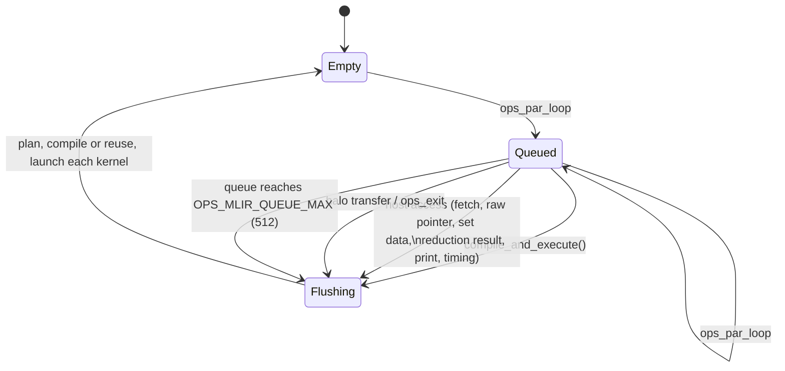
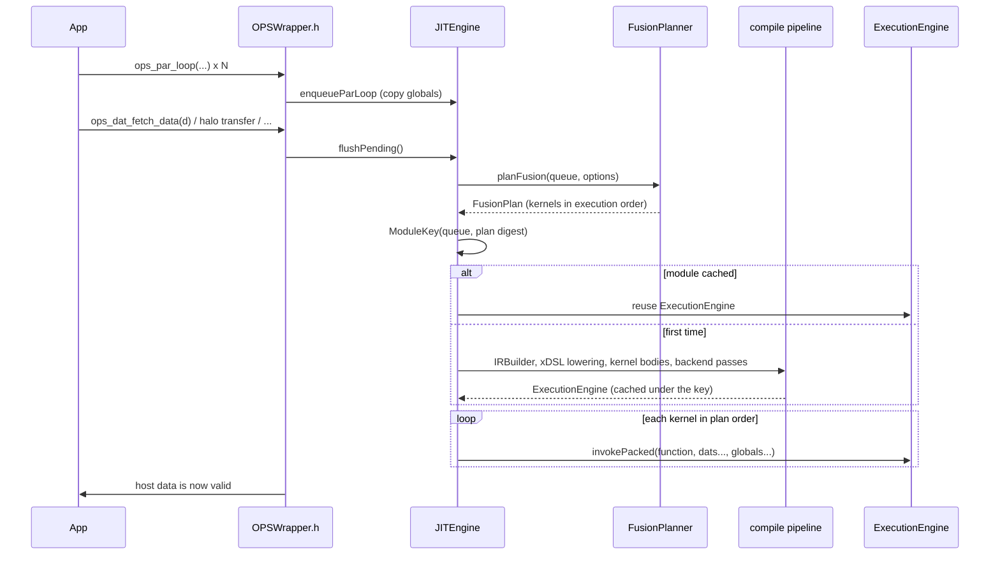
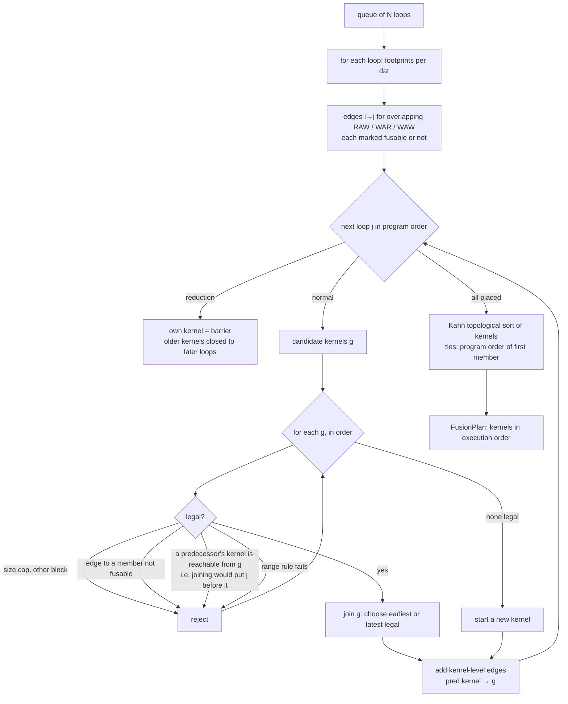
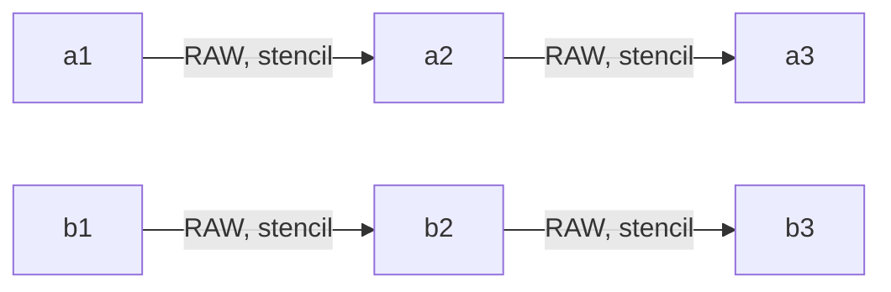

# Lazy execution and loop fusion in ops-mlir

> This is the Simplified Technical English (ASD-STE100) version of [loop_fusion.md](../loop_fusion.md). Code, listings and numbers are the same as in the original.

> [compilation_flow.md](compilation_flow.md) shows the whole pipeline, stage by stage, with real IR. This document is about the fusion rules.

This document explains how `ops-mlir` changes a stream of `ops_par_loop` calls
into a small number of generated kernels. The runtime compiles these kernels with JIT.
The document shows how the method fits into OPS and what the runtime does at each step.
It shows how the runtime analyses, groups and reorders the loops.
It shows how the runtime lowers a group to MLIR and how the tests check the result.
The measurements on the Taylor-Green vortex are in [`tgv_evaluation.md`](tgv_evaluation.md).

Contents

1. [Overview](#1-overview)
2. [Where it fits in OPS](#2-where-it-fits-in-ops)
3. [Lazy execution](#3-lazy-execution)
4. [Dependence analysis](#4-dependence-analysis)
5. [The planner](#5-the-planner)
6. [How to lower a group](#6-how-to-lower-a-group)
7. [How the runtime runs the kernels](#7-how-the-runtime-runs-the-kernels)
8. [Precision](#8-precision)
9. [Configuration reference](#9-configuration-reference)
10. [Tests](#10-tests)
11. [Summary of results](#11-summary-of-results)
12. [Limits and future work](#12-limits-and-future-work)

---

## 1. Overview

A time step on a structured mesh has dozens of short loops. Each loop reads a few dats,
applies its user kernel and writes a dat. If the runtime runs the loops one by one, each loop
streams its inputs and outputs through memory. Each loop also pays a launch cost (GPU) or a
parallel-region cost (OpenMP). Two loops that touch the same points can often run as one pass.
The pass does both computations when the data is in registers.

`ops-mlir` does this in three steps:

1. **Defer.** `ops_par_loop` records the loop and does not run it
   ([§3](#3-lazy-execution)). Nothing runs until the program needs a result.
2. **Plan.** When the runtime flushes the queue, the planner decides which loops run
   together and in which order ([§4](#4-dependence-analysis),
   [§5](#5-the-planner)).
3. **Generate.** Each group of loops becomes one MLIR function with one
   iteration space. The runtime compiles the function for the selected backend, caches it and
   launches it one time ([§6](#6-how-to-lower-a-group), [§7](#7-how-the-runtime-runs-the-kernels)).

The rules for fusion are conservative on purpose. The runtime fuses loops only when no value
must travel *between* grid points inside the generated kernel
(*point-local* dependences). Because of this, the generated kernel can run its points
in any order, in parallel, with no synchronisation.


## 2. Where it fits in OPS

OPS usually generates code for each application. A source-to-source translator
reads the `ops_par_loop` calls and writes one backend-specific function for each loop.
`ops-mlir` replaces this with a runtime (JIT) path:

* The application defines `OPS_2D` or `OPS_3D` and includes
  `ops/OPSWrapper.h`. It does **not** run the OPS translator.
* In `OPSWrapper.h`, `ops_par_loop` is a C++ template. When the application calls it, it packs
  the arguments and calls `JITEngine::enqueueParLoop`. The runtime remembers the user kernel only as a
  token. The runtime never runs the body of the user kernel on the host. (The application
  registers the file of the user kernel with `set_kernel_source_file`. `KernelIRBuilder`
  reads the body later, [§6](#6-how-to-lower-a-group).)
* The stock OPS library (`ops_seq`) still does everything that is *not* a parallel loop:
  the declaration of block, dat and stencil, memory allocation, halo
  exchange, HDF5 and timers. The memory of an `ops_dat` is ordinary OPS host memory.
* OPS API calls that let the host **read or change** data have wrappers (macros in
  `OPSWrapper.h`). The wrappers first flush the queue. On the GPU, they also copy
  the dat back to the host ([§3](#3-lazy-execution)).

OPS has its own lazy-execution mode (`OPS_TILING`,
`OPS/ops/c/src/core/ops_lazy.cpp`). This mode analyses the dependences across the queued
loops to build *cache-blocking tiles*. The loops still run as separate functions,
tile by tile.

This work does not do that. It fuses loops into **single generated kernels**.
This removes the intermediate loads and stores and the extra launches.
The dependence analysis is similar (footprints from ranges and
stencils), but the uses are different. The two are independent: ops-mlir does not call
`ops_lazy.cpp`.

## 3. Lazy execution

The runtime object is `JITEngine` (`include/runtime/JITEngine.h`). It is a
singleton. Its queue holds one `LoopDesc` for each `ops_par_loop`
(`include/runtime/Core.h`). A `LoopDesc` holds the name of the user kernel and the range.
For each argument, it holds the dat (index, shape, halo, element size, type string), the
stencil (offset table, stride) and the access mode. For a read-only `ops_arg_gbl`, it also
holds **a copy of the value**.



The runtime copies the globals when it enqueues the loop. A program can write
`rkA[stage]` or `dt` between the enqueue of a loop and the flush. The loop must see
the value that it had at the enqueue. This is the same as if the loop ran immediately.

A flush (`JITEngine::compile_and_execute`) does these steps:



**Module cache.** The key is a text digest. It has the digest of the queue and the plan digest.
The digest of the queue has these items:

* the names of the user kernels and the ranges
* the argument access modes
* the dat shapes, types and halos
* the stencil offsets

The plan digest looks like this: `0,2|1,3|4,5`.

An application that enqueues the same batch
in each time step compiles one time. After that, it only launches. Values that change between
steps (read-only globals) are *not* part of the key. They are arguments.

*Extern kernel constants* (`ops_register_kernel_constant`) are the exception.
The runtime bakes them into the generated code when it translates the user kernel.
So they must not change between steps that share a compiled module
([§12](#12-limits-and-future-work)).

**Host-access hooks** (`OPSWrapper.h`) are: `ops_dat_get_raw_pointer`,
`ops_dat_fetch_data*`, `ops_dat_set_data*`, `ops_dat_release_raw_data`,
`ops_get_data`, `ops_print_dat_to_txtfile`, `ops_dat_copy/deep_copy`,
`ops_reduction_result`, `ops_timing_output*`, `ops_halo_transfer`, `ops_exit`.
A read flushes the queue and copies the dat back from the GPU. A write does the same and also
makes the cached device copy not valid. Code that reads `dat->data` directly must call
`sync_all_host_buffers()` first. This call also flushes.

## 4. Dependence analysis

Two loops need an order only if they touch the same dat at overlapping
points and at least one of them writes. The analysis works on **footprints** in OPS
index space:

| quantity | definition |
|---|---|
| write footprint of a loop on dat D | the range of the loop (box `[lo,hi)` for each dimension) |
| read footprint | the range, made larger in each dimension by the min and max offset of the stencil: `[lo+minOff, hi+maxOff)` |
| strided / multigrid stencil | unbounded (it touches everything) |

Take loop *i* before loop *j* and a dat D that both loops touch. There is a dependence edge
*i → j* when:

* **RAW** (flow): *i* writes D, *j* reads D and the write footprint of *i*
  overlaps the read footprint of *j*.
* **WAR** (anti): *i* reads D, *j* writes D and the read footprint of *i* overlaps the
  write footprint of *j*.
* **WAW** (output): both loops write D and the write footprints overlap.

The footprints are boxes. So loops that work on different regions of the same
dat are independent. One example is a boundary strip and a far interior block.

An edge is **fusable** if the two loops can be in the same group and no loop needs a value
from a *different* point:

| edge | fusable when |
|---|---|
| RAW *i → j* | every read of D in *j* is point-local (only the zero offset) |
| WAR *i → j* | every read of D in *i* is point-local |
| WAW | both writes are point-local (always true for OPS write stencils) |

If an edge is not fusable, it is a **barrier between groups**. Loop *j* must run in a later
group than loop *i*. Examples:

```
Jacobi:   Anew = lap5(A)   ;   A = copy(Anew)      WAR on A, lap5 reads A at ±1
                                                   → two kernels (and in-place would race)
Chain:    P = 2*X          ;   Q = lap5(P)         RAW on P, lap5 reads P at ±1
                                                   → two kernels
Pointwise: Y = 2*X         ;   Z = Y + 1           RAW on Y, read at offset 0
                                                   → one kernel, Y forwarded in a register
```

**Reductions are barriers.** A loop that has a reduction (`ops_arg_gbl`
with any access mode other than read) never fuses. The planner moves no loop across it.
(The runtime lowers reductions for accessor-style kernels. See [cloverleaf.md §2.1](cloverleaf.md).
Fusion of reductions is future work, [§12](#12-limits-and-future-work).)

## 5. The planner

The planner is in `include/runtime/FusionPlanner.h` and `lib/runtime/FusionPlanner.cpp`.
It is pure C++ over `LoopDesc`s. It uses no MLIR and no GPU. Because of this, the tests
can use synthetic input and a randomized oracle ([§10](#10-tests)).

There are two planners. They have the same legality rules:

* **Consecutive** (`OPS_MLIR_FUSION_REORDER=0`): It scans the queue one time.
  If the next loop is compatible, it adds the loop to the current group.
  If not, it starts a new group. Only neighbours can fuse.
* **DAG** (default): It builds the dependence graph of [§4](#4-dependence-analysis)
  over the **whole queue**. A loop can join an *earlier* group and move ahead
  of independent loops between them.

### The DAG planner



Details:

* **Acyclicity (convexity).** The groups form a graph. There is an edge *h → g* when
  a loop in *g* depends on a loop in *h*. The planner does not put loop *j* into group *g*
  if a predecessor of *j* is in a group *h ≠ g* that *g*
  already reaches. In that case, *g* must run both before and after *h*.
  This is exactly the condition for which it is safe to move *j* earlier.
* **Placement.** `earliest` (default) joins the first legal group. It works like level
  scheduling of the dependence chains and finds the most
  fusion. `latest` keeps the loops near their neighbours in program order.
* **Range rules.** A group has one iteration space. Identical ranges join
  freely. Different ranges need *guarded* fusion. The generated kernel runs over the
  box, and each member runs only at the points inside its own range.
  The planner allows this only if both of these are true:
  1. `volume(box) ≤ OPS_MLIR_FUSION_BOX_RATIO × Σ member volumes` (a thin strip
     must not force a launch over the full grid), and
  2. every member whose range is smaller than the box reads **point-locally**.
     The generated kernel reads the inputs of a guarded member at every point of the box, not only
     inside the range of the member. A point-local read is always inside the allocation. A
     stencil read can be outside it. The planner checks this rule again for all
     existing members when the box grows.
* **Other limits.** The loops must have the same block and the same dimensionality. A group has
  at most `OPS_MLIR_FUSION_MAX` (8) loops. This limit keeps the register pressure low.
* **Output order.** The planner emits the groups with Kahn's algorithm. It breaks ties
  with the smallest original loop index. So when there are no constraints, the order is the
  program order. The loops inside a group are in ascending original order.
  This is a valid order of running because every edge points forward.
* **Safety net.** If the plan that the planner emits has fewer groups than the planner built
  (a cycle), the planner falls back to the consecutive planner. It does not
  drop work.

### Example

Two independent pipelines have three steps each. Each step is a stencil read of the previous
result. The program enqueues them interleaved (`a1 a2 b1 b2 a3 b3`):



| planner | groups |
|---|---|
| unfused | 6 |
| consecutive | `[a1] [a2 b1] [b2 a3] [b3]` — 4 (5 when the ranges are different, as in the test) |
| DAG, earliest | `[a1 b1] [a2 b2] [a3 b3]` — 3. The planner moved `b1` ahead of `a2`. |

Every group in the DAG plan is a level of the dependence graph. The test
`caseReorder` in `tests/e2e/fusion_cases.cpp` checks this case with a real run.

### How to inspect the plan

`OPS_MLIR_PLAN=1` prints these items one time for each different queue shape:

* the groups
* how many loops moved
* the estimated memory traffic
* a histogram of the reasons why loops had to start a new group
  (`dependence`, `order`, `range`, `size`, `block`, `first`)

The estimate of memory traffic uses the OPS convention: extent × element
size. It counts read and write one time each. It assumes that the stencil neighbours are in the cache.
A generated kernel loads each different dat at most one time.
It does not load a dat at all when a member writes the dat first.

## 6. How to lower a group

Each group becomes one MLIR function. First, `IRBuilder` builds one
`ops.par_loop` operation for each loop and attaches `fuse_group = <kernel index>`.
Then the xDSL pass `OPSToStencilPass` (`xdsl_impl/ops_to_stencil.py`,
`convert_group`) merges the loops that share an id.

**Signature.** The function has one buffer for each *different dat* of the group. The OPS
dat index identifies the dat, in order of first appearance. After the buffers come the read-only
scalar globals of every member loop, in order. `JITEngine::execute` packs the arguments in
exactly this order.

**Body.** The body is one `stencil.apply` over the (normalized) box of the group.
The runtime emits the members in ascending order. For each member:

1. Inputs. If the member reads, at the **zero offset**, a dat that an earlier member of
   the group wrote, the runtime **forwards** the value (an SSA value, no memory
   access). All other reads are `stencil.access` ops on the input field.
   The runtime creates identical (dat, offset) pairs one time.
2. A `memref.alloca_scope` holds the scratch data of the member for one point (the index buffer
   for `ops_arg_idx`, the out-struct of a multi-output kernel) and the call to
   the user kernel.
3. The results become the current value of each dat that the member writes.

The apply returns the final value of each written dat. The stencil lowering
stores it.

Forwarding has this effect. Sometimes a member writes an intermediate value and a later
member reads it immediately. Then the generated kernel computes the value one time. It keeps the value in a
register and stores it one time. The store stays because the application can see the OPS dats.

**Guarded members.** A member whose range is smaller than the box has this form:

```
%inside = (idx0 ≥ lo0) ∧ (idx0 < hi0) ∧ …       // stencil.index, arith.cmpi
%r      = scf.if %inside {
             memref.alloca_scope { …call kernel… }   // new value
          } else {
             <previous value of the dat>             // forwarded value or a zero-offset read
          }
```

`stencil.apply` stores every point of its bounds. So outside the range of the member,
the generated kernel must write the dat back with its old value. Because of this, a guarded write
also adds the dat as an input. Forwarded values use the merged result. So a
later member, at a point outside the range of an earlier member, correctly sees the
old data.

This relies on two facts about the pipeline:

* The lowering of `memref.alloca_scope` needs a parent region that can have many blocks.
  But an `scf.if` region must have exactly one block until the lowering to control flow.
  On CPU, the pipeline lowers the `scf.if` first. The CUDA
  pipeline needed one more pass: `scf-to-cf` inside the `gpu.module` before
  `gpu-to-nvvm` (`BackendPipeline.h`).
* `KernelIRBuilder` (a clang AST walker) translates the body of the user kernel from C++
  into `arith` and `math` ops. Then the runtime inlines it into the loop body. So the generated
  kernel is one flat region, and the LLVM or NVVM back end can optimise across
  the members.

The lowering of the stencil dialect (`ConvertStencilToLLMLIRPass`) gives an
`scf.parallel` over the box. Then the backend pipelines make sequential
loops, `omp.parallel` loops, or a `gpu.launch` with 32×4×1 thread blocks.

## 7. How the runtime runs the kernels

`JITEngine::execute(engine, plan)` goes through the groups of the plan in order. For
each group:

1. Collect the different dats, and find which of them any member writes.
2. On CUDA: call `ensureDeviceBuffer` (it allocates the buffer and copies host→device on first use).
3. Collect the captured global values (4 or 8 bytes, chosen by `sizeof`).
4. Call `invokePacked` for the generated function. Then synchronize.
5. Record the time under a name such as `fused(k1+k2+k3)`. Mark the written dats
   host-dirty, so the next host access copies them back.

Counters (`JITEngine::stats()`) count loops, launches, flushes and compiles.
`OPS_MLIR_STATS=1` prints them at exit.

## 8. Precision

Dats and scalar globals can be `float` or `double`. The MLIR element type of a
dat comes from the type string that the program gives to `ops_decl_dat`. Scalar globals use
`sizeof` (OPS records only the size of an `ops_arg_gbl`).

The translator for user kernels
follows the C++ types. This covers `float` and `double` parameters, results, locals and
literals (the suffix gives the type). It uses `truncf` and `extf` where C++ converts.
Names such as `sinf` map to the same math ops.

C++ silently promotes `0.5 * x` to double when `x` is `float`. Also, `cos(x)` can
bind to the double overload. A single-precision user kernel must not do this, because it
costs throughput and changes the results. `KernelIRBuilder` gives a warning when a user kernel with
only single-precision parameters computes in `f64`.

With
`OPS_MLIR_STRICT_FP=1` it rejects the user kernel. The generated single-precision
Taylor-Green vortex (`to_single_precision.py`) converts every floating literal,
type, type-name string, `M_PI` and math call. The tests prove this with the
strict translator ([§10](#10-tests)).

## 9. Configuration reference

| variable | default | effect |
|---|---|---|
| `OPS_BACKEND` | `cuda` | `seq`, `openmp` or `cuda` |
| `OPS_MLIR_FUSION` | `1` | `0`: one generated kernel for each loop |
| `OPS_MLIR_FUSION_REORDER` | `1` | `0`: only adjacent loops fuse (consecutive planner) |
| `OPS_MLIR_FUSION_PLACEMENT` | `earliest` | `latest`: join the last legal group |
| `OPS_MLIR_FUSION_GUARDED` | `1` | `0`: only identical ranges fuse |
| `OPS_MLIR_FUSION_MAX` | `8` | maximum number of loops in a group |
| `OPS_MLIR_FUSION_BOX_RATIO` | `1.0` | volume of the box / sum of the volumes of the members |
| `OPS_MLIR_QUEUE_MAX` | `512` | flush automatically at this queue length |
| `OPS_MLIR_STRICT_FP` | unset | reject single-precision user kernels that compute in double |
| `OPS_MLIR_PLAN` | unset | print the plan, the traffic estimate and the blockers for each queue shape |
| `OPS_MLIR_STATS` | unset | print the counts of loops, launches, flushes and compiles at exit |
| `OPS_MLIR_DUMP_LOWERED` | unset | print the `ops.par_loop` IR and the lowered IR of each group |
| `OPS_GPU_SM`, `OPS_PTXAS_OPTS`, `OPS_MLIR_CUDA_RUNTIME` | | CUDA target, ptxas flags, runtime library |

## 10. Tests

| suite | what it proves |
|---|---|
| `unittests/FusionPlannerTest` | It tests every legality rule on loops that the test builds by hand. It tests interleaved chains. The DAG planner needs 3 groups where adjacent grouping needs 4. It tests footprint independence and barriers. It also has a **randomized oracle**: 4000 random 1D programs × 6 planner configurations. The test runs the plan with fused at-point semantics in plan order. The result must be the same data as the program order. The test fails if a mutation removes the convexity check. It also fails if a mutation makes RAW or WAR fusable. A mutation test verified this. |
| `tests/e2e/accessor_cases` (double, on seq, OpenMP and CUDA) | These tests cover the accessor-style kernel path that CloverLeaf uses. They test INC/MIN/MAX reductions (many elements, `r = r + e`, two loops into one handle, a single-point loop that assigns). They test loops that write 1-D arrays indexed along one axis of a 2-D loop and read them back. They test a registered array of structs under a loop that a registered constant bounds. This includes a changed constant that translates the user kernel again. Each case also makes sure that no loop ran as a stock loop. |
| `tests/e2e/fusion_cases` (built for `float` and `double`) | These tests compare every pattern with a host reference. The patterns are pointwise chain, stencil RAW with identical and different ranges, and Jacobi WAR. They also include boundary setup, multi-output kernels, RW chains, globals, lazy flush, queue cap and module-cache reuse. The fused output equals the unfused output (bitwise on CPU). The launch counts are exact. Interleaved chains reorder. The tests run on seq, OpenMP and CUDA. They also run with fusion off, with same-range fusion only, with no reordering and with latest placement. |
| `unittests/KernelIRBuilderTest`, `kernel-ir-dump` tests | Translation to f32: signatures, types of literals, casts, `sinf` and out-structs |
| `apps/c/taylor_green_vortex/check_single_precision.py` | The generated single-precision sources have no `double`, no unsuffixed literal, no `M_PI` and no bare math call. All 25 user kernels translate under `OPS_MLIR_STRICT_FP=1` with no `f64` in the IR. The translator must reject a **negative control** (plain `double`→`float`). So the check cannot pass when it does not see the problem. |
| `check_tgv_precision.py` | The single-precision fields stay within the single-precision distance of the double fields on seq, OpenMP and CUDA |

```bash
ctest --test-dir build                # everything except the fp64-on-GPU check
ctest --test-dir build -L gpu         # fp32 on the GPU
ctest --test-dir build -L gpu-fp64    # fp64 on the GPU (correctness only)
```

## 11. Summary of results

The measurements are on the Taylor-Green vortex (RTX 4050 laptop GPU). The full data and method are in
[`tgv_evaluation.md`](tgv_evaluation.md):

* One Runge-Kutta stage queues 17 loops. Without fusion, the runtime makes 17 generated kernels. Adjacent-only
  fusion gives 8. **The dependence DAG gives 6** (3 loops moved).
* Single precision, 128³: **20.9 → 13.7 ms/iteration (1.53×)**. Plain fusion gives most of this
  (1.44×). Reordering adds about 6%. The kernels are memory-bound: the modelled
  traffic drops 1.55× and the kernel time drops 1.55× too. The host overhead is less than 4%.
* Double precision on this GPU: only 1.10× (fp64 throughput is the limit).
* On an A100 (cluster node `renyi`, 256³, [`tgv_evaluation_a100.md`](tgv_evaluation_a100.md)) the
  single-precision gain is smaller: **24.2 → 20.0 ms (1.21×)**. Nsight Compute shows the reason. The largest
  generated kernel moves 2× fewer bytes than the loops that it replaces, but it needs 160 registers for each thread.
  So it runs at 17% occupancy and 30% of peak DRAM throughput, and it is only 1.48× faster. Double precision gains 1.05×.
* Every configuration gives the same result as the unfused run, bit for bit, on both GPUs.

## 12. Limits and future work

* **Reductions.** The runtime lowers reductions (a contribution for each point into a scratch buffer, then a deterministic
  fold), but the planner still treats them as barriers. In CloverLeaf, `calc_dt` has three consecutive
  loops (`calc_dt_kernel`, `calc_dt_kernel_min`, `calc_dt_kernel_get`) that can share a generated kernel. The
  `field_summary` loop can join the loops before it. To do this, the scratch buffers must be per group.
  The fold then runs one time for each group and not one time for each loop.
* **Point-local fusion only.** A stencil consumer cannot join the group that
  produces its input. Other points produce the neighbours of a point.
  To fuse these loops, the runtime needs redundant halo computation or tiles with shared memory.
  In the Taylor-Green vortex, these stencil chains limit the number
  of generated kernels ([evaluation](tgv_evaluation.md)).
* **Greedy placement.** The planner is a heuristic. It is not the best clustering.
  It has no cost model for arithmetic intensity, for register pressure (it has only a
  cap on the number of loops) or for occupancy.
* **Kernel constants.** For user kernels in the original `KernelIRBuilder` style,
  the translator reads the values of `ops_register_kernel_constant` when it translates the user kernel.
  If the constant changes later, a cached module keeps the old value. Accessor-style kernels
  (CloverLeaf, [cloverleaf.md](cloverleaf.md)) do not have this problem. Each constant
  becomes a scalar argument, and the runtime saves a copy of its value when it enqueues the loop.
  (Read-only `ops_arg_gbl` values never had this problem.) The runtime trusts that the type of the registered pointer
  matches the `extern` declaration of the user kernel.
* **Guarded kernels evaluate a guard for each member at each point** and add a
  read of the old value. The box-ratio rule limits the waste, but it does not limit the
  divergence on GPUs.
* **GPU threads after the end of a range do the last point again.** The runtime does not mask them. See
  [compilation_flow.md §14](compilation_flow.md#14-findings-from-the-work-on-this-document-and-limits-that-matter).
* **Hazards inside `stencil.apply`.** The correctness of a fused group depends on the
  point-local guarantee of the planner. Without this guarantee, the buffer semantics of the stencil dialect
  are ambiguous for in-place updates.
* **Flush points are conservative.** Every halo transfer flushes, also a transfer on
  dats that the queue does not touch.
