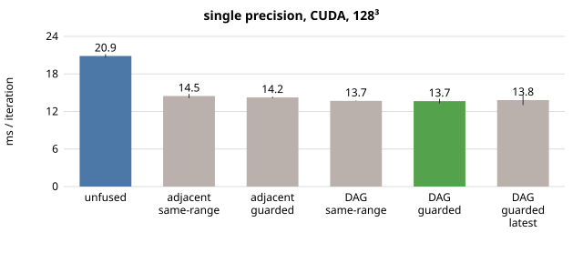
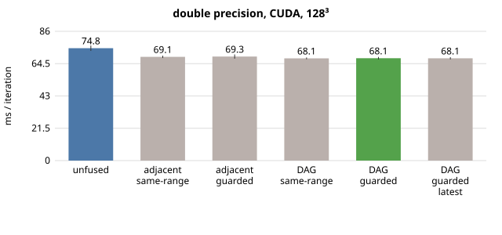
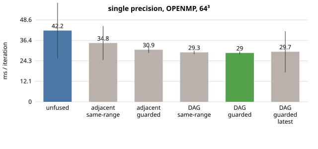
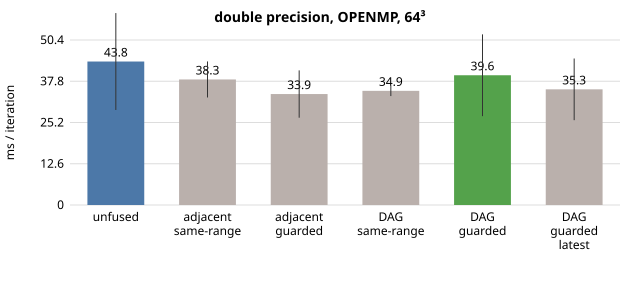
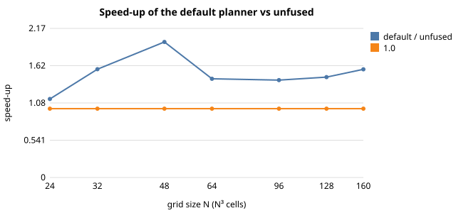

# Taylor-Green vortex: evaluation of fusion and reordering

> This is the Simplified Technical English (ASD-STE100) version of [tgv_evaluation.md](../tgv_evaluation.md). Code, listings and numbers are the same as in the original.

The program `apps/c/taylor_green_vortex/eval_tgv.py` made this report on 2026-09-30 22:24:15. The GPU is an NVIDIA GeForce RTX 4050 Laptop GPU, 6141 MiB, 595.79. The host has 16 CPU threads. The raw data is in `data/tgv_eval.json`.

## Summary

* **One Runge-Kutta stage** puts 17 loops in the queue. Fusion of adjacent loops only makes 8 generated kernels from them. The dependence DAG makes 6 generated kernels and moves 3 loops past independent loops. The launches for each iteration, with the filter steps, go from 51 → 24 → 18.
* **Single precision on NVIDIA GeForce RTX 4050 Laptop GPU (128³):** One iteration takes 20.87 ms unfused. It takes 14.47 ms with adjacent same-range fusion (1.44×) and 13.65 ms with the DAG planner (1.53×).

  Ordinary fusion gives most of the gain. The reordering adds 6% more. Different-range (guarded) fusion changes nothing for this application. A stage has the same number of generated kernels with or without it.
* **Why:** The generated kernels are memory-bound. The byte model predicts 1.55× less traffic and the measured kernel time is 1.55× less.

  The modelled bandwidth is 138 GB/s unfused and 138 GB/s fused (peak 192). The gain comes from the memory traffic that fusion removes. The host overhead (enqueue, plan, key, argument packing) is less than 4% of an iteration. The number of launches is not what costs the time.
* **Double precision on NVIDIA GeForce RTX 4050 Laptop GPU:** 74.82 → 68.14 ms (1.10×). Double precision takes 5.0× the time of single precision. Twice the bytes alone gives 2×. So the throughput of fp64 arithmetic is a limit. Fusion helps double precision much less than single precision (1.10× for double precision and 1.53× for single precision).
* **OpenMP (8 threads, 64³):** 1.25× in single precision (34.45 → 27.52 ms) and 1.02× in double precision (32.70 → 32.09 ms). Section 2 has every configuration and its spread.
* **Problem size (single precision, GPU):** For N = 24…160, the lowest speed-up is 1.14× (N=24) and the highest is 1.97× (N=48). The speed-up does not rise or fall in one direction when N increases. The dips were not investigated.
* **Parameters:** A limit of 8 loops for each generated kernel already gives the best time (6 generated kernels for each stage). Larger limits change nothing. A limit of 1 is the unfused case.

  The box ratio has a small effect here (13.63–13.99 ms). The time with the earliest placement is 13.65 ms. The time with the latest placement is 13.82 ms.
* **Cost:** The JIT compile of the 9 different queue shapes takes 6.9 s unfused and 6.1 s fused. The first 100 iterations take about 5.5 s more than the steady state. This cost occurs one time. It is equal to about 449 steady iterations.
* **Correctness:** All 20 runs of planner configurations are bitwise identical to the unfused run (CPU and GPU, both precisions, section 6). After 26 steps, single precision is within 2e-06 of double precision (rms, relative to the flow scale).
* **What limits it:** A stage still needs many generated kernels. Some loops had to start a new generated kernel. For these loops, the diagnostics of the planner count the reasons why the planner rejected an existing generated kernel: `dependence` 5, `order` 1, `range` 3.
  * `dependence`: a stencil read of a field that a loop in that generated kernel writes.
  * `order`: the join moves the loop before a loop that it depends on.
  * `range`: the rules of the box.

  Fusion across the dependence edges needs redundant halo computation.

*Method note.* The time for one iteration comes from windows of 100 iterations in one process after the warm-up.

An earlier version of this evaluation subtracted the wall time of a short run from the wall time of a long run. The JIT time changes by about 1 s between runs. This is ±10 ms for each iteration. That method gave wrong numbers. It also counted the one-time compile of the filter kernels at iteration 25. The numbers were discarded.

## 1. What the planner does to one time step

One Runge-Kutta stage puts a batch of loops in the queue between halo exchanges. A time step has three stages. Every 25 steps, a filter block follows. The filter block has seven loops. The application flushes these loops one at a time.

| configuration | loops / stage | generated kernels / stage | loops moved | estimated traffic (unfused → fused) | less traffic |
|---|---:|---:|---:|---:|---:|
| unfused | 17 | 17 | 0 | 4.11 → 4.11 MB (N=16) | 1.00× |
| adjacent, same-range | 17 | 8 | 0 | 4.11 → 2.74 MB (N=16) | 1.50× |
| adjacent, guarded | 17 | 8 | 0 | 4.11 → 2.74 MB (N=16) | 1.50× |
| DAG, same-range | 17 | 6 | 3 | 4.11 → 2.63 MB (N=16) | 1.56× |
| DAG, guarded | 17 | 6 | 3 | 4.11 → 2.63 MB (N=16) | 1.56× |
| DAG, guarded, latest | 17 | 6 | 3 | 4.11 → 2.63 MB (N=16) | 1.56× |

One time step has 51 launches of generated kernels when unfused. It has 18 launches with the default planner. These numbers do not include the filter block.

Why some loops still start a new generated kernel: the planner rejected candidate generated kernels. The counts are for the default planner and one stage: `dependence`=5, `first`=1, `order`=1, `range`=3.

## 2. Time per iteration

The steady-state time for one iteration is the timing that the application makes for windows of 100 iterations in one process. The windows are **after** the warm-up window. The warm-up window contains the JIT compile of every shape of generated kernel. 

The values are medians over all steady windows of all repetitions. `±` is (max−min)/median over these windows. `warm-up` is the extra time that the first 100 iterations took, compared with the steady state. `JIT` is the total seconds that the runtime spent in compile.

### single precision, CUDA, 128³

| configuration | ms / iteration | ± | speed-up vs unfused | generated kernels / iteration | warm-up s | JIT s |
|---|---:|---:|---:|---:|---:|---:|
| unfused | 20.87 | 2.8% | 1.000× | 51.3 | 6.1 | 6.9 |
| adjacent, same-range | 14.47 | 4.7% | 1.442× | 24.3 | 5.5 | 6.3 |
| adjacent, guarded | 14.24 | 1.5% | 1.465× | 24.3 | 5.5 | 6.2 |
| DAG, same-range | 13.69 | 0.6% | 1.524× | 18.3 | 5.4 | 6.2 |
| DAG, guarded | 13.65 | 5.6% | 1.528× | 18.3 | 5.5 | 6.1 |
| DAG, guarded, latest | 13.82 | 11.6% | 1.510× | 18.3 | 5.4 | 6.1 |

### double precision, CUDA, 128³

| configuration | ms / iteration | ± | speed-up vs unfused | generated kernels / iteration | warm-up s | JIT s |
|---|---:|---:|---:|---:|---:|---:|
| unfused | 74.82 | 4.8% | 1.000× | 51.3 | 6.0 | 6.8 |
| adjacent, same-range | 69.06 | 2.2% | 1.083× | 24.3 | 5.5 | 6.2 |
| adjacent, guarded | 69.26 | 4.0% | 1.080× | 24.3 | 5.4 | 6.3 |
| DAG, same-range | 68.05 | 1.7% | 1.099× | 18.3 | 5.4 | 6.1 |
| DAG, guarded | 68.14 | 2.5% | 1.098× | 18.3 | 5.4 | 6.1 |
| DAG, guarded, latest | 68.09 | 2.1% | 1.099× | 18.3 | 5.4 | 6.1 |

### single precision, OPENMP, 64³

| configuration | ms / iteration | ± | speed-up vs unfused | generated kernels / iteration | warm-up s | JIT s |
|---|---:|---:|---:|---:|---:|---:|
| unfused | 42.23 | 77.9% | 1.000× | 51.3 | 6.1 | 6.8 |
| adjacent, same-range | 34.84 | 57.7% | 1.212× | 24.3 | 5.5 | 5.9 |
| adjacent, guarded | 30.86 | 12.4% | 1.368× | 24.3 | 5.1 | 5.5 |
| DAG, same-range | 29.32 | 7.5% | 1.441× | 18.3 | 5.2 | 5.5 |
| DAG, guarded | 28.96 | 6.0% | 1.458× | 18.3 | 5.5 | 5.4 |
| DAG, guarded, latest | 29.67 | 82.0% | 1.423× | 18.3 | 5.5 | 5.5 |

### double precision, OPENMP, 64³

| configuration | ms / iteration | ± | speed-up vs unfused | generated kernels / iteration | warm-up s | JIT s |
|---|---:|---:|---:|---:|---:|---:|
| unfused | 43.83 | 67.5% | 1.000× | 51.3 | 5.6 | 6.7 |
| adjacent, same-range | 38.35 | 28.7% | 1.143× | 24.3 | 5.3 | 5.6 |
| adjacent, guarded | 33.89 | 42.7% | 1.293× | 24.3 | 5.2 | 5.5 |
| DAG, same-range | 34.87 | 9.2% | 1.257× | 18.3 | 5.1 | 5.5 |
| DAG, guarded | 39.63 | 63.0% | 1.106× | 18.3 | 4.5 | 5.6 |
| DAG, guarded, latest | 35.33 | 53.3% | 1.240× | 18.3 | 5.2 | 5.6 |

### OpenMP, controlled repeat (5 repetitions)

The OpenMP runs above use every available thread. They can have much noise. The runs below use a fixed number of threads and more repetitions.

**single precision, 64³, 8 threads**

| configuration | ms / iteration | ± | speed-up vs unfused |
|---|---:|---:|---:|
| unfused | 34.45 | 32.8% | 1.000× |
| adjacent, same-range | 31.90 | 22.2% | 1.080× |
| adjacent, guarded | 29.16 | 19.9% | 1.181× |
| DAG, guarded | 27.52 | 11.1% | 1.252× |

**double precision, 64³, 8 threads**

| configuration | ms / iteration | ± | speed-up vs unfused |
|---|---:|---:|---:|
| unfused | 32.70 | 11.3% | 1.000× |
| adjacent, same-range | 31.79 | 9.2% | 1.029× |
| adjacent, guarded | 32.68 | 8.9% | 1.001× |
| DAG, guarded | 32.09 | 8.1% | 1.019× |

Single precision against double precision on the GPU (default planner, 128³): one iteration takes 13.65 ms and 68.14 ms. The ratio is **4.99×**.

## 3. Effect of the problem size (single precision, GPU)

| N³ | unfused ms | adjacent, same-range ms | DAG, guarded ms | speed-up (default) |
|---:|---:|---:|---:|---:|
| 24 | 2.01 | 1.38 | 1.76 | 1.141× |
| 32 | 2.80 | 1.99 | 1.78 | 1.573× |
| 48 | 3.31 | 1.85 | 1.68 | 1.969× |
| 64 | 3.46 | 2.56 | 2.41 | 1.434× |
| 96 | 9.89 | 7.22 | 6.99 | 1.415× |
| 128 | 20.98 | 14.22 | 14.39 | 1.458× |
| 160 | 39.89 | 27.44 | 25.38 | 1.572× |

## 4. Parameter sweeps (single precision, GPU, 128³)

Maximum number of loops for each generated kernel (`OPS_MLIR_FUSION_MAX`):

| max | generated kernels / stage | ms / iteration |
|---:|---:|---:|
| 1 | 17 | 20.46 |
| 2 | 11 | 16.23 |
| 4 | 8 | 15.47 |
| 8 | 6 | 13.85 |
| 16 | 6 | 13.88 |
| 32 | 6 | 13.90 |

Box ratio (`OPS_MLIR_FUSION_BOX_RATIO`):

| ratio | generated kernels / stage | ms / iteration |
|---:|---:|---:|
| 0.5 | 6 | 13.99 |
| 1.0 | 6 | 13.63 |
| 2.0 | 6 | 13.65 |
| 4.0 | 6 | 13.63 |

## 5. Where the time goes

This is the exact steady-state breakdown for one iteration (single precision, GPU, 128³). It comes from the cumulative timers of the runtime. The runtime subtracts the timers between windows of 100 iterations.

*kernels* is the time in the generated functions, with the device synchronisation. *run overhead* is the time that the runtime uses around the generated functions.
This time has the argument packing, the buffer management and the profiler work.

| configuration | wall ms | kernels | run overhead | halo exchange | enqueue | plan + key | other (app) |
|---|---:|---:|---:|---:|---:|---:|---:|
| unfused | 20.87 | 19.48 | 0.27 | 0.75 | 0.24 | 0.13 | -0.00 |
| adjacent, same-range | 14.47 | 13.22 | 0.15 | 0.67 | 0.22 | 0.19 | 0.02 |
| DAG, guarded | 13.65 | 12.60 | 0.10 | 0.54 | 0.14 | 0.26 | 0.00 |

Modelled memory bandwidth = (byte model of the generated kernels that the runtime launched) × 3 stages ÷ kernel time. The peak of the GPU is 192 GB/s.

| configuration | model traffic / iteration | kernel ms | modelled GB/s |
|---|---:|---:|---:|
| unfused | 2.70 GB | 19.48 | 138 |
| DAG, guarded | 1.74 GB | 12.60 | 138 |

The share of each generated kernel in the kernel time (profiler, 250 iterations):

**unfused**: total kernel time 5.072 s

| name | calls | total s | share |
|---|---:|---:|---:|
| `opensbliblock00Kernel040` | 750 | 1.038 | 20% |
| `opensbliblock00Kernel031` | 750 | 0.915 | 18% |
| `opensbliblock00Kernel032` | 750 | 0.907 | 18% |
| `opensbliblock00Kernel008` | 750 | 0.470 | 9% |
| `opensbliblock00Kernel019` | 750 | 0.285 | 6% |
| `opensbliblock00Kernel010` | 750 | 0.167 | 3% |

**DAG, guarded**: total kernel time 3.452 s

| name | calls | total s | share |
|---|---:|---:|---:|
| `opensbliblock00Kernel040` | 750 | 1.076 | 31% |
| `fused(opensbliblock00Kernel013+opensbliblock00Kernel016+open` | 750 | 1.029 | 30% |
| `fused(opensbliblock00Kernel008+opensbliblock00Kernel010+open` | 750 | 0.732 | 21% |
| `fused(opensbliblock00Kernel011+opensbliblock00Kernel014+open` | 750 | 0.222 | 6% |
| `opensbliblock00Kernel007` | 750 | 0.164 | 5% |
| `opensbliblock00Kernel009` | 750 | 0.114 | 3% |

## 6. Accuracy

The table compares each configuration with the unfused run. The backend and the precision are the same. The size is 32³ and the run has 26 steps. The steps include a filter step.

| app / backend | configuration | bitwise equal | max abs diff | relative L2 |
|---|---|:---:|---:|---:|
| opensbli/seq | adjacent, same-range | yes | 0.00e+00 | 0.00e+00 |
| opensbli/seq | adjacent, guarded | yes | 0.00e+00 | 0.00e+00 |
| opensbli/seq | DAG, same-range | yes | 0.00e+00 | 0.00e+00 |
| opensbli/seq | DAG, guarded | yes | 0.00e+00 | 0.00e+00 |
| opensbli/seq | DAG, guarded, latest | yes | 0.00e+00 | 0.00e+00 |
| opensbli_f32/seq | adjacent, same-range | yes | 0.00e+00 | 0.00e+00 |
| opensbli_f32/seq | adjacent, guarded | yes | 0.00e+00 | 0.00e+00 |
| opensbli_f32/seq | DAG, same-range | yes | 0.00e+00 | 0.00e+00 |
| opensbli_f32/seq | DAG, guarded | yes | 0.00e+00 | 0.00e+00 |
| opensbli_f32/seq | DAG, guarded, latest | yes | 0.00e+00 | 0.00e+00 |
| opensbli_f32/cuda | adjacent, same-range | yes | 0.00e+00 | 0.00e+00 |
| opensbli_f32/cuda | adjacent, guarded | yes | 0.00e+00 | 0.00e+00 |
| opensbli_f32/cuda | DAG, same-range | yes | 0.00e+00 | 0.00e+00 |
| opensbli_f32/cuda | DAG, guarded | yes | 0.00e+00 | 0.00e+00 |
| opensbli_f32/cuda | DAG, guarded, latest | yes | 0.00e+00 | 0.00e+00 |
| opensbli/cuda | adjacent, same-range | yes | 0.00e+00 | 0.00e+00 |
| opensbli/cuda | adjacent, guarded | yes | 0.00e+00 | 0.00e+00 |
| opensbli/cuda | DAG, same-range | yes | 0.00e+00 | 0.00e+00 |
| opensbli/cuda | DAG, guarded | yes | 0.00e+00 | 0.00e+00 |
| opensbli/cuda | DAG, guarded, latest | yes | 0.00e+00 | 0.00e+00 |

Single precision against double precision (rms error relative to the flow scale): rho 3.84e-07, rhou0 2.03e-06, rhou1 2.03e-06, rhou2 1.93e-06, rhoE 1.84e-07.
