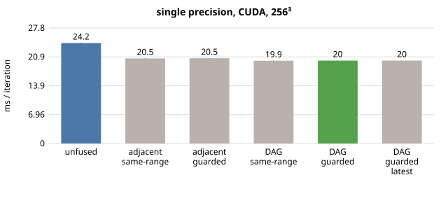
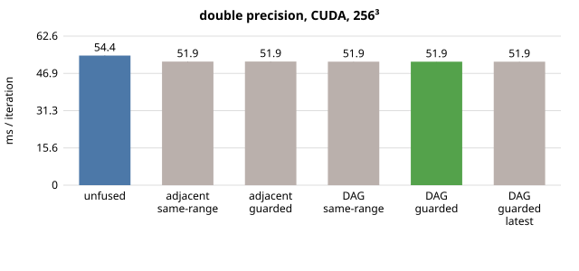
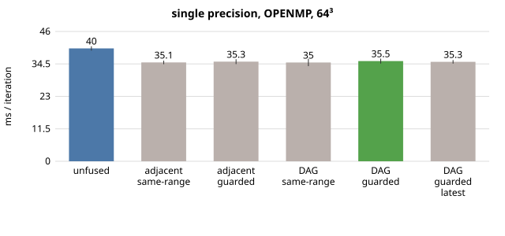
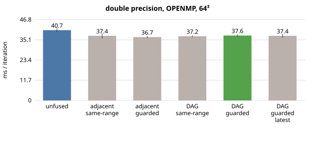
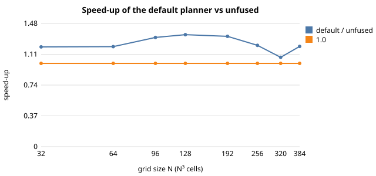

# Taylor-Green vortex: fusion and reordering evaluation - NVIDIA A100-PCIE-40GB

Generated by `apps/c/taylor_green_vortex/eval_tgv.py` on 2026-10-01 09:37:50. GPU: NVIDIA A100-PCIE-40GB, 40960 MiB, 580.95.05; 48 CPU threads. Raw data: `data/tgv_eval_a100.json`.

## Summary

* **One Runge-Kutta stage** queues 17 loops. Adjacent-only fusion turns them into 8 kernels; the dependence DAG into 6, moving 3 loops past independent ones. Launches per iteration (including the filter steps): 51 → 24 → 18.
* **Single precision on NVIDIA A100-PCIE-40GB (256³):** 24.19 ms/iteration unfused → 20.50 ms with adjacent same-range fusion (1.18×) → 19.96 ms with the DAG planner (1.21×). Most of the gain is ordinary fusion; reordering adds 3% on top. Different-range (guarded) fusion changes nothing for this app: the stage has the same kernel count with or without it.
* **Why less than the traffic saving:** the byte model predicts 1.54× less traffic but the kernel time drops only 1.23×. The modelled bandwidth falls from 911 GB/s (59% of the 1555 GB/s peak) unfused to 724 GB/s (47%) fused: the fused kernels move fewer bytes but sustain less bandwidth (see the Nsight Compute section for the per-kernel cause). Host overhead (enqueue, planning, cache key, argument packing) is under 2% of an iteration, so the number of launches itself is not what costs time.
* **Double precision on NVIDIA A100-PCIE-40GB:** 54.43 → 51.86 ms (1.05×). Double costs 2.6× single (doubling the bytes alone would give 2×), somewhat more than that. Fusion helps double much less than single (1.05× vs 1.21×).
* **OpenMP (24 threads, 64³):** 1.13× in single precision (40.33 → 35.66 ms) and 1.08× in double (40.80 → 37.75 ms). (Section 2 has every configuration and its spread.)
* **Problem size (single precision, GPU):** the speed-up ranges from 1.07× (N=320) to 1.34× (N=128) over N = 32…384. It is not monotonic in N, and the dips were not investigated.
* **Parameters:** a cap of 8 loops per kernel already reaches the best time (6 kernels per stage; larger caps change nothing, a cap of 1 is the unfused case). The bounding-box ratio has little effect here (19.94–19.96 ms). Earliest vs. latest placement: 19.96 vs 19.97 ms.
* **Cost:** JIT compilation of the 9 distinct queue shapes takes 11.4 s unfused and 10.3 s fused (the first 100 iterations cost about 9.0 s more than steady state), a one-off equal to roughly 514 steady iterations.
* **Correctness:** all 20 planner-configuration runs are bitwise identical to the unfused run (CPU and GPU, both precisions; section 6). Single precision stays within 2e-06 of double (rms, relative to the flow scale) after 26 steps.
* **What limits it:** a stage still needs several kernels. For the loops that had to start a new kernel, the planner's diagnostics count the reasons an existing kernel was rejected: `dependence` 5, `order` 1, `range` 3 (`dependence`: a stencil read of a field written in that kernel; `order`: joining would move the loop before something it depends on; `range`: the bounding-box rules). Fusing across the dependence edges would need redundant halo computation.

*Method note.* Per-iteration times come from windows of 100 iterations inside one process after warm-up. An earlier version of this evaluation differenced the wall time of a short and a long run; JIT time varies by about a second between runs, which is ±10 ms per iteration, and that method gave wrong numbers (it also counted the one-off compile of the filter kernels at iteration 25). Those numbers were discarded.

## 1. What the planner does to one time step

One Runge-Kutta stage queues a batch of loops between halo exchanges; there are three stages per time step, plus a filter block every 25 steps (seven loops that the app flushes one by one).

| configuration | loops / stage | kernels / stage | loops moved | est. traffic (unfused → fused) | reduction |
|---|---:|---:|---:|---:|---:|
| unfused | 17 | 17 | 0 | 4.11 → 4.11 MB (N=16) | 1.00× |
| adjacent, same-range | 17 | 8 | 0 | 4.11 → 2.74 MB (N=16) | 1.50× |
| adjacent, guarded | 17 | 8 | 0 | 4.11 → 2.74 MB (N=16) | 1.50× |
| DAG, same-range | 17 | 6 | 3 | 4.11 → 2.63 MB (N=16) | 1.56× |
| DAG, guarded | 17 | 6 | 3 | 4.11 → 2.63 MB (N=16) | 1.56× |
| DAG, guarded, latest | 17 | 6 | 3 | 4.11 → 2.63 MB (N=16) | 1.56× |

Per time step that is 51 kernel launches unfused versus 18 with the default planner (excluding the filter block).

Why loops still start a new kernel (counts of rejected candidate kernels, default planner, one stage): `dependence`=5, `first`=1, `order`=1, `range`=3.

## 2. Time per iteration

Steady-state time per iteration is the app's own timing of windows of 100 iterations inside one process, **after** the warm-up window (which contains the JIT compile of every kernel shape). Values are medians over all steady windows of all repetitions; `±` is (max−min)/median over those windows. `warm-up` is the extra time the first 100 iterations took compared with steady state, and `JIT` the seconds the runtime spent compiling in total.

### single precision, CUDA, 256³

| configuration | ms / iteration | ± | speed-up vs unfused | kernels / iteration | warm-up s | JIT s |
|---|---:|---:|---:|---:|---:|---:|
| unfused | 24.19 | 0.8% | 1.000× | 51.3 | 10.2 | 11.4 |
| adjacent, same-range | 20.50 | 0.6% | 1.180× | 24.3 | 9.2 | 10.4 |
| adjacent, guarded | 20.54 | 0.4% | 1.178× | 24.3 | 9.2 | 10.4 |
| DAG, same-range | 19.94 | 0.4% | 1.213× | 18.3 | 9.0 | 10.3 |
| DAG, guarded | 19.96 | 0.3% | 1.212× | 18.3 | 9.0 | 10.3 |
| DAG, guarded, latest | 19.97 | 0.3% | 1.211× | 18.3 | 9.0 | 10.3 |

### double precision, CUDA, 256³

| configuration | ms / iteration | ± | speed-up vs unfused | kernels / iteration | warm-up s | JIT s |
|---|---:|---:|---:|---:|---:|---:|
| unfused | 54.43 | 0.2% | 1.000× | 51.3 | 10.5 | 11.3 |
| adjacent, same-range | 51.91 | 0.1% | 1.049× | 24.3 | 9.6 | 10.3 |
| adjacent, guarded | 51.93 | 0.1% | 1.048× | 24.3 | 9.5 | 10.3 |
| DAG, same-range | 51.87 | 0.1% | 1.049× | 18.3 | 9.4 | 10.2 |
| DAG, guarded | 51.86 | 0.1% | 1.050× | 18.3 | 9.4 | 10.2 |
| DAG, guarded, latest | 51.86 | 0.1% | 1.049× | 18.3 | 9.4 | 10.2 |

### single precision, OPENMP, 64³

| configuration | ms / iteration | ± | speed-up vs unfused | kernels / iteration | warm-up s | JIT s |
|---|---:|---:|---:|---:|---:|---:|
| unfused | 40.02 | 3.8% | 1.000× | 51.3 | 8.9 | 9.3 |
| adjacent, same-range | 35.05 | 3.6% | 1.142× | 24.3 | 8.1 | 8.6 |
| adjacent, guarded | 35.33 | 4.9% | 1.133× | 24.3 | 8.2 | 8.6 |
| DAG, same-range | 35.03 | 7.4% | 1.143× | 18.3 | 8.1 | 8.6 |
| DAG, guarded | 35.52 | 4.9% | 1.127× | 18.3 | 8.0 | 8.5 |
| DAG, guarded, latest | 35.26 | 3.6% | 1.135× | 18.3 | 8.1 | 8.6 |

### double precision, OPENMP, 64³

| configuration | ms / iteration | ± | speed-up vs unfused | kernels / iteration | warm-up s | JIT s |
|---|---:|---:|---:|---:|---:|---:|
| unfused | 40.66 | 5.8% | 1.000× | 51.3 | 8.9 | 9.4 |
| adjacent, same-range | 37.40 | 7.8% | 1.087× | 24.3 | 8.0 | 8.5 |
| adjacent, guarded | 36.66 | 3.5% | 1.109× | 24.3 | 8.1 | 8.6 |
| DAG, same-range | 37.16 | 3.1% | 1.094× | 18.3 | 8.0 | 8.5 |
| DAG, guarded | 37.55 | 3.3% | 1.083× | 18.3 | 8.0 | 8.5 |
| DAG, guarded, latest | 37.38 | 6.0% | 1.088× | 18.3 | 8.0 | 8.4 |

### OpenMP, controlled repeat (5 repetitions)

The OpenMP runs above use every available thread and can be noisy. Repeated with a fixed thread count and more repetitions:

**single precision, 64³, 24 threads**

| configuration | ms / iteration | ± | speed-up vs unfused |
|---|---:|---:|---:|
| unfused | 40.33 | 4.6% | 1.000× |
| adjacent, same-range | 34.69 | 2.0% | 1.163× |
| adjacent, guarded | 35.76 | 3.6% | 1.128× |
| DAG, guarded | 35.66 | 4.8% | 1.131× |

**double precision, 64³, 24 threads**

| configuration | ms / iteration | ± | speed-up vs unfused |
|---|---:|---:|---:|
| unfused | 40.80 | 4.8% | 1.000× |
| adjacent, same-range | 37.45 | 4.0% | 1.090× |
| adjacent, guarded | 37.29 | 3.2% | 1.094× |
| DAG, guarded | 37.75 | 7.4% | 1.081× |

Single versus double precision on the GPU (default planner, 256³): 19.96 ms vs 51.86 ms per iteration, **2.60×**.

## 3. Dependence on problem size (single precision, GPU)

| N³ | unfused ms | adjacent, same-range ms | DAG, guarded ms | speed-up (default) |
|---:|---:|---:|---:|---:|
| 32 | 1.39 | 1.11 | 1.16 | 1.198× |
| 64 | 1.64 | 1.30 | 1.36 | 1.201× |
| 96 | 2.50 | 1.93 | 1.90 | 1.311× |
| 128 | 4.15 | 3.22 | 3.09 | 1.345× |
| 192 | 11.12 | 8.70 | 8.39 | 1.325× |
| 256 | 24.28 | 20.54 | 19.96 | 1.217× |
| 320 | 48.61 | 46.57 | 45.31 | 1.073× |
| 384 | 94.63 | 80.69 | 78.62 | 1.204× |

### Double precision (GPU)

| N³ | unfused ms | adjacent, same-range ms | DAG, guarded ms | speed-up (default) |
|---:|---:|---:|---:|---:|
| 64 | 1.94 | 1.59 | 1.64 | 1.185× |
| 128 | 7.04 | 5.81 | 5.75 | 1.225× |
| 192 | 20.76 | 20.33 | 20.56 | 1.010× |
| 256 | 54.42 | 51.92 | 51.85 | 1.050× |

## 4. Parameter sweeps (single precision, GPU, 256³)

Maximum loops per kernel (`OPS_MLIR_FUSION_MAX`):

| max | kernels / stage | ms / iteration |
|---:|---:|---:|
| 1 | 17 | 24.54 |
| 2 | 11 | 22.68 |
| 4 | 8 | 21.85 |
| 8 | 6 | 19.98 |
| 16 | 6 | 19.95 |
| 32 | 6 | 19.97 |

Bounding-box ratio (`OPS_MLIR_FUSION_BOX_RATIO`):

| ratio | kernels / stage | ms / iteration |
|---:|---:|---:|
| 0.5 | 6 | 19.96 |
| 1.0 | 6 | 19.94 |
| 2.0 | 6 | 19.95 |
| 4.0 | 6 | 19.94 |

## 5. Where the time goes

Exact steady-state breakdown per iteration from the runtime's cumulative timers, differenced between windows of 100 iterations (single precision, GPU, 256³). *kernel* is the time inside the generated functions including the device synchronisation; *execute overhead* is argument packing, buffer bookkeeping and profiling around them.

| configuration | wall ms | kernels | execute overhead | halo exchange | enqueue | plan + cache key | other (app) |
|---|---:|---:|---:|---:|---:|---:|---:|
| unfused | 24.19 | 23.44 | 0.08 | 0.39 | 0.14 | 0.12 | 0.01 |
| adjacent, same-range | 20.50 | 19.72 | 0.07 | 0.39 | 0.14 | 0.17 | 0.00 |
| DAG, guarded | 19.96 | 19.09 | 0.07 | 0.39 | 0.15 | 0.26 | -0.00 |

Modelled memory bandwidth (byte model of the kernels actually launched × 3 stages ÷ kernel time; the GPU's peak is 1555.0 GB/s):

| configuration | model traffic / iteration | kernel ms | modelled GB/s |
|---|---:|---:|---:|
| unfused | 21.36 GB | 23.44 | 911 |
| DAG, guarded | 13.83 GB | 19.09 | 724 |

Per-kernel share of kernel time (profiler, 250 iterations):

**unfused** — total kernel time 1.239 s

| kernel | calls | total s | share |
|---|---:|---:|---:|
| `opensbliblock00Kernel008` | 750 | 0.308 | 25% |
| `opensbliblock00Kernel032` | 750 | 0.184 | 15% |
| `opensbliblock00Kernel031` | 750 | 0.168 | 14% |
| `opensbliblock00Kernel040` | 750 | 0.151 | 12% |
| `opensbliblock00Kernel019` | 750 | 0.043 | 3% |
| `opensbliblock00Kernel010` | 750 | 0.028 | 2% |

**DAG, guarded** — total kernel time 0.896 s

| kernel | calls | total s | share |
|---|---:|---:|---:|
| `fused(opensbliblock00Kernel008+opensbliblock00Kernel010+open` | 750 | 0.288 | 32% |
| `fused(opensbliblock00Kernel013+opensbliblock00Kernel016+open` | 750 | 0.265 | 30% |
| `opensbliblock00Kernel040` | 750 | 0.154 | 17% |
| `fused(opensbliblock00Kernel011+opensbliblock00Kernel014+open` | 750 | 0.037 | 4% |
| `opensbliblock00Kernel007` | 750 | 0.023 | 3% |
| `opensbliblock00Kernel009` | 750 | 0.022 | 2% |

## 6. Accuracy

Each configuration against the unfused run (same backend and precision), 32³, 26 steps (covers a filter step).

| app / backend | configuration | bitwise equal | max abs diff | rel L2 |
|---|---|:---:|---:|---:|
| opensbli/seq | adjacent, same-range | yes | 0.00e+00 | 0.00e+00 |
| opensbli/seq | adjacent, guarded | yes | 0.00e+00 | 0.00e+00 |
| opensbli/seq | DAG, same-range | yes | 0.00e+00 | 0.00e+00 |
| opensbli/seq | DAG, guarded | yes | 0.00e+00 | 0.00e+00 |
| opensbli/seq | DAG, guarded, latest | yes | 0.00e+00 | 0.00e+00 |
| opensbli_f32/seq | adjacent, same-range | yes | 0.00e+00 | 0.00e+00 |
| opensbli_f32/seq | adjacent, guarded | yes | 0.00e+00 | 0.00e+00 |
| opensbli_f32/seq | DAG, same-range | yes | 0.00e+00 | 0.00e+00 |
| opensbli_f32/seq | DAG, guarded | yes | 0.00e+00 | 0.00e+00 |
| opensbli_f32/seq | DAG, guarded, latest | yes | 0.00e+00 | 0.00e+00 |
| opensbli_f32/cuda | adjacent, same-range | yes | 0.00e+00 | 0.00e+00 |
| opensbli_f32/cuda | adjacent, guarded | yes | 0.00e+00 | 0.00e+00 |
| opensbli_f32/cuda | DAG, same-range | yes | 0.00e+00 | 0.00e+00 |
| opensbli_f32/cuda | DAG, guarded | yes | 0.00e+00 | 0.00e+00 |
| opensbli_f32/cuda | DAG, guarded, latest | yes | 0.00e+00 | 0.00e+00 |
| opensbli/cuda | adjacent, same-range | yes | 0.00e+00 | 0.00e+00 |
| opensbli/cuda | adjacent, guarded | yes | 0.00e+00 | 0.00e+00 |
| opensbli/cuda | DAG, same-range | yes | 0.00e+00 | 0.00e+00 |
| opensbli/cuda | DAG, guarded | yes | 0.00e+00 | 0.00e+00 |
| opensbli/cuda | DAG, guarded, latest | yes | 0.00e+00 | 0.00e+00 |

Single against double precision (rms error relative to the flow scale): rho 2.79e-07, rhou0 1.91e-06, rhou1 1.92e-06, rhou2 1.89e-06, rhoE 1.47e-07.

## 7. Kernel-level view (Nsight Compute, A100)

One Runge-Kutta stage of the single-precision app at 128³, profiled with Nsight Compute
(`cluster/job_ncu.sbatch`, summarised by `ncu_summary.py`; raw CSVs in `data/`). "Occupancy" is
achieved warp occupancy, "DRAM util" the fraction of peak DRAM throughput during the kernel.

**Unfused (17 kernels)**

| kernel | µs | regs/thread | achieved occupancy | DRAM util | DRAM MB | L2 hit |
|---|---:|---:|---:|---:|---:|---:|
| `Kernel008_0` | 36 | 16 | 64% | 41% | 23 | 53% |
| `Kernel010_1` | 36 | 16 | 57% | 42% | 23 | 53% |
| `Kernel012_2` | 39 | 16 | 74% | 38% | 23 | 51% |
| `Kernel019_3` | 52 | 18 | 85% | 70% | 56 | 46% |
| `Kernel025_4` | 35 | 16 | 56% | 42% | 23 | 53% |
| `Kernel007_5` | 29 | 20 | 50% | 22% | 10 | 62% |
| `Kernel009_6` | 28 | 20 | 50% | 22% | 10 | 62% |
| `Kernel011_7` | 29 | 20 | 50% | 22% | 10 | 60% |
| `Kernel013_8` | 28 | 22 | 61% | 24% | 10 | 67% |
| `Kernel014_9` | 29 | 22 | 67% | 23% | 10 | 67% |
| `Kernel015_10` | 29 | 22 | 67% | 23% | 10 | 65% |
| `Kernel016_11` | 33 | 18 | 78% | 19% | 10 | 75% |
| `Kernel017_12` | 33 | 18 | 78% | 20% | 10 | 75% |
| `Kernel018_13` | 33 | 18 | 78% | 19% | 10 | 74% |
| `Kernel031_14` | 286 | 119 | 23% | 47% | 210 | 71% |
| `Kernel032_15` | 294 | 56 | 53% | 42% | 193 | 72% |
| `Kernel040_16` | 219 | 45 | 56% | 62% | 212 | 58% |
| **stage total** | **1267** | 54 (time-weighted) | 52% | 43% | **854** | 65% |

**Default planner (6 kernels)**

| kernel | µs | regs/thread | achieved occupancy | DRAM util | DRAM MB | L2 hit |
|---|---:|---:|---:|---:|---:|---:|
| `group_0` | 109 | 22 | 89% | 50% | 86 | 70% |
| `Kernel007_5` | 29 | 20 | 50% | 22% | 10 | 62% |
| `Kernel009_6` | 29 | 20 | 51% | 22% | 10 | 62% |
| `group_3` | 50 | 32 | 84% | 45% | 35 | 76% |
| `group_4` | 479 | 160 | 17% | 30% | 223 | 82% |
| `Kernel040_16` | 217 | 45 | 56% | 63% | 212 | 58% |
| **stage total** | **914** | 100 (time-weighted) | 41% | 41% | **576** | 73% |

Stage time 1267 → 914 µs (1.39×); DRAM traffic 854 → 576 MB (1.48×).

What the numbers show:

* The first fused kernel (`group_0`, five loops) is the ideal case: 22 registers, 89% occupancy, and it takes 109 µs where its five unfused parts took 198 µs.
* The largest fused kernel (`group_4`: loops 013, 016, 017, 018, 031, 032) moves 223 MB where its parts moved 443 MB (2.0× less), but it needs **160 registers per thread**, so its achieved occupancy is only 17% and it reaches 30% of peak DRAM throughput. It takes 479 µs against 707 µs for the unfused parts: 1.48× faster for 2.0× less traffic.
* `Kernel040` (the Runge-Kutta update, 212 MB) is untouched by fusion and is now the second-largest cost at 62% DRAM utilisation.
* The larger and faster the memory system, the more threads in flight a kernel needs to use it. The register-heavy fused kernel is therefore the part of the stage that falls short of the traffic saving. This is consistent with the smaller gain here than on the laptop GPU (whose 192 GB/s needs far less concurrency); it was not tested by capping register use.
